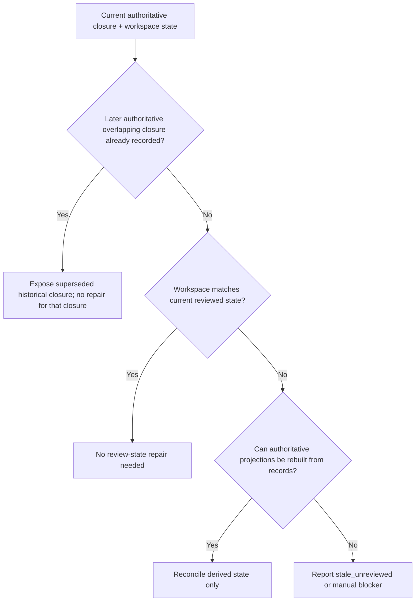
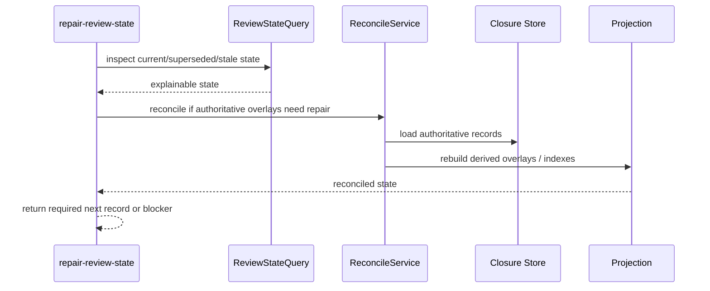

# Supersession-Aware Review State Reconcile

**Workflow State:** Implementation Target  
**Spec Revision:** 4  
**Last Reviewed By:** clean-context review loop
**Implementation Target:** Current

## Problem Statement

The old repair model assumes stale proof should be refreshed back into current truth:

- replay evidence
- refresh receipts
- rewrite late-stage artifacts
- republish authoritative truth

Under the supersession-aware model, that is the wrong recovery shape.

If later reviewed work replaced earlier reviewed work, the older closure should become superseded. If unreviewed changes landed after a current closure, that closure should become stale. Repair should reconcile closure state, not rewrite old proof until it looks current again.

## Desired Outcome

Repair should become explicit review-state reconcile:

- explain what is current
- explain what is superseded
- explain what is stale due to unreviewed changes
- identify when a new closure-recording flow is required next
- rebuild derivable overlays from closure records
- give agents one preferred repair command instead of forcing them to manually string together inspect/reconcile steps

## Decision

Selected approach: replace proof-rewrite-centric repair with supersession-aware reconcile and stale-closure repair flows.

## Dependency

This spec depends on:

- `2026-04-01-supersession-aware-review-identity.md`
- `2026-04-02-branch-closure-recording-and-binding.md`
- `2026-04-01-gate-diagnostics-and-runtime-semantics.md`
- `2026-04-01-workflow-public-phase-contract.md`

Downstream-slice rule:

- release-readiness, final-review, and QA slices must consume this reconcile contract for stale-late-stage reroute and recovery instead of inventing their own repair semantics

## Requirement Index

- [REQ-001][behavior] FeatureForge must expose a public non-mutating command that explains current, superseded, stale-unreviewed, and blocked closure state.
- [REQ-002][behavior] FeatureForge must expose a public reconcile command that recomputes effective current closure state and authoritative derivative overlays from runtime-owned closure records.
- [REQ-003][behavior] Reconcile must not rewrite old reviewed proof in place merely to make it appear current for a newer workspace state.
- [REQ-004][behavior] When later reviewed work legitimately replaces earlier reviewed work, reconcile must mark the older closure superseded rather than stale.
- [REQ-005][behavior] When unreviewed changes land after a current closure, reconcile must mark that closure stale-unreviewed rather than silently refreshing it.
- [REQ-006][behavior] If derived human-readable artifacts are regenerated from authoritative records, that regeneration must be explicit and must not change the historical state of the underlying older records.
- [REQ-007][behavior] Reconcile must be able to rebuild derivable authoritative overlays and milestone indexes from closure records when those overlays are missing or corrupted.
- [REQ-008][behavior] Repair output must clearly distinguish “record a new superseding closure” from “reconcile derived state” from “manual blocker.”
- [REQ-009][behavior] Explain/reconcile flows must be owned by dedicated query and reconcile services rather than by broad mutation helpers that also own artifact formatting or unrelated workflow state.
- [REQ-010][behavior] FeatureForge must expose `repair-review-state` as the preferred aggregate agent-facing repair command, with `explain-review-state` and `reconcile-review-state` retained as lower-level primitives.
- [REQ-011][verification] Integration tests must cover later reviewed supersession, post-review unreviewed drift, missing derived-state recovery, and append-only repair behavior.

## Scope

In scope:

- public review-state explain command
- public reconcile command
- current/superseded/stale-unreviewed recomputation
- derived overlay rebuild
- append-only repair semantics

Out of scope:

- redesigning execution topology
- preserving the old `rebuild-evidence` semantics as the primary recovery model

## Selected Approach

The new operator questions should be:

- "what current reviewed closures do I rely on right now?"
- "which closures became superseded by later reviewed work?"
- "which closures are stale because unreviewed changes landed?"
- "what new review or milestone do I need to record next?"

Expected public shapes:

- `featureforge plan execution repair-review-state --plan <path> ...`
- `featureforge plan execution explain-review-state --plan <path> ...`
- `featureforge plan execution reconcile-review-state --plan <path> ...`

`repair-review-state` should be the documented first-choice agent-facing surface. It should:

1. inspect current review-state truth
2. distinguish stale-unreviewed state from historical supersession and from missing projections
3. invoke reconcile only when authoritative derived state needs repair
4. return the exact next required record or execution-reentry action
5. never mint new task closures, branch closures, or late-stage milestones

Compatibility handling for `rebuild-evidence` can be decided later, but it should not remain the conceptual center.

Migration decision:

- `rebuild-evidence` should become a compatibility alias that routes operators toward `explain-review-state` and `reconcile-review-state`
- it should not remain the canonical concept or receive new primary behavior in the supersession-aware model
- default reconcile should rebuild projections and authoritative derived indexes only
- regeneration of human-readable derived artifacts should require explicit request or compatibility mode

## Reconcile Decision Flow

## Reconcile Interaction Sequence

## Public Contract

`repair-review-state` should report at least:

- `action`: `reconciled` | `already_current` | `blocked`
- current reviewed task closures
- current reviewed branch closure state
- superseded closures
- stale-unreviewed closures
- missing derived overlays
- actions it performed automatically
- `required_follow_up` when immediate follow-up is required
- exact next required operator command as `recommended_command`
- `trace[]` or `trace_summary`

For `repair-review-state`, allowed `required_follow_up` values are:

- `execution_reentry`
- `record_branch_closure`

`repair-review-state` must omit `required_follow_up` only when:

- `action=already_current`, or
- `action=reconciled` repaired derived overlays and no immediate recording or execution step is required before the operator re-queries workflow/operator

`repair-review-state` action coupling rule:

- when `required_follow_up` is present, `action` must be `blocked`
- `action=reconciled` is reserved for successful derived-state repair with no immediate blocking follow-up
- `action=already_current` is reserved for the no-op case where no reconcile or reroute was needed

`repair-review-state` must set `recommended_command` deterministically:

- when `required_follow_up=record_branch_closure`, `recommended_command` must be `featureforge plan execution record-branch-closure --plan <path>`
- when `required_follow_up=execution_reentry`, `recommended_command` must be `featureforge workflow operator --plan <path>` so the exact step-oriented execution command is re-derived from the authoritative workflow surface
- when `required_follow_up` is omitted, `recommended_command` must be `featureforge workflow operator --plan <path>`

`explain-review-state` should report at least:

- current reviewed task closures
- current reviewed branch closure state
- superseded closures
- stale-unreviewed closures
- missing derived overlays
- next required operator action
- `recommended_command` when the next exact operator command is known

`reconcile-review-state` should be able to:

- recompute effective current closure state
- repair derived overlays and indexes from closure records
- regenerate derived artifacts if explicitly requested
- refuse in-place historical-proof rewriting

Chosen write boundary:

1. `repair-review-state` may call `reconcile-review-state`
2. `reconcile-review-state` may rebuild projections, indexes, and explicitly requested derived artifacts
3. neither `repair-review-state` nor `reconcile-review-state` may record new task closures, branch closures, release-readiness milestones, final-review milestones, or QA milestones
4. when new authoritative reviewed state is needed, repair must return the exact next recording command instead of minting the record itself

`repair-review-state` itself returns only the frozen follow-up vocabulary defined above.

That means:

- branch-scope late-stage reroute is represented as `required_follow_up=record_branch_closure`
- task-scope stale reviewed state is represented as `required_follow_up=execution_reentry`
- later commands such as `close-current-task` or `advance-late-stage` may become valid only after workflow/operator reevaluates state following that reroute

Chosen late-stage repair rule:

- `repair-review-state` must distinguish repo-tracked drift confined to trusted `Late-Stage Surface` from drift that escapes that declared surface
- `repair-review-state` must use the shared `Late-Stage Surface` normalization and matching contract defined by `2026-04-01-supersession-aware-review-identity.md`; command-local path matching heuristics are not allowed
- if drift is confined to that trusted late-stage declared surface, repair may return `recommended_command=featureforge plan execution record-branch-closure --plan <path>` and reroute workflow/operator to `document_release_pending`
- if drift escapes that declared surface, repair must return execution reentry and must not pretend branch closure recreation alone is sufficient

The public commands should remain thin adapters over a review-state query service and a separate reconcile service. `repair-review-state` composes them; it must not become a new hidden repair engine with duplicated policy.

## Concrete Examples

### Example 1: Rebase Without New Review

Scenario:

- branch closure is current at reviewed state `A`
- branch rebases to `B`
- no new review exists

Expected result:

- `repair-review-state` reports branch closure `stale_unreviewed`
- `reconcile-review-state` may rebuild projections, but does not rewrite the old `A` closure into `B`
- operator is told to follow the exact rerouted next step: execution reentry when the rebase escapes trusted late-stage surface, or `record-branch-closure` only when the drift is confined to trusted `Late-Stage Surface`

### Example 2: Later Reviewed Work Supersedes Earlier Task Closure

Scenario:

- Task 1 closure is current
- Task 2 later changes the same reviewed surface and is reviewed

Expected result:

- `repair-review-state` reports Task 1 as `superseded`
- reconcile does not ask for Task 1 proof repair
- gates consume the Task 2 current closure

### Example 3: Missing Projection Or Derived Overlay

Scenario:

- authoritative closure records exist
- projection or milestone index is missing or corrupted

Expected result:

- `repair-review-state` reports derived-state corruption distinctly from stale review state
- `reconcile-review-state` rebuilds the missing projection from append-only authoritative records
- no historical closure is rewritten

## Acceptance Criteria

1. Later reviewed work can supersede earlier closure state through supported flows.
2. Post-review unreviewed changes are surfaced as stale closure state through supported flows.
3. Missing authoritative overlays can be rebuilt from closure records when derivable.
4. Repair no longer depends on rewriting old proof to make it appear current.
5. Operators can tell whether they need a new review, a derived-state reconcile, or both.
6. Reconcile policy is testable without exercising CLI formatting or derived artifact rendering.
7. `repair-review-state` is the documented first-choice agent-facing recovery command.

## Derived Artifact Regeneration Policy

Chosen default:

1. `reconcile-review-state` repairs authoritative projections and indexes automatically
2. `reconcile-review-state` does not regenerate markdown artifacts unless explicitly asked
3. `rebuild-evidence` remains only as a temporary compatibility alias during migration
4. the compatibility alias may request markdown regeneration explicitly, but the canonical path stays explicit
5. once downstream skills and commands no longer rely on legacy artifact expectations, the compatibility alias should be removed

## Test Strategy

- add CLI-only `repair-review-state` tests for current, superseded, and stale-unreviewed states
- add a scenario where Task 2 reviewed work supersedes earlier Task 1 closure
- add a scenario where post-review edits make a current closure stale until a new review is recorded
- add derived-overlay rebuild tests from closure records
- add tests proving old historical closure records are not rewritten in place
- add metadata-normalization tests for `Late-Stage Surface`, including invalid entries, file-versus-directory matching, and case-sensitive path behavior during repair rerouting

## Risks

- keeping proof rewriting as the main recovery model will preserve the current churn under new names
- failing to separate historical proof from current effective closure state will keep stale states confusing
