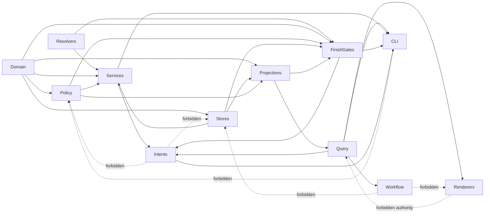
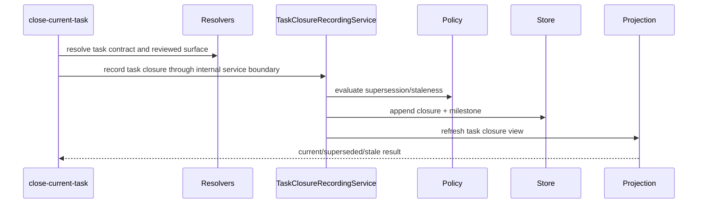
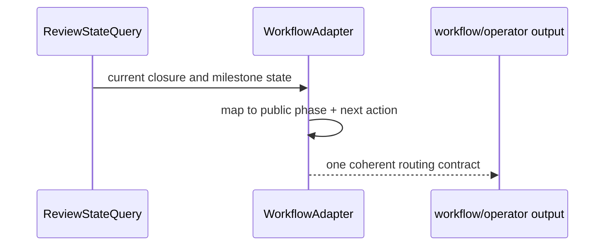
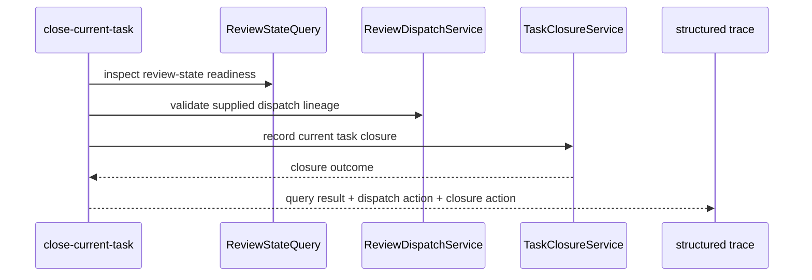
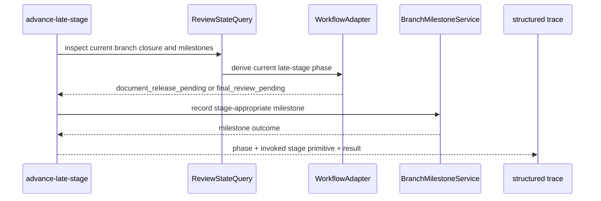
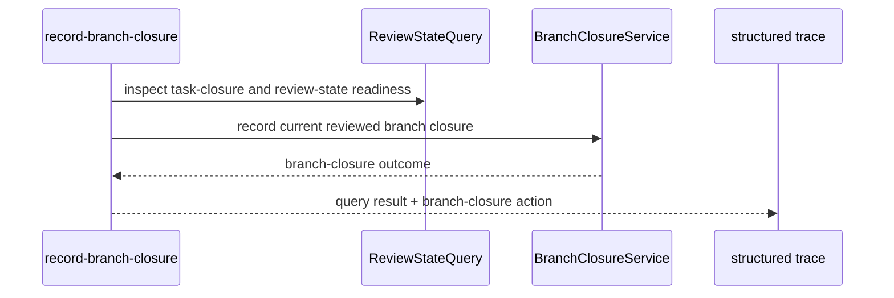
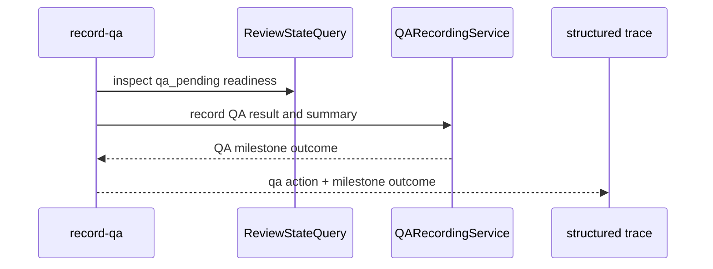

# Execution Runtime Boundary Separation

**Workflow State:** Implementation Target  
**Spec Revision:** 4  
**Last Reviewed By:** clean-context review loop
**Implementation Target:** Current

## Problem Statement

The new supersession-aware model adds architectural concepts that should not be smeared across oversized files:

- closure records
- supersession logic
- stale-unreviewed detection
- milestone recording
- effective current closure computation
- gate/status consumption of current closure state
- repair/reconcile
- routing and public phase derivation

If those responsibilities stay scattered, the project will recreate the same churn under a new vocabulary.

## Desired Outcome

FeatureForge should have clear runtime ownership boundaries so that:

- closure recording is not mixed with routing text
- supersession logic is not mixed with generic status assembly
- milestone recording is not mixed with derived artifact formatting
- reconcile is not mixed with historical proof rewriting
- runtime-owned helper logic is not duplicated across Rust, skills, and generated docs

## Decision

Selected approach: refactor around reviewed-closure ownership after behavior and coverage stabilize.

## Dependency

This spec depends on:

- `2026-04-01-supersession-aware-review-identity.md`
- `2026-04-01-runtime-path-coverage-and-doc-contract-rehab.md`

## Requirement Index

- [REQ-001][behavior] Closure record creation and validation responsibilities must have a dedicated domain-owned boundary.
- [REQ-002][behavior] Reviewed-state and reviewed-surface resolution must be separable from supersession policy, milestone recording, and workflow routing.
- [REQ-003][behavior] Authoritative append-only stores must be separable from read-model/projection building.
- [REQ-004][behavior] Supersession and stale-unreviewed evaluation must be separable from generic gate/status assembly.
- [REQ-005][behavior] Release-readiness and final-review milestone recording must be separable from derived artifact formatting.
- [REQ-006][behavior] Review-state explain/reconcile must be separable from milestone recording and generic status assembly.
- [REQ-007][behavior] Gate/status logic must consume a stable review-state query layer rather than raw stores, markdown artifacts, or ad hoc state scans.
- [REQ-008][behavior] Workflow phase derivation and routing recommendation generation must consume a stable public review-state interface rather than reaching through unrelated execution internals.
- [REQ-009][behavior] Derived artifact parsing and rendering must live behind a compatibility boundary and must not be the primary authority path for gates.
- [REQ-010][behavior] Runtime-owned helper logic for entrypoints, branch/base-branch resolution, and public contract generation must have one clear ownership boundary instead of remaining duplicated across runtime and docs.
- [REQ-011][verification] Public behavior must remain stable through the refactor, protected by end-to-end operator-path coverage.
- [REQ-012][verification] Each architectural layer must have a corresponding test seam so policy can be verified without exercising unrelated filesystem or CLI code.
- [REQ-013][verification] Module boundaries must be documented so future contributors know which file owns which contract surface and which dependency directions are forbidden.
- [REQ-014][behavior] Intent command adapters such as `close-current-task`, `repair-review-state`, and `advance-late-stage` must return structured execution traces and must remain thin over query and service boundaries.

## Scope

In scope:

- module boundary refactor across execution and workflow runtime internals
- ownership documentation
- behavior-preserving extraction of closure, supersession, milestone, gate, reconcile, and routing responsibilities

Out of scope:

- new user-visible workflow semantics beyond the already agreed model
- weakening runtime trust boundaries

## Likely Extraction Targets

### Recommended Component Map

1. closure, milestone, and dispatch record domain
2. reviewed-state / reviewed-surface / repository-context input resolvers
3. authoritative append-only stores
4. projection and effective-current-closure read model
5. supersession / stale-unreviewed evaluator
6. review-dispatch recording and query service
7. task-closure recording service
8. branch milestone recording services
9. QA recording service
10. review-state explain / reconcile service
11. finish-gate evaluation and checkpoint service
12. gate and status query layer
13. workflow phase derivation and routing adapter
14. derived artifact rendering/parsing compatibility boundary
15. runtime-owned contract helper surfaces
16. intent-level aggregate command adapters

## Responsibility Matrix

| Component | Owns | Must Not Own |
| --- | --- | --- |
| Domain model | closure types, milestone types, dispatch types, statuses, identities | git inspection, filesystem IO, CLI flags, markdown |
| Input resolvers | plan parsing, repo/worktree inspection, reviewed-surface normalization, repo slug / branch / base-branch normalization | supersession decisions, routing text, storage |
| Stores | append-only authoritative persistence | routing, markdown, policy |
| Projections | effective current closure views, milestone indexes, query-friendly state | mutation orchestration, CLI formatting |
| Policy | supersession and stale-unreviewed transitions | persistence, rendering, routing |
| Recording services | mutation orchestration for dispatch, task, branch, and QA records | CLI parsing, markdown authoring, routing text |
| Finish-gate service | `gate-review` evaluation, finish-gate checkpoint recording/refresh, `gate-finish` evaluation | dispatch lineage, task/branch/release/final-review/QA recording |
| Reconcile service | explain + rebuild derived truth from authoritative records | ad hoc workflow copy, direct renderer authority |
| Query layer | status/gate-ready read interface, including `finish_review_gate_pass_branch_closure_id` exposure | mutation, markdown, CLI parsing |
| Workflow adapter | public phases and next-action mapping | closure mutation or storage internals |
| Renderer compatibility layer | markdown/report emission and legacy parsing | gate truth |
| Intent command adapters | aggregate agent-facing sequences such as task close, review-state repair, and late-stage advance; structured trace assembly | supersession policy, raw store access, hidden truth |

## Dependency Diagram

The forbidden arrows matter. Without them, implementation convenience will collapse the architecture back into giant mixed files.

## Dependency Rules

The refactor should enforce these dependency directions:

1. Domain types must not depend on workflow, CLI, markdown, git invocation, or persistence details.
2. Input resolvers may depend on git/worktree/plan readers, but must return normalized domain inputs and no public workflow phrasing.
3. `RepositoryContextResolver` is the named owner for normalized repo slug, branch identity, and base-branch bindings consumed by branch closure, release-readiness, final review, QA, and workflow/operator.
4. Stores and projections may depend on persistence/serialization, but must not own supersession policy or routing text.
5. Policy/evaluator code must depend on domain inputs only.
6. Recording, finish-gate, and reconcile services may depend on resolvers, stores, and policy, but must not own CLI formatting or workflow copy.
7. `gate-review` may mutate only the runtime-owned finish-gate checkpoint for the still-current branch closure it just validated; it must not write any other authoritative milestone or dispatch record.
8. Gate/status query code may depend on projections, policy, and the finish-gate checkpoint view, but must not parse rendered receipts as the truth path.
9. Workflow routing may depend on the public review-state query interface only.
10. Derived artifact renderers/parsers may depend on domain/query outputs, but nothing authoritative may depend on them for correctness.
11. Intent command adapters may depend on query and service interfaces only; they must not bypass those interfaces to reach raw storage or policy.
12. Intent command adapters must return machine-readable traces of delegated validations, mutations, and blockers so workflow/skills do not reconstruct that information in prose.

## Ownership Decision For The Public Query Interface

The public review-state query interface should be owned by the execution runtime, not by workflow.

Reason:

- execution owns the authoritative closure records, milestones, projections, and supersession semantics
- workflow should translate state into phases and recommendations, not reconstruct state truth

Chosen boundary:

1. execution owns the `ReviewStateQuery` interface and its backing projections
2. workflow depends on that interface as a consumer only
3. workflow may add phase/routing adapters, but it must not become a second owner of review-state semantics

## Testability Rules

1. Domain and supersession policy must be testable in pure unit tests.
2. Store and projection logic must be testable with append-only fixture records.
3. Recording and reconcile services must be testable with fake resolvers and stores.
4. Workflow routing must be testable from public review-state fixtures, not from full execution state construction.
5. CLI end-to-end tests must prove orchestration through the public surface, not substitute for lower-level policy tests.
6. Compatibility tests for rendered markdown must be isolated so they cannot masquerade as proof that the runtime workflow works.
7. Aggregate command adapters must have direct orchestration tests that prove they delegate to the right query and service seams without owning hidden policy.

## Intent Adapter Rules

The aggregate command layer is part of the public runtime surface, not a private convenience wrapper.

That means:

1. `close-current-task` owns task-close orchestration only.
2. `repair-review-state` owns review-state inspect/reconcile orchestration only.
3. `record-branch-closure` owns branch-closure recording orchestration only.
4. `advance-late-stage` owns release-readiness and final-review progression orchestration only. It does not own QA.
5. `record-qa` owns QA milestone recording orchestration only.
6. none of those commands may embed a second supersession engine, a second routing engine, or direct store mutation logic.
7. each adapter must emit a structured trace that names the delegated query/service actions it ran and the blocker, if any, that stopped progress.
8. `advance-late-stage` must emit a discriminated aggregate payload keyed by `stage_path`, including the delegated primitive name and the shared trace contract, so consumers do not infer which late-stage path ran from prose.

## Example Interaction Slices

### Slice A: Task Closure Recording

### Slice B: Workflow Routing

The second slice is important because workflow should consume prepared public state, not rediscover closure semantics itself.

### Slice C: Aggregate Task Close

### Slice D: Aggregate Late-Stage Advance

### Slice E: Explicit Branch Closure Recording

### Slice F: QA Phase

## Extensibility Rules

1. Adding a new milestone type should not require editing supersession policy unless the milestone changes closure semantics.
2. Adding a new workflow phase should not require editing closure storage or milestone record builders.
3. Adding a new renderer or report format should not require editing gate logic.
4. Adding a new repo-state resolver should not require editing workflow routing text.
5. New runtime-owned helpers must have a single implementation boundary that docs and skills reference rather than re-encode.
6. Adding a new aggregate command should not require reopening domain policy; it should compose existing query and service interfaces.

## Acceptance Criteria

1. Public behavior remains unchanged under the new module layout.
2. Closure-model changes no longer require edits across unrelated routing and artifact-formatting files.
3. Reconcile changes no longer require edits across unrelated gate/status logic.
4. Workflow phase changes no longer require editing closure-record builders.
5. Runtime-owned helper logic no longer requires parallel edits across Rust, skills, and generated docs.
6. Contributors can identify ownership for each runtime contract surface from code layout plus docs.
7. Gates and workflow routing consume stable read/query interfaces rather than reaching into storage or artifact internals.
8. Pure policy logic is testable without CLI or filesystem setup.
9. Agent-facing aggregate commands compose existing query and service interfaces instead of becoming a second hidden runtime core.
10. Aggregate command adapters remain replaceable orchestration layers rather than becoming mandatory hidden dependencies for lower-level primitives.

## Test Strategy

- rely on the behavioral coverage established in the coverage rehab unit
- keep focused module tests for extracted closure, resolver, projection, supersession, and milestone logic
- add query-layer tests for gate/status behavior over review-state fixtures
- add workflow-adapter tests that depend only on public review-state fixtures
- add intent-adapter tests for `close-current-task`, `repair-review-state`, and `advance-late-stage`
- add ownership-oriented comments or docs where needed

## Risks

- doing this before behavioral coverage exists will hide regressions
- extracting by convenience instead of ownership will preserve the same coupling under smaller file names

## Compatibility Migration Rule

Compatibility parsing for legacy artifacts should be treated as temporary migration adapter code, not a permanent co-equal boundary.

Removal rule:

1. keep compatibility parsing only while legacy markdown artifacts still need to be accepted or regenerated during migration
2. once the runtime and active skills fully consume authoritative records and generated derivatives, remove the legacy parser path
