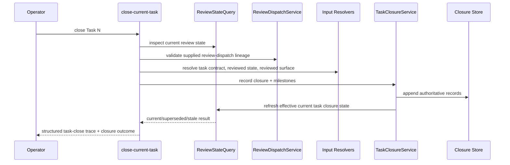

# Execution Task Closure On Current Reviewed Closures

**Workflow State:** Implementation Target  
**Spec Revision:** 4  
**Last Reviewed By:** clean-context review loop
**Implementation Target:** Current

## Problem Statement

FeatureForge currently blocks Task `N+1` begin on a brittle set of artifacts tied to old attempt provenance:

- review-dispatch lineage
- per-step unit-review receipts
- task-verification receipts
- packet fingerprint provenance
- reviewed checkpoint SHA provenance

That makes later legitimate changes to earlier reviewed code expensive, because the runtime keeps asking old proof to remain current instead of letting later reviewed work supersede it.

## Desired Outcome

Task advancement should depend on a **current reviewed task closure**, not on the permanent freshness of old per-attempt proof.

After this work:

- task closure is recorded through one public runtime-owned primitive and one preferred aggregate agent-facing command
- the runtime owns the authoritative task closure record
- older overlapping task closures can be superseded by later reviewed work
- human-readable receipts remain optional derivatives, not the primary gate truth
- next-task advancement depends on effective current closure state

## Decision

Selected approach: replace receipt-first task closure with a task-closure record flow that records one current reviewed task closure and optional derived artifacts.

## Dependency

This spec depends on:

- `2026-04-01-supersession-aware-review-identity.md`
- `2026-04-01-gate-diagnostics-and-runtime-semantics.md`
- `2026-04-01-workflow-public-phase-contract.md`

## Requirement Index

- [REQ-001][behavior] FeatureForge must provide a public runtime command surface for recording a task closure against the current reviewed task state.
- [REQ-002][behavior] The authoritative result of task closure must be a runtime-owned task closure record, not a hand-authored markdown artifact.
- [REQ-003][behavior] The task closure record must bind at least task contract identity, reviewed state identity, reviewed surface, review provenance, and verification provenance.
- [REQ-004][behavior] The runtime may emit unit-review and task-verification receipts as derived artifacts, but gates must not require those derived artifacts as the only primary truth surface.
- [REQ-005][behavior] The runtime must automatically supersede older overlapping task closures when later reviewed work replaces the earlier reviewed surface.
- [REQ-006][behavior] Post-review unreviewed changes that overlap a current task closure must mark it stale instead of forcing old proof surgery.
- [REQ-007][behavior] Blocked validation or dispatch paths must fail closed before mutating strategy or cycle state.
- [REQ-008][behavior] Re-running task closure for the same effective reviewed state must be safe and idempotent.
- [REQ-009][behavior] Command output must clearly report whether the result is `current`, `superseded`, `stale_unreviewed`, or blocked.
- [REQ-010][behavior] Task-closure recording must be owned by a dedicated recording service that consumes resolved domain inputs and authoritative stores rather than embedding closure policy in CLI code or derived receipt writers.
- [REQ-011][behavior] FeatureForge must expose `close-current-task` as the preferred aggregate agent-facing command for normal task-closing flow, with task-closure persistence owned by a lower-level runtime service boundary rather than a first-slice public fallback CLI.
- [REQ-012][behavior] Negative task-review or task-verification outcomes must be recorded as authoritative milestone truth but must not create a `current` task closure; the runtime must return `required_follow_up=execution_reentry` by default and must return `record_handoff` or `record_pivot` instead when an explicit authoritative handoff or pivot override is already in force for that next-safe action.
- [REQ-013][verification] Integration tests must prove Task `N+1` can begin through current reviewed task closure state, that later reviewed overlap can supersede Task `N` without rewriting old proof, and that failed review or verification returns execution reentry without recording a `current` closure.

## Scope

In scope:

- public task-closure recording command
- runtime-owned task closure records
- derived receipt generation where still useful
- supersession behavior for overlapping later reviewed work
- next-task advancement through effective current closure state

Out of scope:

- changing dedicated-independent review policy itself
- redesigning execution topology
- removing all human-readable receipts if they still add audit value

## Selected Approach

Add one preferred aggregate agent-facing command:

- `featureforge plan execution close-current-task --plan <path> --task <n> ...`

`close-task-boundary` may remain only as a compatibility alias during migration if needed, but the preferred agent-facing surface should be `close-current-task`.

The aggregate command must:

1. inspect current review state
2. validate explicit review-dispatch lineage for the supplied `dispatch_id`
3. record task-review and task-verification milestones from explicit operator inputs
4. delegate to the task-closure recording service
5. refresh the effective current task-closure view
6. return a structured trace of what it validated, recorded, and refused to do

The internal task-closure recording service boundary must:

1. validate that the task is complete enough to close
2. assume review-dispatch lineage has already been recorded or has been supplied by the aggregate layer
3. consume explicit task-review and task-verification milestone references
4. record one current task closure against the current reviewed state
5. optionally emit derived unit-review and task-verification receipts
6. mark older overlapping task closures superseded when appropriate
7. return structured closure state

## Task Closure Flow

## Command Responsibilities

`close-current-task` should do five things only:

1. gather operator inputs
2. query current review-state truth
3. validate the supplied review-dispatch checkpoint and invoke task-closure services through supported interfaces
4. optionally request derived artifact rendering
5. return structured state plus a trace to the operator

It must not:

- create hidden review truth
- bypass the query or recording services
- compute supersession policy inline
- author receipts inline
- decide workflow routing inline
- mutate unrelated cycle or strategy state before blocked validation succeeds

The runtime-owned task-closure recording service boundary should remain available for lower-level flows, testing, compatibility, and debugging. It is not a first-slice public CLI path, and skills must not teach it as an operator-facing fallback once `close-current-task` exists.

## Aggregate Command Contract

`close-current-task` should return at least:

- top-level `action`: `recorded` | `already_current` | `blocked`
- requested task number
- `dispatch_validation_action`: `validated` | `blocked`
- `closure_action`: `recorded` | `already_current` | `blocked`
- resulting task-closure status
- superseded closure ids if any
- `required_follow_up` when the task cannot yet proceed to a current closure
- `trace[]` or `trace_summary`

Top-level `action` mapping rule:

- `action=recorded` when `closure_action=recorded`
- `action=already_current` when `closure_action=already_current`
- `action=blocked` when `dispatch_validation_action=blocked` or `closure_action=blocked`

For `close-current-task`, blocked follow-up values are:

- `record_review_dispatch`
- `repair_review_state`
- `execution_reentry`
- `record_handoff`
- `record_pivot`

If the direct command is invoked out of phase and the exact next safe step is not deterministically one of those blocked follow-ups, the runtime must return the shared out-of-phase response contract defined by `2026-04-01-gate-diagnostics-and-runtime-semantics.md`. In that case, `dispatch_validation_action` and `closure_action` must both be `blocked` so the command-specific envelope does not contradict the top-level `action=blocked`.

`closure_action=already_current` means:

- the same still-current reviewed state already has an equivalent recorded task closure for the same task, resolved contract identity, and supplied `dispatch_id`
- equivalent means same still-current reviewed state, same resolved contract identity, same `dispatch_id`, same `review_result`, same normalized review summary content as produced by the shared runtime-owned `SummaryNormalizer`, same `verification_result`, and same normalized verification summary content as produced by that same shared normalizer
- no duplicate current task closure or duplicate task-scope milestone pair was appended

If the reviewed state and `dispatch_id` are the same but one or more equivalence inputs differ, the runtime must fail closed with `closure_action=blocked`, emit a validation error for conflicting same-state rerun inputs, and append no new task closure or replacement milestone pair.

## Review-Dispatch Lineage Boundary

Review-dispatch lineage is a mutating checkpoint surface and should be named accordingly.

Chosen public boundary:

- `featureforge plan execution record-review-dispatch --plan <path> --scope task --task <n>`
- `featureforge plan execution record-review-dispatch --plan <path> --scope final-review`

Migration boundary:

1. `record-review-dispatch` is the canonical mutating command name for the supersession-aware model
2. `gate-review-dispatch` may remain as a compatibility alias temporarily
3. `gate-review` must not mint dispatch lineage; its only allowed mutation is the separate runtime-owned finish-gate checkpoint described by the gate semantics spec
4. blocked validation must fail before any review-dispatch checkpoint mutation occurs

This removes the predicate-style naming trap while preserving a migration path for existing operator habits and older docs.

Chosen dispatch-scope rule:

- `record-review-dispatch --scope task` normalizes to persisted/query `scope_type=task`
- `record-review-dispatch --scope final-review` normalizes to persisted/query `scope_type=final_review`
- the shared `DispatchScopeNormalizer` owns that conversion; command-local enum drift is not allowed

Canonical return contract:

- `dispatch_id`
- `scope`
- `action`
- `recorded_at`

Allowed `record-review-dispatch` action values:

- `recorded`
- `already_current`
- `blocked`

A dispatch record is valid only when all of these remain true:

1. its scope matches the requested scope and scope key
2. it binds to the same current reviewed state id the runtime still trusts for that scope
3. it has not been invalidated by later reviewed-state movement that made the relevant closure stale or missing

If the same dispatch intent is recorded again against the same still-current reviewed state, the command must return `action=already_current` rather than minting duplicate dispatch lineage.

If the direct command is invoked out of phase and the exact next safe step is not deterministically dispatch recording for the requested scope, the runtime must return the shared out-of-phase response contract defined by `2026-04-01-gate-diagnostics-and-runtime-semantics.md`.

`close-current-task` and final-review recording surfaces should accept that `dispatch_id` explicitly rather than relying on hidden ambient state.

Chosen ownership rule:

- `close-current-task` MUST validate the supplied `dispatch_id`
- `close-current-task` MUST NOT record a missing review-dispatch checkpoint on behalf of the operator
- recording dispatch remains the responsibility of `record-review-dispatch`

## Public Contract

The authoritative output is a task closure record containing at least:

- source plan path and revision
- task number
- execution run id
- reviewed state id
- reviewed surface
- review milestone reference
- verification milestone reference
- closure status
- supersedes / superseded_by lineage

Operator-facing aggregate input contract:

`close-current-task` must accept at least:

- `--plan <path>`
- `--task <n>`
- `--dispatch-id <dispatch-id>`
- `--review-result pass|fail`
- `--review-summary-file <path>`
- `--verification-result pass|fail|not-run`
- `--verification-summary-file <path>` when `--verification-result` is `pass` or `fail`

`close-current-task` must fail closed unless all of these are true:

1. `phase=task_closure_pending`
2. `review_state_status` is `clean`
3. a valid explicit task-scope dispatch record exists for the supplied `dispatch_id`
4. the supplied dispatch still binds to the same still-current reviewed state the runtime trusts for that task
5. when workflow/operator is queried with `--external-review-result-ready`, the corresponding routed substate is `task_closure_recording_ready`

The aggregate command validates those underlying truth conditions directly. It does not require the caller to persist a prior workflow/operator response, but the public routing surface must expose `task_closure_recording_ready` when those same conditions are queried through workflow/operator with `--external-review-result-ready`.

Internal service contract:

The runtime-owned task-closure recording service must accept at least:

- resolved plan path and revision
- task number
- resolved task `contract_identity`
- canonical current `reviewed_state_id`
- effective reviewed surface
- authoritative task-review milestone id
- authoritative task-verification milestone id
- validated `dispatch_id`

The runtime-owned task-closure recording service must return at least:

- `action`: `recorded` | `already_current` | `blocked`
- `task_number`
- `closure_record_id` when current
- `superseded_task_closure_ids[]`
- `trace[]` or `trace_summary`

The aggregate command owns conversion from operator-supplied review and verification evidence into authoritative milestone records. The internal service owns closure recording once those milestone ids exist.

Chosen verification policy for the first slice:

- a passing current task closure requires `--verification-result pass` unless the runtime introduces an explicit future verification-optional policy surface for that task
- `--verification-result not-run` is accepted only when no current task closure can be recorded because review already failed before verification ran
- a passing current task closure with `--verification-result not-run` must fail closed in the first slice

The runtime supplies:

- current reviewed state identity
- contract identity
- derived artifact naming
- authoritative mutation ordering

The command surface should remain a thin adapter over a dedicated task-closure recording service plus a query/read-model layer.

`task_review_result_pending` is an external-input wait state, not a hidden runtime latch. While the reviewer has not yet returned a result to the caller, workflow/operator omits `recommended_command`. When the caller reruns workflow/operator with `--external-review-result-ready`, the public routed substate becomes `task_closure_recording_ready` and the exact next mutation command becomes `close-current-task` for that same dispatch lineage.

## Negative Result Handling

`close-current-task` must define failure outcomes explicitly:

1. `--review-result fail` must record an authoritative failed task-review milestone from the supplied summary input.
2. `--verification-result fail` must record an authoritative failed task-verification milestone from the supplied summary input.
3. If either supplied result is `fail`, the runtime must not record a `current` task closure for the task.
4. Those failed task-scope milestones must remain authoritative audit truth with `closure_record_id=null`, bound instead to the supplied `dispatch_id` and the reviewed state the runtime validated for that dispatch.
5. If either supplied result is `fail`, the aggregate command must return `closure_action=blocked` and:
   - `required_follow_up=execution_reentry` when normal execution repair is the next safe action
   - `required_follow_up=record_handoff` when an authoritative handoff override is already in force
   - `required_follow_up=record_pivot` when an authoritative pivot override is already in force
   - the command must choose among those values by consulting authoritative workflow query field `follow_up_override = none|record_handoff|record_pivot`, not by command-local heuristics
6. Failed milestone recording must remain append-only audit truth; the runtime must not silently overwrite a prior passing milestone or fabricate a replacement passing closure.
7. A later successful closure attempt may create a new `current` task closure only after new reviewed state and passing milestone inputs are supplied.
8. `--verification-result not-run` is valid only when review failure prevented verification from running; it must not be used to create a passing current closure in the first slice.

## Next-Task Gating Rule

The gating rule should be explicit:

1. Beginning Task `N+1` requires Task `N` to have a current, non-stale task closure.
2. Earlier historical tasks do not need to remain `current` forever if later reviewed work superseded them.
3. `superseded` is acceptable historical lineage, not a gating defect by itself.
4. `stale_unreviewed` is not acceptable for the task whose closure is being relied on next.
5. Gates reason over the effective closure set, not over the perpetual freshness of every old task artifact.

## Concrete Examples

### Example 1: Normal Task Closure

Scenario:

- Task 1 is complete
- the branch still matches the reviewed state used for Task 1 review
- verification passed

Expected result:

- `close-current-task` validates the supplied review-dispatch lineage, records task-review and task-verification milestones from explicit inputs, then records one `current` task closure
- Task 2 can begin without any manual unit-review or task-verification receipt authoring

### Example 2: Task 2 Review Changes Task 1 Files

Scenario:

- Task 1 reviewed `src/a.rs`
- Task 2 later changes `src/a.rs` and is reviewed

Expected result:

- Task 2 closure becomes `current`
- Task 1 closure becomes `superseded`
- the runtime does not ask the operator to repair Task 1 fingerprints or synthesize new Task 1 receipts

### Example 3: Post-Review Edit Before Closure Recording

Scenario:

- Task 1 review completed
- an additional unreviewed fix lands before `close-current-task`

Expected result:

- `close-current-task` returns blocked or `stale_unreviewed` against the older reviewed state
- explicit instruction that execution reentry is required first; once execution stabilizes again, workflow/operator must return to task review dispatch before a new closure attempt can succeed
- no hidden rewrite of the old reviewed state into current truth

### Example 4: Task Review Fails

Scenario:

- Task 3 implementation is complete
- a task review is dispatched and returns `fail`
- verification may or may not have already run

Expected result:

- `close-current-task --review-result fail ...` records the failed review milestone
- the runtime does not create a `current` task closure for Task 3
- command output returns the authoritative `required_follow_up`, normally `execution_reentry` and exceptionally `record_handoff` or `record_pivot` when one of those overrides is already in force
- the task remains in reentry/remediation flow until a new reviewed state is recorded with passing review and verification inputs

If verification did not run before the review failed, the negative task-close command must use `--verification-result not-run` and omit `--verification-summary-file`.

## Acceptance Criteria

1. A completed task can be closed through public CLI without direct artifact writes under `~/.featureforge`.
2. The runtime records one current task closure instead of requiring old packet/file proof to remain the main gate surface forever.
3. Later reviewed work that overlaps the earlier task surface can supersede the earlier task closure cleanly.
4. Unreviewed post-review changes surface as stale task closure state, not hidden drift or rewritten proof.
5. Command output explains what became current, what was superseded, and what remains stale or blocked.
6. Task-closure policy remains testable outside the CLI and outside derived receipt rendering.
7. `close-current-task` is the documented first-choice agent-facing command and delegates to supported runtime seams only.
8. Failed task review or failed task verification records authoritative failed milestone truth without creating a `current` closure and returns execution reentry.

## Derived Receipt Policy

Chosen default:

1. authoritative task closure and milestone records are always persisted
2. derived unit-review and task-verification receipts are emitted only when explicitly requested or when a temporary compatibility mode is enabled
3. default task closure should not generate markdown churn unnecessarily

This keeps receipts available for migration without making them the default operational truth path.

## Test Strategy

- add a CLI-only happy-path test for Task 1 closure then Task 2 begin
- add a CLI-only happy-path test for `close-current-task`
- add a supersession test where Task 2 changes Task 1 surface and reviewed Task 2 supersedes the earlier Task 1 closure
- add a stale-unreviewed test where post-review changes invalidate the current task closure until a new review closes it
- add a blocked-path test proving failed validation does not mutate strategy checkpoint or cycle-count state
- add a negative-path test where `--review-result fail` and one where `--verification-result fail` both record failed milestones, leave the task without a `current` closure, and return the authoritative `required_follow_up`
- add a validation test proving `--verification-result not-run` cannot create a passing current closure in the first slice
- keep narrow parser/receipt tests only as derivative-artifact tests, not as the primary proof of task closure behavior

## Risks

- keeping derived receipts as the only primary gate truth would preserve the current dead end
- dropping machine-bound reviewed state identity for task closure would make supersession impossible to validate
