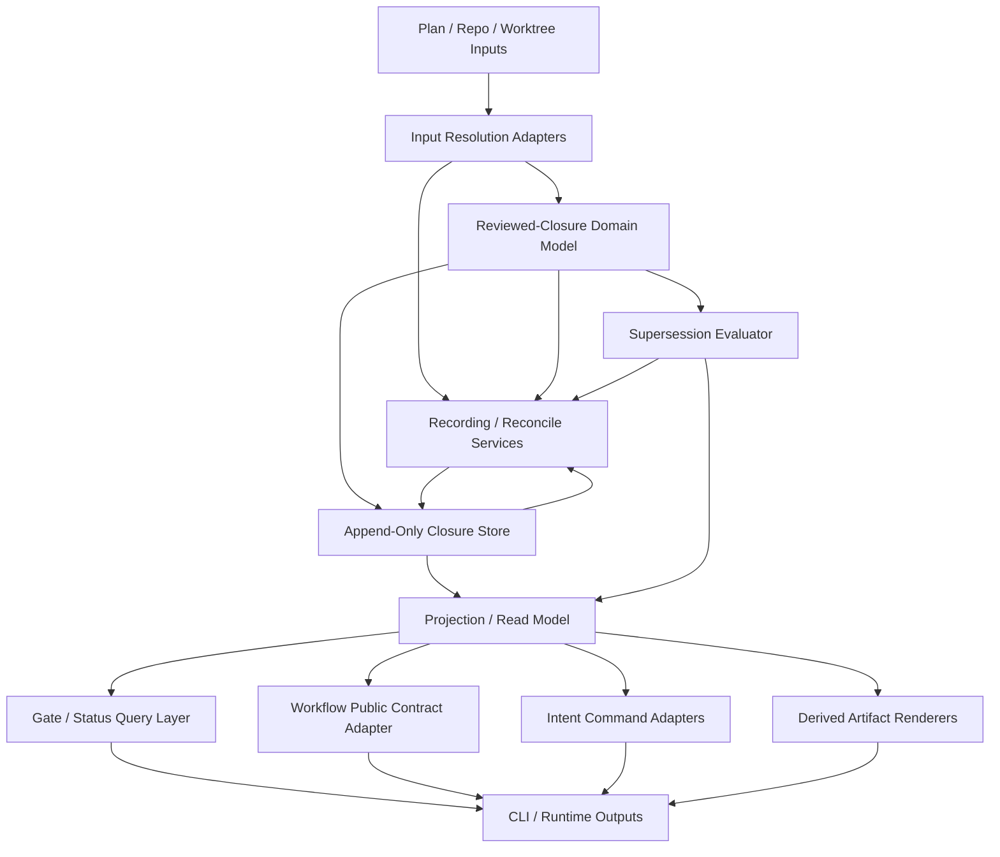
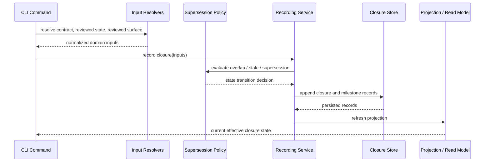

# Supersession-Aware Review Identity

**Workflow State:** Implementation Target  
**Spec Revision:** 3  
**Last Reviewed By:** clean-context review loop
**Implementation Target:** Current

## Problem Statement

FeatureForge currently treats too much proof as if it remains authoritative forever:

- per-attempt packet fingerprints
- per-file proof fingerprints
- task-boundary receipts that must keep matching old attempt provenance
- late-stage markdown artifacts that are validated back into truth

That model is expensive after rebases, review-driven remediation, and later tasks that legitimately change earlier reviewed code.

The real question the runtime needs to answer is simpler:

- what is the current reviewed closure state we rely on now
- what earlier reviewed state was superseded by later reviewed work
- what current reviewed state became stale because unreviewed changes landed afterward

The current model answers that badly because it keeps preserving obsolete proof as if it still deserves currency.

## Desired Outcome

FeatureForge should treat **current reviewed closure** as the authoritative proof surface.

After this work:

- plan checkboxes remain workflow progress, not authority
- runtime-owned closure records become the primary gate truth
- later reviewed work can supersede earlier reviewed work cleanly
- unreviewed post-review changes mark current closures stale
- historical proof remains auditable without being treated as current
- repair becomes append-only supersession and reconcile instead of proof rewriting
- new superseding closures are recorded only through dedicated closure-recording flows, not by repair
- agents use a small explicit intent-level command layer instead of reassembling runtime-owned sequences by hand

## Decision

Selected approach: introduce a runtime-owned supersession-aware review identity model centered on closure records and effective current reviewed state.

## Implementation Target Baseline

This April supersession-aware corpus is the intended implementation target for the future architecture handoff.

The March 2026 specs and plans that introduced `gate-review-dispatch` and `rebuild-evidence` remain historical and useful for provenance, but they are no longer normative for the implementation target after this architectural pivot.

The machine-readable human-facing index for the active implementation-target corpus lives in [ACTIVE_IMPLEMENTATION_TARGET.md](ACTIVE_IMPLEMENTATION_TARGET.md). Historical March specs that still live under the same directory are not normative unless they are listed there.

## Core Model

### Closure Record

A closure record is the authoritative runtime-owned record that a task scope or branch scope was reviewed and verified in a particular state.

Each closure record must bind:

- closure scope
- contract identity
- reviewed state identity
- reviewed surface
- review milestone where the closure itself is directly reviewed
- verification milestone where the closure itself is directly verified
- source closure lineage when the closure is derived from already-reviewed lower-scope closures rather than from a direct scope-local review
- supersession lineage
- current status

### Current Status Vocabulary

Closure records must support at least:

- `current`
- `superseded`
- `stale_unreviewed`
- `historical`

`historical` is retained for audit. `current` is what gates trust.

### Contract Identity

The contract identity says what approved unit of work the closure is satisfying.

For task closures, this should be based on stable runtime-owned task contract identity such as:

- approved plan path
- approved plan revision
- task number
- step or execution unit identity where needed

For branch closures, this should be based on stable runtime-owned branch contract identity such as:

- approved plan path
- approved plan revision
- repo slug
- branch identity
- base branch where applicable

This deliberately avoids making packet fingerprints the primary long-lived authority surface.

### Reviewed State Identity

The reviewed state identity is the machine-checkable answer to:

- what exact code or branch state was reviewed

The reviewed-state identity should use one generic field across the runtime:

- `reviewed_state_id`

That field should be opaque at the API level. Input and diagnostic values are typed by convention:

- `git_commit:<sha>`
- `git_tree:<sha>`
- `runtime_snapshot:<id>`

Chosen rule:

1. repo-writing workflows use one generic `reviewed_state_id` field everywhere
2. first-slice authoritative equality, currentness, supersession, and idempotency use canonical `git_tree:<sha>` identity
3. `git_commit:<sha>` is accepted only as an input or diagnostic alias that the runtime resolves to the underlying tree before comparison or persistence
4. non-repo or mixed-runtime flows may use another runtime-owned immutable variant such as `runtime_snapshot:<id>`

The public API should not fork into separate repo-specific and non-repo-specific fields. One generic field with typed values is the cleaner contract.

For repo-writing workflows in the first slice, authoritative stored and compared `reviewed_state_id` values canonicalize to `git_tree:<sha>`. Commit-form identifiers remain accepted only as input or diagnostic aliases that resolve to that canonical tree identity first.

This model does **not** drop machine-bound identity. It drops the assumption that every old per-attempt proof must remain current forever.

Chosen workspace-state rule:

- public fields such as `workspace_state_id` and `observed_workspace_state_id` use the same typed identity family as `reviewed_state_id`
- repo-writing workflows derive workspace-state identity from normalized repo-tracked content only; untracked files do not change `workspace_state_id`
- `git_commit:<sha>` is used when the observed workspace matches a commit exactly
- `git_tree:<sha>` or `runtime_snapshot:<id>` is used when the observed workspace is machine-checkable but not represented by a commit yet

First implementation slice decision:

- the initial implementation scope supports repo-writing workflows only
- the only supported typed forms in that slice are `git_commit:<sha>` and `git_tree:<sha>`
- non-repo variants such as `runtime_snapshot:<id>` remain future-extension material and are out of scope for the first delivery slices

### Reviewed Surface

The reviewed surface says what area of the repo or branch closure this record covered.

It is not optional metadata. It is part of the authority model because supersession depends on it.

The reviewed surface must be computed as a normalized union of:

1. **declared surface**
   Derived from approved plan task file blocks, task scope declarations, and any explicit closure-scope declarations the runtime already trusts.
2. **observed surface**
   Derived from runtime-observed writes, reconciled repo diff from prior reviewed state to current reviewed state, and any runtime-owned scope expansion that the execution actually touched.

The union rule is deliberate:

- plan declarations alone are too weak because real execution can touch more than was declared
- observed writes alone are too weak because some reviewed obligations are about declared scope even when no final diff survives

So the runtime must normalize both into one effective reviewed surface. Supersession decisions rely on overlap within that effective surface plus reviewed state advancement.

Chosen atomicity rule for the first slice:

- a `ClosureRecord` is the smallest authoritative review-identity unit; the runtime must not split one closure record into partially current and partially superseded fragments
- if later reviewed work overlaps any part of an earlier closure record’s effective reviewed surface and becomes authoritative for that overlap, the earlier closure record becomes `superseded` as a whole for public query and gating purposes
- if teams need non-overlapping residue to survive independently, that work must live in a separate closure record from the start rather than relying on post-hoc record splitting

Chosen late-stage declared-surface rule:

- late-stage branch-only reclosure is allowed only for repo-tracked edits confined to a trusted late-stage declared surface
- in the first slice, that trusted source is normalized approved-plan metadata field `Late-Stage Surface`
- if `Late-Stage Surface` is omitted, the trusted late-stage declared surface is empty and repo-tracked edits after task closure require execution reentry unless they are already covered by current task-closure truth
- in the first slice, this is an explicit policy exemption from requiring a new branch-scope review milestone; trust for that recreated current branch closure derives from the still-current source task closures plus the approved `Late-Stage Surface`, not from a synthetic branch-scope review

Chosen late-stage surface matching rule:

- `Late-Stage Surface` entries normalize to repo-relative, slash-separated paths after trimming whitespace and removing any leading `./`
- entries must not be empty and must not contain absolute roots, backtracking segments such as `..`, or glob syntax; invalid entries fail closed
- entries ending in `/` are directory prefixes and match all repo-tracked descendant paths under that normalized prefix
- entries without a trailing `/` match one exact normalized repo-relative path
- matching is case-sensitive and is evaluated against normalized git-style repo paths; command-local path heuristics are not allowed

Chosen summary normalization rule:

- the runtime owns one `SummaryNormalizer` used by idempotency checks across task closure, release-readiness, final review, and QA
- `SummaryNormalizer` decodes summary input as UTF-8 text, normalizes line endings to `\\n`, trims trailing horizontal whitespace on each line, and trims leading and trailing blank lines
- internal line order and non-whitespace content are preserved
- “same normalized summary content” means byte-for-byte equality after that single shared normalization step

Chosen QA requirement normalization rule:

- the runtime owns one `PolicyMetadataNormalizer` for `QA Requirement`
- `QA Requirement` is normalized by trimming surrounding whitespace and lowercasing ASCII letters
- only `required` and `not-required` are accepted normalized values
- missing values, empty values, or any other token fail closed

Chosen repository-context binding rule:

- repo slug, branch identity, and base branch are authoritative runtime-owned bindings, not operator-supplied free text
- in the first slice, one named `RepositoryContextResolver` owns normalization of those bindings from the active plan/worktree/repository context
- branch closure, release-readiness, final review, QA, and workflow/operator must all consume that same normalized repository-context output instead of re-deriving those fields independently
- `RepositoryContextResolver` must resolve repo slug from one authoritative repository binding for the active plan/worktree context; ambiguity or absence fails closed
- `RepositoryContextResolver` must resolve branch identity from the active worktree branch for the plan context; detached-head or ambiguous branch identity fails closed
- `RepositoryContextResolver` must resolve base branch from one authoritative branch-tracking or plan/workflow binding; if that value is required for the current command and cannot be resolved unambiguously, the runtime must fail closed
- command-local fallback parsing or silent defaulting for repo slug, branch identity, or base branch is not allowed

Chosen generated-by identity rule:

- `generated_by_identity` is runtime-owned and never operator-supplied
- the first-slice normalized format is lower-case ASCII `featureforge/<producer>`
- first-slice allowed values are `featureforge/release-readiness` and `featureforge/qa`
- any other value fails closed

Chosen dispatch-scope normalization rule:

- CLI dispatch scope tokens are `task` and `final-review`
- persisted/query enum values are `task` and `final_review`
- one shared `DispatchScopeNormalizer` owns conversion between CLI tokens and persisted/query values
- command-local free-form scope parsing is not allowed

## Requirement Index

- [REQ-001][behavior] FeatureForge must introduce a runtime-owned closure record model for task and branch scopes.
- [REQ-002][behavior] Closure records must bind one contract identity and one reviewed state identity.
- [REQ-003][behavior] Closure records must track reviewed surface information sufficient for overlap and supersession decisions.
- [REQ-004][behavior] Later reviewed work that overlaps and replaces earlier reviewed work must be able to supersede the earlier closure automatically.
- [REQ-005][behavior] Unreviewed changes after a current reviewed closure must mark that closure `stale_unreviewed` rather than silently refreshing or rewriting old proof.
- [REQ-006][behavior] Historical reviewed closures must remain auditable and append-only even after they are superseded.
- [REQ-007][behavior] Gates must reason over the effective current closure set rather than requiring every old closure artifact to remain current forever.
- [REQ-008][behavior] Human-readable receipts and artifacts may remain, but they must be treated as derived outputs of runtime-owned records rather than the primary gate truth.
- [REQ-009][behavior] Per-file content proofs may remain as drift diagnostics or repair hints, but they must no longer be the primary long-lived authority surface for reviewed state.
- [REQ-010][verification] Tests must prove current, superseded, stale-unreviewed, and historical closure transitions under later reviewed work and post-review unreviewed changes.
- [REQ-011][behavior] The public operator surface must expose a small intent-level aggregate command layer for the most common reviewed-closure intents without creating a second authority model.
- [REQ-012][behavior] Aggregate commands must compose the same recording, reconcile, query, and policy services used by lower-level runtime primitives rather than embedding duplicate authority logic.

## Scope

In scope:

- closure record model
- current/superseded/stale/historical state model
- contract identity and reviewed state identity semantics
- reviewed surface overlap model
- effective current closure computation
- derived-artifact relationship

Out of scope:

- exact final CLI naming for every downstream command
- broad workflow stage redesign beyond what this identity model requires

## Selected Approach

Make closure records authoritative and append-only.

Downstream work then becomes simpler:

- task closure records current reviewed task state
- release-readiness records current reviewed branch state
- final review records current reviewed branch state plus independent reviewer provenance
- repair reconciles closure state instead of rewriting old proof
- gates consume the effective current closure set
- agent-facing aggregate commands can internalize repeated runtime orchestration without changing the underlying authority model

The aggregate command layer is intentionally small:

- `close-current-task`
- `repair-review-state`
- `advance-late-stage`

These are the preferred agent-facing commands. The lower-level record/reconcile primitives remain the canonical service boundaries beneath them.

## System Shape



The important point is structural, not cosmetic:

- inputs are resolved once into domain facts
- authoritative state is stored append-only
- effective current truth is projected from records plus policy
- gates and workflow consume the projected truth
- intent-level commands consume query plus service boundaries instead of bypassing them
- markdown is downstream output, not the authority path

## Agent-Facing Command Stratification

The external mutation surface should be stratified explicitly rather than left implicit.

| operator intent | preferred agent-facing command | underlying primitive/service boundary |
| --- | --- | --- |
| close reviewed task work | `close-current-task` | validated `dispatch_id` + `TaskClosureRecordingService` + review-state query |
| repair stale or inconsistent review state | `repair-review-state` | `explain-review-state` + `reconcile-review-state` |
| establish a current reviewed branch closure when one is missing | `record-branch-closure` | `BranchClosureService` |
| move through terminal branch stages once branch closure is current | `advance-late-stage` | `record-release-readiness` / `record-final-review` plus late-stage query/gate checks |
| record ordered QA once branch closure, release-readiness, and final review are already current | `record-qa` | `QARecordingService` |

Rules:

1. Aggregate commands exist to reduce operator burden, not to hide authority.
2. Lower-level primitives remain stable service boundaries for debugging, compatibility, and implementation layering.
3. Workflow/operator and skill docs should point agents to the aggregate layer first once it exists.
4. `record-branch-closure` remains an explicit prerequisite recording command when review-state repair or workflow status says branch closure is missing.
5. `record-qa` remains a distinct ordered late-stage milestone surface. It is not folded into `advance-late-stage` in the first slice.
6. No aggregate command may invent a second store, second policy engine, or second routing contract.

## Branch Closure Producer Path

Branch closures are authoritative records. They are not implied by prose and they are not magical by-products of late-stage milestones.

Chosen producer path:

- lower-level primitive: `featureforge plan execution record-branch-closure --plan <path>`
- owning service: `BranchClosureService`

`record-branch-closure` must:

1. fail closed unless all task-level execution blockers are resolved and no active task remains
2. derive the branch reviewed surface from the effective current task-closure set plus any trusted late-stage declared surface
3. record one authoritative branch-scope `ClosureRecord`
4. supersede or stale prior branch closures under the same reviewed-state rules as task closures
5. return a structured result naming the resulting current branch closure id and any superseded branch closure ids

Normal operator path:

1. operators must call `record-branch-closure` explicitly when workflow or repair status says branch closure is missing
2. `advance-late-stage` consumes an already-current reviewed branch closure and must fail closed when branch closure is missing
3. `repair-review-state` must not mint new branch closures; it may only explain state, rebuild derived overlays, and return that branch-closure recording is required next

## Concrete Data Model

### Closure Record Shape

The exact field names can change in implementation, but the model should be concrete enough to build against.

```text
ClosureRecord
  record_id
  plan_path
  plan_revision
  repo_slug
  scope_type                task | branch
  scope_key                 task_number or branch identity
  branch_identity           branch for the reviewed workstream
  base_branch               nullable when not applicable
  contract_identity         approved unit of work being satisfied
  execution_run_id          nullable for branch closures that summarize already-closed task work
  reviewed_state_id         immutable reviewed state the runtime trusts
  reviewed_surface          normalized set of covered repo surfaces
  review_milestone_id       nullable when the closure is derived from lower-scope reviewed closures rather than a direct scope-local review
  verification_milestone_id nullable when verification is not required for that closure or when the closure is derived from lower-scope reviewed closures
  source_task_closure_ids[] task closure ids that provide inherited review provenance for first-slice derived branch closures
  provenance_basis          direct_scope_review | task_closure_lineage | task_closure_lineage_plus_late_stage_surface_exemption
  status                    current | superseded | stale_unreviewed | historical
  supersedes[]              prior record ids
  superseded_by[]           later record ids
  recorded_at
  recorded_by
```

For the first slice:

- task closures carry direct `review_milestone_id` and `verification_milestone_id`
- branch closures carry `source_task_closure_ids[]` pointing at the current task closures they summarize, set `provenance_basis=task_closure_lineage`, and leave direct `review_milestone_id` / `verification_milestone_id` null by design
- late-stage recreated branch closures set `provenance_basis=task_closure_lineage_plus_late_stage_surface_exemption`; `source_task_closure_ids[]` must include every still-current task closure whose effective reviewed surface overlaps the recreated branch surface outside late-stage-only paths, and it may be empty only when the recreated branch surface is covered solely by the approved late-stage exemption
- the runtime must not invent synthetic branch-scope review or verification milestones just to satisfy field shape symmetry

Chosen branch-reclosure provenance rule:

1. first-slice branch reclosure provenance is always explicit and machine-readable through `provenance_basis` plus `source_task_closure_ids[]`
2. `task_closure_lineage` means the branch closure is a pure summary of still-current task-closure truth for the current reviewed branch state
3. `task_closure_lineage_plus_late_stage_surface_exemption` means the current reviewed branch state includes repo-tracked edits confined to approved `Late-Stage Surface`, and branch-level trust derives from current task-closure lineage plus that explicit policy exemption
4. `source_task_closure_ids[]` must include every still-current task closure that contributes authoritative reviewed surface outside late-stage-only paths
5. `source_task_closure_ids[]` may be empty only when the recreated current reviewed branch state is covered solely by the approved late-stage exemption and no still-current task closure contributes non-exempt reviewed surface
6. if the runtime cannot determine provenance unambiguously from authoritative closure/query state, branch reclosure must fail closed rather than guessing lineage

### Dispatch Record Shape

```text
DispatchRecord
  dispatch_id
  plan_path
  plan_revision
  repo_slug
  scope_type                task | final_review
  scope_key                 task_number or branch identity
  branch_identity           branch for the addressed workstream
  base_branch               nullable when not applicable
  reviewed_state_id         reviewed state the runtime validated for dispatch
  dispatch_provenance       runtime-owned request context for this dispatch lineage
  status                    current | stale_unreviewed | historical
  recorded_at
  recorded_by
```

### Milestone Record Shape

```text
MilestoneRecord
  milestone_id
  plan_path
  plan_revision
  repo_slug
  branch_identity           branch for the milestone workstream
  base_branch               nullable when not applicable
  milestone_type            task_review | task_verification | release_readiness | final_review | qa
  closure_record_id         nullable only for failed or pre-closure task_review/task_verification milestones
  dispatch_id               nullable where not applicable
  execution_run_id          nullable except where the milestone binds directly to task execution
  reviewed_state_id
  generated_by_identity     nullable except where the milestone type uses a runtime-owned generator identity for the authoritative record or derived compatibility artifact set
  reviewer_provenance       nullable except for independent final review; binds reviewer_source and reviewer_id
  result
  provenance
  summary
  status                    current | stale_unreviewed | historical
  recorded_at
  recorded_by
```

The implementation is free to split or normalize these further, but the runtime should not leave these concepts implicit.

Shared field binding rule:

1. `plan_path`, `plan_revision`, `repo_slug`, `branch_identity`, and `base_branch` are shared record-level bindings rather than command-local inference
2. task closures and any directly execution-bound task milestones populate `execution_run_id`; branch closures and branch milestones may leave it null when they summarize already-recorded lower-scope truth rather than one new execution run
3. in the first slice, `generated_by_identity` is required for `release_readiness` and `qa` milestones and must be null for `task_review`, `task_verification`, and `final_review` unless a later spec intentionally extends that surface
4. independent final review surfaces reviewer source and reviewer id through `reviewer_provenance`; in the first slice that field is exactly the pair `{ reviewer_source, reviewer_id }`, and `reviewer_source` must use the approved independent-review class vocabulary rather than a second hidden policy channel
5. public command contracts that mention those fields must bind to these shared record-model fields rather than inventing second-copy storage or output-only semantics

Chosen milestone-status rule:

1. closure records may be `current`, `superseded`, `stale_unreviewed`, or `historical`
2. milestone records may be `current`, `stale_unreviewed`, or `historical`
3. `task_review` and `task_verification` milestones may be recorded before a successful task closure exists; in that case they must bind `reviewed_state_id` plus `dispatch_id`, and `closure_record_id` remains null
4. closure records become `superseded` or `stale_unreviewed` first; `historical` is the archival status used for older non-current closure records that are no longer the primary superseded or stale record the query layer needs to surface distinctly
5. release-readiness, final-review, and QA milestones must always bind a non-null `closure_record_id`
6. milestone supersession is represented through the closure lineage they bind to rather than through a separate milestone-level `superseded` status
7. for any given still-current closure and milestone type, query surfaces must expose at most one `current` milestone at a time; when a newer eligible milestone of that same type is appended on the same still-current closure, the older one becomes `historical`

## Reviewed Surface Rules

The reviewed surface rules should be explicit enough to implement:

1. The effective reviewed surface is `normalize(declared_surface union observed_surface)`.
2. If execution touched files outside the declared surface, those files are included automatically.
3. If the declared surface includes files that end with no diff but still formed part of the reviewed obligation, they remain in the effective reviewed surface.
4. Supersession requires reviewed-surface overlap plus a later reviewed state that becomes authoritative for that overlap.
5. Non-overlapping later work does not supersede earlier closures.
6. Ambiguous or missing reviewed-surface inputs must fail closed at record time rather than silently producing a weak closure.

## Architectural Implications

This model only stays clean if the component boundaries are explicit.

Minimum architectural seams:

1. **Reviewed-closure domain model**
   Owns closure record types, status vocabulary, contract identity, reviewed state identity, reviewed surface, and supersession lineage.
   This layer should be pure and have no filesystem, markdown, git command, or CLI concerns.
2. **Input resolution adapters**
   Own plan-contract resolution, reviewed-state resolution, reviewed-surface resolution, and any repo/worktree inspection needed to produce domain inputs.
   This layer should not own supersession policy, workflow routing, or markdown generation.
3. **Closure store**
   Owns persistence of authoritative closure and milestone records.
   This layer should not implement supersession policy; it should store and load records only.
4. **Projection/read-model builder**
   Owns materialized views and indexes derived from closure and milestone records, including effective current closure sets and late-stage milestone views.
   This layer should not own CLI parsing, markdown formatting, or workflow phrasing.
5. **Supersession evaluator**
   Owns overlap detection, superseded-state transitions, and stale-unreviewed detection.
   This should be mostly pure logic over domain inputs plus runtime-owned reviewed-surface and state-id resolvers.
6. **Closure/milestone recording services**
   Own task closure, branch closure, release-readiness, and final-review recording.
   These services orchestrate model + store + policy, but should not own CLI parsing or markdown rendering.
7. **Derived artifact renderers**
   Own human-readable markdown/report generation only.
   Gates must not parse these artifacts as the primary truth path once runtime-owned records exist.
8. **Gate/status query layer**
   Owns effective current closure computation for status and gate consumption.
   Workflow and gate code should depend on this read model rather than on raw store internals.
9. **Workflow public contract adapter**
   Owns translation from reviewed-closure state into public phases and routing recommendations.
10. **Intent command adapters**
   Own agent-facing aggregate commands such as `close-current-task`, `repair-review-state`, and `advance-late-stage`.
   These adapters should orchestrate query plus mutation services, but should not own policy or direct store internals.

If those seams are not kept, the project will reproduce the old failure mode where state, mutation, markdown, and routing all drift together.

## Component Interaction Sequence



The recording service is where mutation orchestration belongs. It is not where CLI parsing, markdown generation, or workflow phrasing should live.

## Dependency Rules

The dependency directions matter as much as the component names.

1. The domain model depends on nothing runtime-specific.
2. Supersession/staleness policy depends on domain types, not on persistence, CLI, or markdown.
3. Input resolution depends on runtime adapters and returns normalized domain inputs; it must not own policy.
4. Stores and projections depend on domain types and persistence mechanics; they must not own workflow decisions or rendering.
5. Recording and reconcile services depend on resolvers, stores, and policy; they are the mutation orchestration layer.
6. Gate/status query code depends on projections and policy, not directly on markdown artifacts or CLI parsing.
7. Workflow routing depends on the public review-state query interface, not directly on execution internals.
8. Intent command adapters depend on query plus service interfaces and return structured traces of what they validated and mutated.
9. Derived artifact renderers and parsers depend on domain/query outputs, but nothing authoritative depends on rendered markdown for truth.
10. CLI entrypoints depend on services, query interfaces, and intent adapters only; they must not contain business rules.

## Testability And Maintenance Rules

This architecture only pays off if the seams are test seams.

1. Pure domain and supersession policy must be unit-testable without touching the filesystem, git, or markdown.
2. Store and projection behavior must be testable with focused integration tests against append-only records and derived read models.
3. Recording services must be testable with fake resolvers and stores so closure transitions can be exercised without full CLI setup.
4. Public CLI behavior must still be covered end to end, but those tests should verify orchestration, not substitute for pure policy coverage.
5. Derived artifact compatibility must live in narrow compatibility tests only.
6. New milestone types or workflow stages should be addable by extending the domain model, projections, and query adapters without reopening unrelated task-closure or supersession policy code.
7. Aggregate command adapters must be testable as thin orchestration layers over query and service interfaces, not as new hidden policy owners.

## Concrete Usage Examples

### Example 1: Task 2 Review Supersedes Earlier Task 1 Closure

Scenario:

- Task 1 changes `src/parser.rs`
- Task 1 is reviewed and closed as `current`
- Task 2 later changes `src/parser.rs` again
- Task 2 is reviewed and closed

Expected behavior:

1. Task 1 closure remains auditable.
2. Task 2 closure becomes `current`.
3. Because closure records are atomic in the first slice, Task 1 becomes `superseded` as a whole instead of remaining partially current.
4. Query layers may later retain older non-current closure lineage as `historical`, but not by splitting the original Task 1 closure record.
5. Gates reason over the Task 2 current closure, not over stale Task 1 attempt fingerprints.

### Example 2: Rebase Or Manual Fix After Review Makes Current Closure Stale

Scenario:

- branch closure is current through reviewed state `A`
- the branch is rebased or manually edited to state `B`
- no new review has been recorded yet

Expected behavior:

1. the closure tied to `A` becomes `stale_unreviewed`
2. the runtime explains that the workspace moved past the current reviewed state
3. reconcile may rebuild projections, but it must not rewrite the old reviewed state `A` into looking current for `B`
4. the operator must record a new reviewed closure for `B`

### Example 3: Release-Readiness And Final Review Remain Separate Milestones

Scenario:

- branch closure is current
- release-readiness is recorded
- a later doc or code change lands before final review

Expected behavior:

1. release-readiness against the older reviewed state becomes stale or historical
2. final review cannot silently reuse it
3. the runtime requires a new current reviewed branch closure before new late-stage milestones are recorded

## Planning Packaging

This spec can and should serve as the architectural umbrella superspec.

That does **not** mean one undifferentiated implementation plan is a good idea.

The dependency order is real:

- model first
- command/state surfaces second
- skills/docs third
- behavioral coverage before refactor

So the recommended packaging is:

- one superspec here
- downstream slice specs or workstreams for each delivery area
- phased implementation plans aligned to those slices

If someone wants one master planning document, it should be a program-level phased plan that references the slice specs and enforces phase gates. It should not be one linear execution plan that pretends model, commands, workflow semantics, tests, and refactor can all be changed safely in one pass.

The most reasonable phase packaging is:

1. core reviewed-closure model plus task and branch closure recording
2. public gate semantics and workflow contract
3. late-stage milestone recording plus review-state reconcile
4. skills and behavioral coverage after the public command/routing contract is frozen
5. boundary refactor after the behavior is locked

## Acceptance Criteria

1. FeatureForge can answer which reviewed closures are current, superseded, stale-unreviewed, or historical.
2. Later reviewed work that changes an earlier reviewed surface supersedes the earlier closure instead of forcing old proof to remain current.
3. Unreviewed changes after a current closure make that closure stale without rewriting its old proof.
4. Gates depend on effective current closure state, not the continued freshness of every old per-attempt proof artifact.
5. Human-readable receipts are derivable from runtime-owned records instead of being the only authoritative truth surface.
6. The architecture has explicit seams between domain model, input resolution, store/projection, supersession policy, recording services, derived artifact renderers, gate/status query, workflow adapter, and intent-command layers.
7. The architecture enforces one-way dependency directions so workflow, markdown, CLI, and aggregate-command code cannot become hidden authorities again.

## Test Strategy

- add model tests for closure supersession
- add model tests for stale-unreviewed transitions
- add service tests for task and branch milestone recording with fake resolvers/stores
- add projection tests for effective current closure computation
- add orchestration tests for aggregate command adapters such as task close, review-state repair, and late-stage advance
- add integration tests proving gates consume current closure state
- add integration tests proving old closures remain auditable but no longer gate as current once superseded

## Risks

- dropping machine-bound reviewed state identity entirely would collapse the model into trust-me theater
- keeping all old packet/file proof as the primary authority would preserve the current churn
