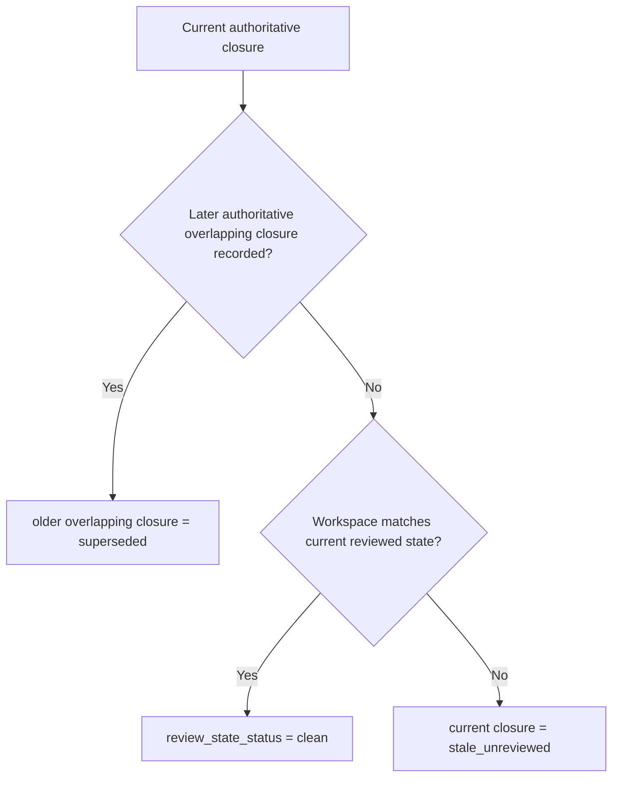

# Review-State Reference

**Status:** Implementation-target reference  
**Audience:** implementation and skill authors
**Implementation Target:** Current
**Reviewed Through:** clean-context review loop

## Purpose

This reference centralizes the runtime concepts that skills and workflow-facing docs should reuse instead of re-explaining inconsistently:

- current reviewed closure
- superseded closure
- stale-unreviewed closure
- historical closure
- reviewed state identity
- reviewed surface
- task closure
- release-readiness
- final review
- review-state repair

It is not a replacement for the specs. It is the short shared reference that skill docs and operator-facing references should point to.

## Core Mental Model

The runtime trusts current reviewed closure state, not every historical proof artifact forever.

Supersession and stale drift are different events:

- supersession happens only when a later authoritative overlapping closure is successfully recorded
- `stale_unreviewed` happens when the workspace moves past the current reviewed state without a later authoritative replacement

## Review-State Status Vocabulary

| `review_state_status` | meaning | operator implication |
| --- | --- | --- |
| `clean` | current reviewed state is usable for the active workflow phase | proceed with the routed recording or execution step |
| `stale_unreviewed` | repo-tracked work moved past the current reviewed state without a new reviewed closure | repair review state or reenter execution |
| `missing_current_closure` | the workflow phase needs a current reviewed closure and none exists yet | record the required task or branch closure before advancing |

## Preferred Command Surface

The reviewed-closure runtime should expose a small preferred aggregate command layer:

The authoritative public workflow query surface is:

- `featureforge workflow operator --plan <path>`
- `featureforge workflow operator --plan <path> --external-review-result-ready` when the caller already has the external task-review or final-review result in hand and needs workflow/operator to surface the matching recording-ready substate

`featureforge plan execution status --plan <path>` is a supporting diagnostic surface. If it ever appears to disagree with workflow/operator about `phase`, `next_action`, or `recommended_command`, workflow/operator is authoritative for public routing and status is treated as supporting detail.

Explicit usage rule:

- agents MUST run both `featureforge workflow operator --plan <path>` and `featureforge plan execution status --plan <path>` at session start
- agents MUST rerun `featureforge plan execution status --plan <path>` before invoking `repair-review-state`
- after `repair-review-state`, the command’s own `recommended_command` is authoritative for the immediate reroute; agents rerun workflow/operator next only when that returned command is `featureforge workflow operator --plan <path>` or after completing the returned follow-up step

When workflow/operator returns a recording-ready substate, it must also surface the runtime-known ids needed to execute the next command directly:

- `task_closure_recording_ready` must include task number plus dispatch id
- `release_readiness_recording_ready.recording_context.branch_closure_id` and `release_blocker_resolution_required.recording_context.branch_closure_id` must exist for authoritative binding context, transparency, and primitive fallback to `record-release-readiness` even though the aggregate release-readiness path still takes only `--plan`, `--result`, and `--summary-file`
- `final_review_recording_ready` must include dispatch id plus current branch closure id
- `recording_context` is omitted entirely when the current `recommended_command` needs no extra runtime-known identifiers and no documented primitive-fallback or transparency ids need to be surfaced; it is never `null` or an empty object
- `final_review_recording_ready.recording_context.branch_closure_id` exists for authoritative binding context, transparency, and primitive fallback even though the aggregate final-review command still takes only `--dispatch-id`

| operator intent | preferred aggregate command | lower-level primitive or service boundary |
| --- | --- | --- |
| dispatch task review | `featureforge plan execution record-review-dispatch --plan <path> --scope task --task <n>` | `ReviewDispatchService` |
| close reviewed task work | `featureforge plan execution close-current-task --plan <path> --task <n> --dispatch-id <id> --review-result pass|fail --review-summary-file <path> --verification-result pass|fail|not-run [--verification-summary-file <path> when verification ran]` | `TaskClosureRecordingService` internal boundary only; not a first-slice public CLI fallback |
| repair review-state truth | `featureforge plan execution repair-review-state --plan <path>` | `explain-review-state` then `reconcile-review-state` |
| record missing reviewed branch closure | `featureforge plan execution record-branch-closure --plan <path>` | `BranchClosureService` |
| record release-readiness after branch closure is current | `featureforge plan execution advance-late-stage --plan <path> --result ready|blocked --summary-file <path>` | `record-release-readiness` |
| dispatch final review | `featureforge plan execution record-review-dispatch --plan <path> --scope final-review` | `ReviewDispatchService` |
| record final-review outcome after dispatch is current and the same branch closure already has a current release-readiness result `ready` | `featureforge plan execution advance-late-stage --plan <path> --dispatch-id <id> --reviewer-source <source> --reviewer-id <id> --result pass|fail --summary-file <path>` | `record-final-review` |
| record QA outcome once current branch closure, current release-readiness result `ready`, and current final-review result `pass` are already current for the same branch closure and `QA Requirement: required` | `featureforge plan execution record-qa --plan <path> --result pass|fail --summary-file <path>` | `QARecordingService` |
| run first finish gate against the still-current branch closure | `featureforge plan execution gate-review --plan <path>` | finish gate query layer plus gate-pass checkpoint |
| run final finish gate after `gate-review` already passed for the same still-current branch closure | `featureforge plan execution gate-finish --plan <path>` | finish gate query layer plus `finish_review_gate_pass_branch_closure_id` |
| record required handoff | `featureforge plan execution transfer --plan <path> --scope <task|branch> --to <owner> --reason <reason>` | execution transfer surface |
| record required pivot | `featureforge workflow record-pivot --plan <path> --reason <reason>` | workflow pivot surface |

## Status Vocabulary

| state | meaning | operator implication |
| --- | --- | --- |
| `current` | this reviewed closure is authoritative now | gates may rely on it |
| `superseded` | later reviewed work overlapped its reviewed surface and superseded the whole closure record | historical, not a defect by itself |
| `stale_unreviewed` | workspace moved past the reviewed state without new review | review-state repair or reentry required |
| `historical` | retained for audit only | not current gate truth |

## Reviewed State Identity

First-slice supported forms:

- canonical authoritative form: `git_tree:<sha>`
- accepted input and diagnostic alias: `git_commit:<sha>`

The runtime uses one generic `reviewed_state_id` field everywhere rather than forking the public API into repo-specific variants.

First-slice equality rule:

- authoritative record equality, currentness, supersession, and idempotency use canonical `git_tree:<sha>` identity
- `git_commit:<sha>` is accepted only as an input or diagnostic alias that resolves to the underlying tree before the runtime compares or persists reviewed-state identity

`workspace_state_id` and `observed_workspace_state_id` use the same typed identity family, but they are derived from normalized repo-tracked workspace content rather than from operator assertions.

## Reviewed Surface

The effective reviewed surface is:

- declared surface from trusted plan/task scope
- union observed surface from runtime-observed writes or reconciled diff
- normalized into one effective reviewed surface

That is what allows later reviewed work to supersede earlier reviewed work without pretending earlier proof is still current.

## Authoritative Policy Inputs

The first-slice corpus relies on these normalized approved-plan metadata inputs:

- `Late-Stage Surface`: trusted repo paths that may be reclosed at branch scope after task closure without reopening task execution; omission means the trusted late-stage surface is empty; entries use the shared repo-relative normalization and matching contract from the supersession-aware identity spec
- `QA Requirement: required|not-required`: the one authoritative source for whether workflow/operator may emit `qa_pending`; missing or invalid values fail closed to `phase=pivot_required` with `phase_detail=planning_reentry_required`

The first-slice corpus also relies on one named runtime-owned resolver:

- `RepositoryContextResolver`: the authoritative source for normalized repo slug, branch identity, and base-branch bindings used by branch closure, release-readiness, final review, QA, and workflow/operator
- `SummaryNormalizer`: the authoritative source for summary equivalence used by same-state idempotency checks across task closure, release-readiness, final review, and QA
- `PolicyMetadataNormalizer`: the authoritative source for normalized `QA Requirement` values
- `FollowUpOverrideResolver`: the authoritative source for `follow_up_override = none|record_handoff|record_pivot`, including precedence and clearing behavior

## Milestone Model

Task closure and branch closure are closure records.

Task review and task verification are milestones that feed task closure recording.

Review dispatch is a separate record type. It is not a milestone and not a closure; it is a freshness-bound prerequisite record consumed by task closure and final review.

Release-readiness, final review, and QA are branch-level milestones recorded against current reviewed branch-closure state.

Milestone statuses are:

- `current`
- `stale_unreviewed`
- `historical`

Milestones do not carry a separate `superseded` status. Supersession is represented through the closure lineage they bind to.

For any given still-current closure and milestone type, query surfaces expose at most one `current` milestone at a time. If a newer eligible milestone of the same type is recorded on that same still-current closure, the older one becomes `historical`.

They are not primary markdown truth surfaces.

Markdown outputs can still exist, but they are generated from authoritative records.

## Typical Scenarios

### Review-Driven Code Change After Earlier Task Review

1. Task 1 is reviewed and closed.
2. Task 2 later changes some of the same files.
3. Task 2 is reviewed and closed.
4. Task 1 becomes `superseded` as a whole closure record because later reviewed work overlapped its reviewed surface.
5. The runtime does not ask for Task 1 fingerprint repair.

### Rebase Or Late Fix After Review

1. A task or branch closure is current.
2. The workspace changes due to rebase or late fix.
3. No new review exists yet.
4. The current closure becomes `stale_unreviewed`.
5. The operator records a new reviewed closure instead of rewriting old proof.

### Late-Stage Branch Flow

1. `featureforge plan execution record-branch-closure --plan <path>` records the current reviewed branch closure once no active task remains, task-level closure blockers are resolved, and the runtime can derive one unambiguous reviewed branch state for the branch.
2. Release-readiness is recorded.
3. Final-review dispatch is recorded explicitly through `featureforge plan execution record-review-dispatch --plan <path> --scope final-review`.
4. Final review is recorded independently only after the same branch closure already has a current release-readiness result `ready` and a current final-review dispatch.
5. If `QA Requirement: required`, QA is recorded only after current branch closure, current release-readiness result `ready`, and current final-review result `pass` all exist for the same branch closure.
6. If another change lands, late-stage milestones become stale until `featureforge plan execution repair-review-state --plan <path>` reroutes either to execution reentry or, when drift is confined to `Late-Stage Surface`, back to `featureforge plan execution record-branch-closure --plan <path>`.

## Workflow Contract Summary

The public workflow contract should be read like this:

- `featureforge workflow operator --plan <path>` is the authoritative public query surface
- `featureforge plan execution status --plan <path>` is a supporting status/detail surface, not a second routing authority
- `phase` says where the workflow is
- `phase_detail` says which substate inside the phase is active
- `review_state_status` says whether current reviewed state is usable
- `next_action` says what the operator should do next
- `recommended_command` says which exact command string or command template should run next

Supporting query fields that runtime-owned commands rely on:

- `follow_up_override = none|record_handoff|record_pivot` tells negative-result commands whether to emit execution reentry or a forced handoff/pivot follow-up
- `follow_up_override` is derived by `FollowUpOverrideResolver`; `record_pivot` wins if both raw handoff and pivot conditions exist, and the field clears once the corresponding handoff/pivot recording succeeds or workflow reevaluates to `none`
- `finish_review_gate_pass_branch_closure_id` tells workflow/operator whether `gate-review` already passed for the still-current branch closure and therefore whether `finish_completion_gate_ready` is true

`review_state_repair_required` is not a top-level phase. Repair is represented by `review_state_status` plus the corresponding `next_action`.

`repair-review-state` is inspect/reconcile only. It does not record new closures or milestones; it returns the next required recording step.

Preferred future agent-facing `next_action` families:

- continue execution
- execution reentry required
- dispatch review
- wait for external review result
- close current task
- repair review state / reenter execution
- record branch closure
- advance late stage
- resolve release blocker
- dispatch final review
- run QA
- run finish review gate
- run finish completion gate
- hand off
- pivot / return to planning

## Testing Summary

The implementation and skills should assume five test layers:

1. pure domain and supersession policy
2. store and projection behavior
3. service-level recording and reconcile behavior
4. public CLI end-to-end behavior
5. compatibility tests for derived artifacts only

## Usage Guidance For Skills

Skills should:

- link here for the conceptual model
- link to the concrete command specs for task closure, reconcile, branch closure, release-readiness, final review, and QA
- avoid re-encoding runtime-owned logic in prose or shell snippets
- treat aggregate runtime commands such as `close-current-task`, `repair-review-state`, and `advance-late-stage` as the normal operator path
- present lower-level primitives only as explicit fallback or debug paths
