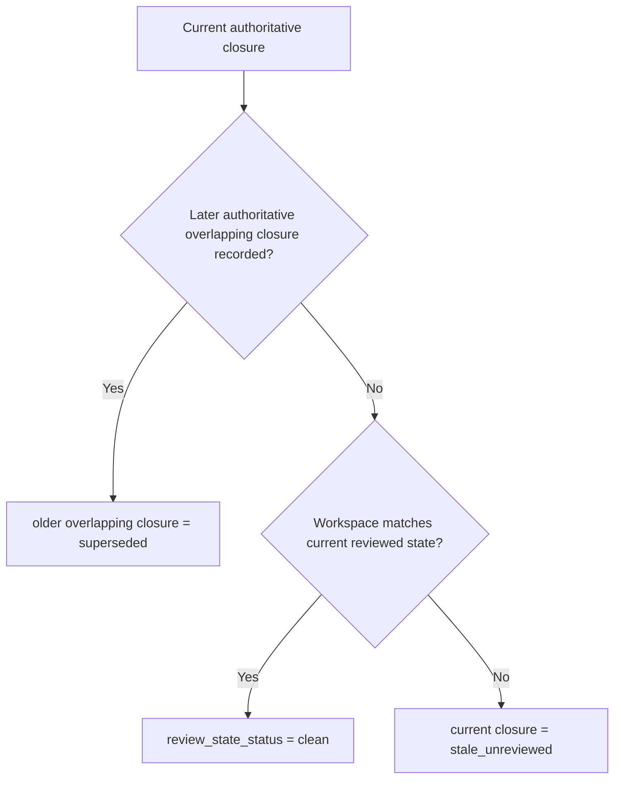

# Review-State Reference

**Status:** Implementation-target reference  
**Audience:** implementation and skill authors
**Implementation Target:** Current
**Reviewed Through:** clean-context review loop

## Purpose

This reference centralizes the runtime concepts that skills and workflow-facing docs should reuse instead of re-explaining inconsistently:

- current reviewed closure
- superseded closure
- stale-unreviewed closure
- historical closure
- reviewed state identity
- reviewed surface
- task closure
- release-readiness
- final review
- review-state repair

It is not a replacement for the specs. It is the short shared reference that skill docs and operator-facing references should point to.

## Core Mental Model

The runtime trusts current reviewed closure state, not every historical proof artifact forever.

Supersession and stale drift are different events:

- supersession happens only when a later authoritative overlapping closure is successfully recorded
- `stale_unreviewed` happens when the workspace moves past the current reviewed state without a later authoritative replacement

## Review-State Status Vocabulary

| `review_state_status` | meaning | operator implication |
| --- | --- | --- |
| `clean` | current reviewed state is usable for the active workflow phase | proceed with the routed recording or execution step |
| `stale_unreviewed` | repo-tracked work moved past the current reviewed state without a new reviewed closure | repair review state or reenter execution |
| `missing_current_closure` | the workflow phase needs a current reviewed closure and none exists yet | record the required task or branch closure before advancing |

## Preferred Command Surface

The reviewed-closure runtime should expose a small preferred aggregate command layer:

The authoritative public workflow query surface is:

- `$_FEATUREFORGE_BIN workflow operator --plan <path>`
- `$_FEATUREFORGE_BIN workflow operator --plan <path> --external-review-result-ready` when the caller already has the external task-review or final-review result in hand and needs workflow/operator to surface the matching recording-ready substate

For live FeatureForge-on-FeatureForge work, those commands run through the
installed control plane: `~/.featureforge/install/bin/featureforge` plus
installed skills from `~/.featureforge/install/skills`. Workspace binaries such
as `./bin/featureforge`, `target/debug/featureforge`, or `cargo run -- ...` are
test subjects only and must use isolated temp/fixture state. Workspace skills
under `<repo>/skills/*` are generated artifacts, not active instruction roots.

`$_FEATUREFORGE_BIN plan execution status --plan <path>` is a supporting diagnostic surface. `$_FEATUREFORGE_BIN workflow doctor --plan <path> --json` is the read-only orientation/diagnostic companion to workflow/operator. Both status and doctor must consume the same routing decision as workflow/operator for `harness_phase`, `phase_detail`, `review_state_status`, `next_action`, `recommended_public_command_argv`, `required_inputs`, `recommended_command`, `blocking_scope`, `blocking_reason_codes`, and `external_wait_state`. Any disagreement is a runtime bug. `recommended_command` is display-only compatibility text; `recommended_public_command_argv` is the exact machine-invocation representation when present.

Parity checks must use matching routing inputs. Compare `status --plan <path>` and `workflow doctor --plan <path> --json` to `workflow operator --plan <path>` for baseline parity, and compare `status --plan <path> --external-review-result-ready` plus `workflow doctor --plan <path> --external-review-result-ready --json` to `workflow operator --plan <path> --external-review-result-ready` when asserting external-review-result-ready recording routes.

Explicit usage rule:

- agents SHOULD run `$_FEATUREFORGE_BIN workflow doctor --plan <path> --json` first for orientation/diagnosis when an approved plan path is known
- agents SHOULD run `$_FEATUREFORGE_BIN workflow operator --plan <path>` for authoritative normal routing after doctor orientation
- agents SHOULD run `$_FEATUREFORGE_BIN workflow doctor --plan <path>` directly when the user asks for human-facing diagnosis/orientation and should show the compact dashboard output
- agents SHOULD run `$_FEATUREFORGE_BIN plan execution status --plan <path>` only when deeper diagnostics are needed
- agents SHOULD NOT fall back from doctor to the legacy workflow-status route; if doctor fails, fail closed and repair the doctor/operator route path
- when workflow/operator reports stale or missing closure context, agents SHOULD NOT invent a repair command; if `recommended_public_command_argv` is present, invoke it exactly except for installed-control-plane rebinding (`featureforge` argv[0] executes as `~/.featureforge/install/bin/featureforge`), if argv is absent and `next_action` is `runtime diagnostic required`, stop on the diagnostic, otherwise satisfy `required_inputs` or run `$_FEATUREFORGE_BIN plan execution repair-review-state --plan <path>` only when the non-diagnostic route owns that repair lane
- after `repair-review-state`, the command’s own `recommended_public_command_argv` is authoritative for the immediate reroute when present; if argv is absent and `next_action` is `runtime diagnostic required`, stop on the diagnostic; otherwise satisfy typed `required_inputs` or the prerequisite named by `next_action`, rerun the route owner, and do not shell-parse or whitespace-split `recommended_command`
- Do not add or route through `featureforge plan execution recover`; recovery remains on existing workflow/operator-routed public command families.

Agents can inspect the active runtime/skill boundary with
`featureforge doctor self-hosting --json`. Workspace-runtime live mutation is
blocked by default; `FEATUREFORGE_ALLOW_WORKSPACE_RUNTIME_LIVE_MUTATION=1` is
an explicit, auditable override that should almost never be used.

When workflow/operator returns a recording-ready substate, it must surface only the runtime-known ids the current recommended command still needs directly, plus any documented transparency-only identifiers that remain exposed:

- `task_closure_recording_ready` must include the task number; dispatch id is compatibility/debug-only and must not be required for the normal public `close-current-task` path
- `release_readiness_recording_ready.recording_context.branch_closure_id` and `release_blocker_resolution_required.recording_context.branch_closure_id` must exist for authoritative binding context and transparency even though the aggregate release-readiness path still takes only `--plan`, `--result`, and `--summary-file`
- `final_review_recording_ready` must include the current branch closure id; dispatch id is compatibility/debug-only and must not be required for the normal public `advance-late-stage` final-review path
- `recording_context` is omitted entirely when the current recommended public command argv needs no extra runtime-known identifiers and no transparency ids need to be surfaced; it is never `null` or an empty object
- `final_review_recording_ready.recording_context.branch_closure_id` exists for authoritative binding context and transparency even though the aggregate final-review command itself no longer requires a public dispatch-id flag

Compatibility/debug review-dispatch service responses use explicit action semantics:

- `action=recorded` when a new dispatch record is appended
- `action=already_current` when the current dispatch record is already valid for the same boundary
- `action=blocked` when dispatch recording is rejected for the current boundary
- `dispatch_id` must be present whenever `action` is `recorded` or `already_current`

When workflow/operator reports `phase=qa_pending` with `phase_detail=test_plan_refresh_required`, direct QA recording is not yet actionable:

- `next_action` becomes `refresh test plan`
- `recommended_public_command_argv` and `recommended_command` remain omitted until the current-branch test-plan artifact is refreshed
- the agent must route through `featureforge:plan-eng-review` to regenerate the current-branch test-plan artifact before rerunning `$_FEATUREFORGE_BIN workflow operator --plan <path>` or invoking `advance-late-stage`

The command strings in this table that contain placeholders are input shapes only. Runtime output must use `recommended_public_command_argv` only for fully bound argv; otherwise it exposes `required_inputs` and the caller reruns the route owner after supplying them.

| operator intent | preferred aggregate command or input shape | lower-level primitive or service boundary |
| --- | --- | --- |
| request task review | request external review, rerun `$_FEATUREFORGE_BIN workflow operator --plan <path> --external-review-result-ready`, then follow operator-reported recording-ready closure command | `ReviewDispatchService` compatibility/debug boundary only |
| close reviewed task work | `$_FEATUREFORGE_BIN plan execution close-current-task --plan <path> --task <n> --review-result pass|fail --review-summary-file <path> --verification-result pass|fail|not-run [--verification-summary-file <path> when verification ran]` | `TaskClosureRecordingService` internal boundary only; not a first-slice public CLI fallback |
| repair review-state truth | `$_FEATUREFORGE_BIN plan execution repair-review-state --plan <path>` | internal diagnostic boundaries only; normal-path guidance stays on operator + repair |
| record missing reviewed branch closure | `$_FEATUREFORGE_BIN plan execution advance-late-stage --plan <path>` | internal late-stage recording boundary only |
| record release-readiness after branch closure is current | `$_FEATUREFORGE_BIN plan execution advance-late-stage --plan <path> --result ready|blocked --summary-file <path>` | internal late-stage recording boundary only |
| request final review | request external final review, rerun `$_FEATUREFORGE_BIN workflow operator --plan <path> --external-review-result-ready`, then follow operator-reported recording-ready late-stage command | `ReviewDispatchService` compatibility/debug boundary only |
| record final-review outcome after dispatch is current and the same branch closure already has a current release-readiness result `ready` | `$_FEATUREFORGE_BIN plan execution advance-late-stage --plan <path> --reviewer-source <source> --reviewer-id <id> --result pass|fail --summary-file <path>` | internal late-stage recording boundary only |
| record QA outcome once current branch closure, current release-readiness result `ready`, and current final-review result `pass` are already current for the same branch closure and `QA Requirement: required` | `$_FEATUREFORGE_BIN plan execution advance-late-stage --plan <path> --result pass|fail --summary-file <path>` | internal late-stage recording boundary only |
| refresh the current-branch test plan before QA recording when workflow/operator stays in `qa_pending` with `phase_detail=test_plan_refresh_required` | `featureforge:plan-eng-review`, then rerun `$_FEATUREFORGE_BIN workflow operator --plan <path>` | current-branch test-plan regeneration lane |
| record required handoff | `$_FEATUREFORGE_BIN plan execution transfer --plan <path> --scope <task|branch> --to <owner> --reason <reason>` | execution transfer surface |
| record required pivot | `$_FEATUREFORGE_BIN plan execution repair-review-state --plan <path>` | pivot reentry remains aggregated behind repair-review-state |

## Status Vocabulary

| state | meaning | operator implication |
| --- | --- | --- |
| `current` | this reviewed closure is authoritative now | gates may rely on it |
| `superseded` | later reviewed work overlapped its reviewed surface and superseded the whole closure record | historical, not a defect by itself |
| `stale_unreviewed` | workspace moved past the reviewed state without new review | review-state repair or reentry required |
| `historical` | retained for audit only | not current gate truth |

## Reviewed State Identity

First-slice supported forms:

- canonical authoritative form: `git_tree:<sha>`
- accepted input and diagnostic alias: `git_commit:<sha>`

The runtime uses one generic `reviewed_state_id` field everywhere rather than forking the public API into repo-specific variants.

First-slice equality rule:

- authoritative record equality, currentness, supersession, and idempotency use canonical `git_tree:<sha>` identity
- `git_commit:<sha>` is accepted only as an input or diagnostic alias that resolves to the underlying tree before the runtime compares or persists reviewed-state identity

`workspace_state_id` and `observed_workspace_state_id` use the same typed identity family, but they are derived from normalized repo-tracked workspace content rather than from operator assertions.

## Reviewed Surface

The effective reviewed surface is:

- declared surface from trusted plan/task scope
- union observed surface from runtime-observed writes or reconciled diff
- normalized into one effective reviewed surface

That is what allows later reviewed work to supersede earlier reviewed work without pretending earlier proof is still current.

## Authoritative Policy Inputs

The first-slice corpus relies on these normalized approved-plan metadata inputs:

- `Late-Stage Surface`: trusted repo paths that may be reclosed at branch scope after task closure without reopening task execution; omission means the trusted late-stage surface is empty; entries use the shared repo-relative normalization and matching contract from the supersession-aware identity spec
- `QA Requirement: required|not-required`: the one authoritative source for whether workflow/operator may emit `qa_pending`; missing or invalid values fail closed to `phase=pivot_required` with `phase_detail=planning_reentry_required`

The first-slice corpus also relies on one named runtime-owned resolver:

- `RepositoryContextResolver`: the authoritative source for normalized repo slug, branch identity, and base-branch bindings used by branch closure, release-readiness, final review, QA, and workflow/operator
- `SummaryNormalizer`: the authoritative source for summary equivalence used by same-state idempotency checks across task closure, release-readiness, final review, and QA
- `PolicyMetadataNormalizer`: the authoritative source for normalized `QA Requirement` values
- `RouteDecisionRouter`: the authoritative source for public `state_kind`, `next_public_action`, and structured `blockers[]` emitted by operator/status surfaces

## Milestone Model

Task closure and branch closure are closure records.

Task review and task verification are milestones that feed task closure recording.

Review dispatch is a separate record type. It is not a milestone and not a closure; it is a freshness-bound prerequisite record consumed by task closure and final review.

Release-readiness, final review, and QA are branch-level milestones recorded against current reviewed branch-closure state.

Milestone statuses are:

- `current`
- `stale_unreviewed`
- `historical`

Milestones do not carry a separate `superseded` status. Supersession is represented through the closure lineage they bind to.

For any given still-current closure and milestone type, query surfaces expose at most one `current` milestone at a time. If a newer eligible milestone of the same type is recorded on that same still-current closure, the older one becomes `historical`.

They are not primary markdown truth surfaces.

Markdown outputs can still exist, but they are generated from authoritative records.

## Typical Scenarios

### Review-Driven Code Change After Earlier Task Review

1. Task 1 is reviewed and closed.
2. Task 2 later changes some of the same files.
3. Task 2 is reviewed and closed.
4. Task 1 becomes `superseded` as a whole closure record because later reviewed work overlapped its reviewed surface.
5. The runtime does not ask for Task 1 fingerprint repair.

### Rebase Or Late Fix After Review

1. A task or branch closure is current.
2. The workspace changes due to rebase or late fix.
3. No new review exists yet.
4. The current closure becomes `stale_unreviewed`.
5. The operator records a new reviewed closure instead of rewriting old proof.

### Late-Stage Branch Flow

1. `$_FEATUREFORGE_BIN plan execution advance-late-stage --plan <path>` records or refreshes the current reviewed branch closure when workflow/operator routes to the branch-closure lane.
2. Release-readiness is recorded.
3. External final review is requested when workflow/operator reports `phase_detail=final_review_dispatch_required`.
4. Final review is recorded independently only after the same branch closure already has a current release-readiness result `ready` and workflow/operator reports `phase_detail=final_review_recording_ready`.
5. If `QA Requirement: required`, workflow/operator may first route to `qa_pending` with `phase_detail=test_plan_refresh_required`; in that lane the agent must reroute through `featureforge:plan-eng-review` to regenerate the current-branch test-plan artifact before any QA recording attempt.
6. Once workflow/operator reports `qa_pending` with `phase_detail=qa_recording_required`, QA is recorded through `$_FEATUREFORGE_BIN plan execution advance-late-stage --plan <path> --result pass|fail --summary-file <path>` only after current branch closure, current release-readiness result `ready`, and current final-review result `pass` all exist for the same branch closure.
7. If another change lands, late-stage milestones become stale until `$_FEATUREFORGE_BIN plan execution repair-review-state --plan <path>` reroutes either to execution reentry or, when drift is confined to `Late-Stage Surface`, back to `$_FEATUREFORGE_BIN plan execution advance-late-stage --plan <path>`.

## Workflow Contract Summary

The public workflow contract should be read like this:

- `$_FEATUREFORGE_BIN workflow operator --plan <path>` is the authoritative public query surface
- `$_FEATUREFORGE_BIN plan execution status --plan <path>` is a supporting status/detail surface, not a second routing authority
- `phase` says where the workflow is
- `phase_detail` says which substate inside the phase is active
- `review_state_status` says whether current reviewed state is usable
- `next_action` says what the operator should do next
- `recommended_public_command_argv` says which exact public command argv vector should run next when all inputs are bound; if it is absent, `required_inputs` or `next_action` names what must be supplied before rerunning the route owner; `recommended_command` is the display-only rendering for human compatibility

Supporting query fields that runtime-owned commands rely on:

- `state_kind = actionable_public_command|waiting_external_input|terminal|blocked_runtime_bug|runtime_reconcile_required` classifies routability
- `next_public_action` carries the command template for the next legal public command when the state is actionable
- `blockers[]` carries structured blocker scope and action context for actionable blocked states; diagnostic-only `blocked_runtime_bug` / `runtime_reconcile_required` routes intentionally omit blockers, public commands, and required inputs because the correct next step is runtime diagnosis rather than agent mutation
- `finish_review_gate_pass_branch_closure_id` tells workflow/operator whether the finish-review compatibility checkpoint already passed for the still-current branch closure and therefore whether `finish_completion_gate_ready` is true
- `blocking_scope` tells workflow-owned consumers whether the current block is task-scoped or finish-scoped
- `blocking_reason_codes` enumerates the machine-readable reasons for the current block and must stay aligned across operator/status
- `external_wait_state` tells workflow-owned consumers whether the current route is actively waiting on an external task review or final review result instead of a local recording step

`review_state_repair_required` is not a top-level phase. Repair is represented by `review_state_status` plus the corresponding `next_action`.

`repair-review-state` is inspect/reconcile only. It does not record new closures or milestones; it returns the next required recording step.

Preferred future agent-facing `next_action` families:

- continue execution
- execution reentry required
- request task review
- wait for external review result
- close current task
- repair review state / reenter execution
- advance late stage (including branch-closure refresh)
- resolve release blocker
- request final review
- run QA
- refresh test plan
- finish branch
- hand off
- pivot / return to planning
- runtime diagnostic required

## Testing Summary

The implementation and skills should assume five test layers:

1. pure domain and supersession policy
2. store and projection behavior
3. service-level recording and reconcile behavior
4. public CLI end-to-end behavior
5. compatibility tests for derived artifacts only

## Usage Guidance For Skills

Skills should:

- link here for the conceptual model
- link to the concrete command specs for task closure, reconcile, branch closure, release-readiness, final review, and QA
- avoid re-encoding runtime-owned logic in prose or shell snippets
- treat aggregate runtime commands such as `close-current-task`, `repair-review-state`, and `advance-late-stage` as the normal operator path
- present lower-level primitives only as explicit fallback or debug paths
