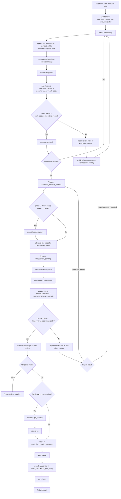
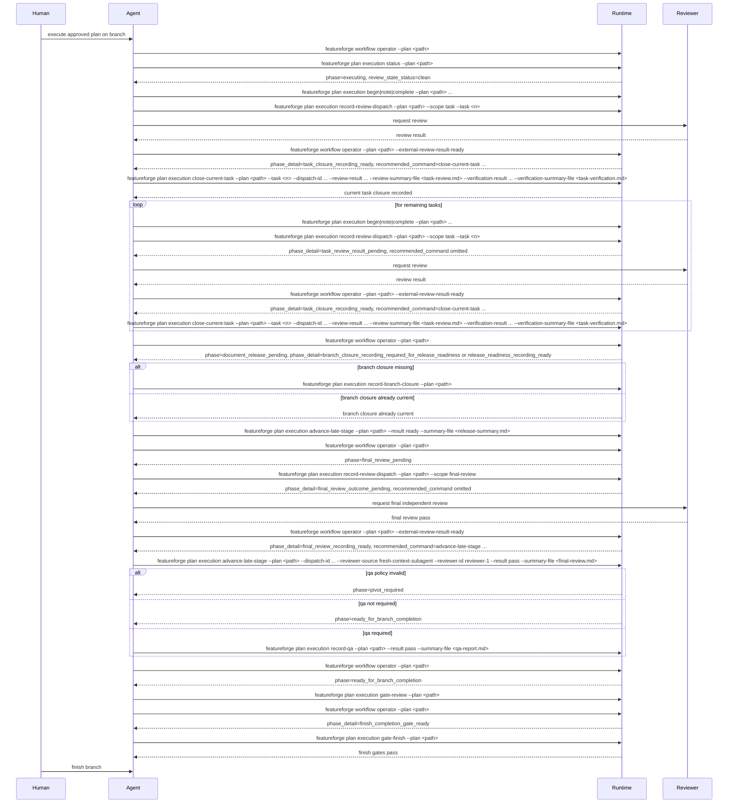

# Future Process Explained

**Status:** Implementation-target explanatory guide  
**Audience:** implementers, runtime authors, skill authors, and operators  
**Purpose:** explain the end-to-end FeatureForge process after the supersession-aware architecture lands
**Implementation Target:** Current
**Reviewed Through:** clean-context review loop

## Why This Exists

The new architecture changes the process in one important way:

- the runtime no longer treats old evidence and old receipts as if they must stay current forever

Instead:

- the runtime trusts current reviewed closure state
- later reviewed work can supersede earlier reviewed work
- unreviewed post-review changes make current state stale
- markdown artifacts become derived outputs, not the primary authority surface

This document explains what that means operationally from start to finish.

## What The Process Is Optimizing For

The future process is designed to support:

- safe workflow-guided agent-driven value creation
- low-churn execution after review feedback and rebases
- clear runtime-owned authority boundaries
- clear operator guidance through `phase`, `review_state_status`, `next_action`, and `recommended_command`
- lower agent orchestration burden through a small aggregate command layer
- explicit runtime-owned substate so clients do not infer dispatch or recording readiness from prose

## Assumptions

This process description assumes:

- the approved spec and implementation plan already exist
- the supersession-aware runtime architecture is implemented
- the new command surfaces are available
- the workflow contract uses the frozen public phases and review-state status fields

## Key Runtime Concepts

### Current reviewed closure

The current reviewed closure is the reviewed task or branch state the runtime trusts now.

### Superseded closure

A superseded closure is older reviewed work whose reviewed surface overlapped later reviewed work, causing the whole older closure record to lose current authority in the first slice.

This is historical lineage, not a defect.

### Stale-unreviewed closure

A stale-unreviewed closure is a previously current reviewed closure whose workspace moved forward without a new review.

This is a defect until new reviewed state is recorded.

### Milestones

The runtime records milestones against current reviewed closure state:

- task review
- task verification
- release-readiness
- final review
- QA

Task closure and branch closure are authoritative closure records, not milestones.

## The Surfaces The Human And Agent Actually See

The runtime should expose one authoritative routing surface plus supporting diagnostic surfaces:

1. `featureforge workflow operator --plan <path>`
   Returns the public workflow contract:
   - `phase`
   - `phase_detail`
   - `review_state_status`
   - `qa_requirement`
   - `follow_up_override`
   - `finish_review_gate_pass_branch_closure_id`
   - `recording_context`
   - `execution_command_context` when `phase=executing`
   - `next_action`
   - `recommended_command`
   This is the authoritative public routing surface.

2. `featureforge plan execution status --plan <path>`
   Returns the execution/status view:
   - `workspace_state_id`
   - `current_branch_reviewed_state_id`
   - `current_branch_closure_id`
   - current closure summaries, including per-task `reviewed_state_id` in `current_task_closures`
   - current milestone summaries
   - blocking records
   - `phase_detail`
   - `recommended_command`
   This is supporting diagnostic detail. If it ever appears to disagree with workflow/operator about routing, workflow/operator wins.

3. `featureforge plan execution ...`
   The mutation and inspection commands:
   - `begin`
   - `note`
   - `complete`
   - `reopen`
   - `transfer`
   - `close-current-task`
   - `repair-review-state`
   - `advance-late-stage`
   - `record-review-dispatch`
   - `record-branch-closure`
   - `explain-review-state`
   - `reconcile-review-state`
   - `record-release-readiness`
   - `record-final-review`
   - `record-qa`
   - `gate-review`
   - `gate-finish`

   Internal service/debug boundary only, not an agent-facing first-slice CLI fallback:
   - `TaskClosureRecordingService`

Additional workflow mutation surface:

- `featureforge workflow record-pivot`

## Preferred Command Rule

The future process has one simple command rule:

- agents use `close-current-task`, `repair-review-state`, and `advance-late-stage` for the scoped flows they actually own
- agents also use explicit first-class recording commands when the workflow phase requires them: `record-review-dispatch`, `record-branch-closure`, and `record-qa`
- lower-level primitives remain available for compatibility, fallback, debugging, and direct service ownership
- workflow/operator and skill docs point agents to the aggregate layer first

## End-To-End Process Flow



## The Process Step By Step

## 1. Orientation And Runtime Truth Check

This is the start of every execution session.

### What the human sees

- a branch or worktree with an approved spec and plan
- a workflow state that tells them whether they should keep executing, repair review state, or move into terminal stages

### What the agent does

The agent starts by asking the runtime what is true now.

```bash
featureforge workflow operator --plan docs/featureforge/plans/<plan>.md
featureforge plan execution status --plan docs/featureforge/plans/<plan>.md
```

### What the runtime answers

At minimum:

- `phase`
- `phase_detail`
- `review_state_status`
- `next_action`
- `recommended_command`
- current workspace versus current reviewed state

### What this step decides

This step answers:

- are we still executing
- are we blocked by stale review state
- are we ready for task closure
- are we in terminal branch stages

## 2. Active Execution Loop

This is the normal task implementation loop.

### What the human sees

- `phase=executing`
- `review_state_status=clean`
- `next_action=continue execution`
- `execution_command_context` identifies the concrete execution action the runtime expects next
- `recommended_command` is the exact step-oriented execution command for the current step, derived by the shared `ExecutionCommandResolver`, not a compound bundle

### What the agent does

For the current task:

```bash
featureforge workflow operator --plan docs/featureforge/plans/<plan>.md
# if recommended_command is begin:
featureforge plan execution begin --plan docs/featureforge/plans/<plan>.md --task <n>

# auxiliary progress logging, not the routed recommended_command:
featureforge plan execution note --plan docs/featureforge/plans/<plan>.md --task <n> --step <step-id> --message "<progress note>"

featureforge workflow operator --plan docs/featureforge/plans/<plan>.md
# if recommended_command is complete:
featureforge plan execution complete --plan docs/featureforge/plans/<plan>.md --task <n> --step <step-id>
```

If the task needs to be reopened:

```bash
featureforge plan execution reopen --plan docs/featureforge/plans/<plan>.md --task <n>
```

If responsibility must move:

```bash
featureforge plan execution transfer --plan docs/featureforge/plans/<plan>.md --scope <task|branch> --to <owner> --reason <reason>
```

### What the runtime is doing underneath

- tracking execution progress
- tracking the workspace state
- tracking whether the current task can later be closed against reviewed state

### Checkpoint at the end of this step

The code is implemented, but the task is not yet formally trusted by the new model.

## 3. Review-Dispatch Checkpoint

This is where review-dispatch lineage is recorded.

### Why this exists

The runtime still wants an explicit review-dispatch checkpoint, but the new process makes the boundary honest:

- mutating commands are named like mutations
- gates only mutate the narrowly scoped finish-gate checkpoint when that mutation is part of their documented contract

### What the human sees

- the current review scope is ready for review dispatch
- the agent is about to record the fact that review is being requested
- `recommended_command=featureforge plan execution record-review-dispatch --plan ... --scope task --task <n>` when `phase_detail=task_review_dispatch_required`
- `recommended_command=featureforge plan execution record-review-dispatch --plan ... --scope final-review` when `phase_detail=final_review_dispatch_required`

### What the agent does

```bash
featureforge plan execution record-review-dispatch --plan docs/featureforge/plans/<plan>.md --scope task --task <n>
```

### What the runtime is doing underneath

- validating that review-dispatch lineage can be recorded
- failing before mutation if blocked
- appending the review-dispatch checkpoint only if allowed
- returning a `dispatch_id` that later review-recording commands must reference explicitly

### Checkpoint at the end of this step

The runtime now knows review dispatch was intentionally recorded.

Immediately after this mutation:

- task-scope dispatch moves workflow/operator to `phase=task_closure_pending` with `phase_detail=task_review_result_pending`
- final-review dispatch moves workflow/operator to `phase=final_review_pending` with `phase_detail=final_review_outcome_pending`
- in either waiting state, `next_action=wait for external review result`
- `recommended_command` is omitted until the external reviewer result exists
- once that external result exists, the caller reruns workflow/operator with `--external-review-result-ready` so the runtime can expose the matching recording-ready substate without hidden stored reviewer-result state

## 4. Review And Task Closure

This is where reviewed task work becomes authoritative.

### What the human sees

- review feedback may pass, fail, or require changes
- while the external reviewer is still working, workflow/operator stays in `phase_detail=task_review_result_pending`, `next_action=wait for external review result`, and omits `recommended_command`
- once the external review result is in hand, the agent reruns workflow/operator with `--external-review-result-ready` and expects `phase_detail=task_closure_recording_ready` with the exact `close-current-task` template

### What the agent does

```bash
featureforge plan execution close-current-task \
  --plan docs/featureforge/plans/<plan>.md \
  --task <n> \
  --dispatch-id <task-dispatch-id> \
  --review-result pass \
  --review-summary-file <task-review-summary> \
  --verification-result pass \
  --verification-summary-file <task-verification-summary>
```

### What the runtime is doing underneath `close-current-task`

- inspecting current review-state truth
- validating the explicit review-dispatch lineage supplied by `--dispatch-id`
- translating explicit review and verification evidence into authoritative milestone records
- resolving task contract identity
- resolving reviewed state identity
- resolving effective reviewed surface
- deciding whether the closure is `current`, `superseded`, `stale_unreviewed`, or blocked
- persisting the authoritative task closure record
- returning a structured trace plus the closure result

### Checkpoint at the end of this step

If review and verification passed, the task is now formally trusted as a current reviewed task closure.

### If task review or verification fails

Human sees:

- the task is not trusted as closed
- workflow/operator must immediately reflect the returned `required_follow_up`; that is normally execution reentry and can be handoff or pivot when an authoritative override is already in force

Agent does:

Record the negative result explicitly instead of skipping the closure command:

```bash
featureforge plan execution close-current-task \
  --plan docs/featureforge/plans/<plan>.md \
  --task <n> \
  --dispatch-id <task-dispatch-id> \
  --review-result fail \
  --review-summary-file <task-review-summary> \
  --verification-result pass \
  --verification-summary-file <task-verification-summary>
```

Or, if verification is the failing surface:

```bash
featureforge plan execution close-current-task \
  --plan docs/featureforge/plans/<plan>.md \
  --task <n> \
  --dispatch-id <task-dispatch-id> \
  --review-result pass \
  --review-summary-file <task-review-summary> \
  --verification-result fail \
  --verification-summary-file <task-verification-summary>
```

Then:

1. treat the returned `required_follow_up` as authoritative
2. rerun `featureforge workflow operator --plan <path>` and expect the public phase to change immediately to `executing`, `handoff_required`, or `pivot_required` to match that returned follow-up
3. if it is `execution_reentry`, remediate the task through normal execution flow
4. if it is `record_handoff`, record the handoff before any further runtime progression
5. if it is `record_pivot`, record the pivot before any further runtime progression
6. dispatch a new review against the new reviewed state once execution resumes
7. rerun `close-current-task` with passing inputs

## 5. Review-State Repair And Reentry

This is the path for rebases, late fixes, or review-driven changes that invalidate current reviewed state.

### What the human sees

- `review_state_status=stale_unreviewed`
- `next_action=repair review state / reenter execution`
- `recommended_command=featureforge plan execution repair-review-state --plan ...`

### What the agent does

```bash
featureforge plan execution repair-review-state --plan docs/featureforge/plans/<plan>.md
```

Then either:

- record a new reviewed closure after new review
- or continue execution until the corrected reviewed state can be recorded

### What the runtime is doing underneath

- inspecting current/superseded/stale state
- distinguishing stale-unreviewed state from historical supersession
- rebuilding projections or indexes from authoritative closure records when needed
- refusing to rewrite old reviewed proof in place
- returning the exact next required record or execution reentry action

### Checkpoint at the end of this step

Either:

- review state is repaired structurally and ready for new review
- or the operator clearly knows that new reviewed state must be recorded

## 6. Repeating The Task Loop

The process repeats for each task:

1. execute task work
2. record review-dispatch lineage
3. review the task
4. run `close-current-task`
5. begin the next task

### Important rule

Beginning Task `N+1` depends on Task `N` having a current, non-stale task closure.

It does not depend on every old historical task artifact staying current forever.

## 7. Transition To Terminal Branch Stages

After the final task closure is recorded, the branch moves out of the task loop and into late stages.

### What the human sees

The runtime should transition out of `executing` and into `document_release_pending` first. Only after late-stage prerequisites are satisfied can later terminal phases become valid:

- `final_review_pending` only after current branch closure and current release-readiness result `ready` both exist for the same branch closure
- `qa_pending` only after current branch closure, current release-readiness result `ready`, and current final-review result `pass` all exist for the same branch closure and QA is required
- `ready_for_branch_completion` only after all required earlier late-stage milestones are current

### What the agent does

It uses workflow/operator to determine which terminal stage is next:

```bash
featureforge workflow operator --plan docs/featureforge/plans/<plan>.md
featureforge plan execution status --plan docs/featureforge/plans/<plan>.md
```

### What the runtime is doing underneath

- computing whether a current reviewed branch closure already exists
- determining whether `record-branch-closure` must run before any terminal milestone can be current
- surfacing that need through `phase_detail` and `recommended_command`

## 8. Terminal Stage: Document Release And Release-Readiness

This is the first normal terminal stage.

### What the human sees

- `phase=document_release_pending`
- `review_state_status=missing_current_closure` with `phase_detail=branch_closure_recording_required_for_release_readiness` when branch closure must be recorded first, or `review_state_status=clean` with `phase_detail=release_readiness_recording_ready` when release-readiness can be recorded immediately
- `next_action=record branch closure` first when branch closure is missing, otherwise `advance late stage`
- `recommended_command=featureforge plan execution record-branch-closure --plan ...` when `phase_detail=branch_closure_recording_required_for_release_readiness`
- `recommended_command=featureforge plan execution advance-late-stage --plan ... --result ready|blocked --summary-file <path>` when `phase_detail=release_readiness_recording_ready`

### What the agent does

After the release-facing docs are ready:

```bash
# run this only when phase_detail=branch_closure_recording_required_for_release_readiness
featureforge plan execution record-branch-closure --plan docs/featureforge/plans/<plan>.md
```

```bash
featureforge plan execution advance-late-stage \
  --plan docs/featureforge/plans/<plan>.md \
  --result ready \
  --summary-file <release-summary>
```

### What the runtime is doing underneath

- validating that the required branch-closure prerequisite has already been recorded
- binding release-readiness to the current reviewed branch closure
- recording it as a runtime-owned milestone
- optionally generating markdown from the record

### Checkpoint at the end of this step

Release-readiness is current for the current reviewed branch state.

### If release-readiness is blocked

Human sees:

- `phase=document_release_pending`
- `phase_detail=release_blocker_resolution_required`
- `next_action=resolve release blocker`
- `recommended_command=featureforge plan execution advance-late-stage --plan ... --result ready|blocked --summary-file <path>` once the blocker is resolved and an updated summary is ready

Agent does:

If resolving the blocker does not change repo-tracked content, rerun:

```bash
featureforge plan execution advance-late-stage \
  --plan docs/featureforge/plans/<plan>.md \
  --result ready \
  --summary-file <release-summary>
```

If resolving the blocker requires repo-tracked edits, the branch state is now stale and the agent must first inspect the reroute that `repair-review-state` returns:

```bash
featureforge plan execution repair-review-state --plan docs/featureforge/plans/<plan>.md
# if the returned reroute is back to document_release_pending because drift is confined to approved-plan Late-Stage Surface:
featureforge plan execution record-branch-closure --plan docs/featureforge/plans/<plan>.md
featureforge plan execution advance-late-stage \
  --plan docs/featureforge/plans/<plan>.md \
  --result ready \
  --summary-file <release-summary>
```

If `repair-review-state` instead returns execution reentry, the agent must reopen the affected execution path, produce a new reviewed task or branch state, and only then return to branch closure and release-readiness.

## 9. Terminal Stage: Final Review

This is the independent branch-level final review stage.

### What the human sees

- `phase=final_review_pending`
- `review_state_status=clean` with `phase_detail=final_review_dispatch_required` before the reviewer runs, then `phase_detail=final_review_outcome_pending` after dispatch is recorded and while the branch is waiting on the external reviewer result
- `next_action=dispatch final review` before the reviewer runs, then `wait for external review result` after dispatch is recorded
- `recommended_command=featureforge plan execution record-review-dispatch --plan ... --scope final-review` when `phase_detail=final_review_dispatch_required`
- `recommended_command` is omitted while `phase_detail=final_review_outcome_pending`, because no runtime mutation is actionable until the reviewer returns
- once the reviewer result is in hand and workflow/operator is rerun with `--external-review-result-ready`, `phase_detail=final_review_recording_ready` and `recommended_command` becomes the exact final-review `advance-late-stage` template

The important detail is that `final_review_outcome_pending` is derived from dispatch state only. The runtime does not need a hidden pre-record reviewer-result object to expose that substate. The explicit `--external-review-result-ready` query-time hint is what moves workflow/operator into `final_review_recording_ready` once the reviewer has actually returned.
If branch closure or current release-readiness result `ready` are missing, workflow/operator must reroute back to `document_release_pending`; the branch must not remain in `final_review_pending`.
If current reviewed state is `stale_unreviewed`, workflow/operator must reroute to `executing` with exact next command `repair-review-state`; only that repair flow may later reroute the branch back to `document_release_pending`.

### What the agent does

The agent records dispatch lineage for the final review request:

```bash
featureforge plan execution record-review-dispatch --plan docs/featureforge/plans/<plan>.md --scope final-review
```

After the independent review completes successfully:

```bash
featureforge workflow operator --plan docs/featureforge/plans/<plan>.md --external-review-result-ready
# run the next command only when phase_detail=final_review_recording_ready
featureforge plan execution advance-late-stage \
  --plan docs/featureforge/plans/<plan>.md \
  --dispatch-id <final-review-dispatch-id> \
  --reviewer-source <fresh-context-subagent|cross-model|human-independent-reviewer> \
  --reviewer-id <id> \
  --result pass \
  --summary-file <review-summary>
```

### What the runtime is doing underneath

- validating that the required branch-closure prerequisite has already been recorded
- validating that final review binds to the current reviewed branch state
- keeping final review as a runtime-owned record
- generating public and dedicated review artifacts as derived outputs if requested

### Checkpoint at the end of this step

The branch now has a current final-review milestone against current reviewed state.

### If final review fails

Human sees:

- the branch is not ready for branch completion
- workflow/operator must immediately reflect the returned `required_follow_up`; that is normally execution reentry and can be handoff or pivot when an authoritative override is already in force

Agent does:

Record the failed final-review outcome explicitly:

```bash
featureforge plan execution advance-late-stage \
  --plan docs/featureforge/plans/<plan>.md \
  --dispatch-id <final-review-dispatch-id> \
  --reviewer-source <fresh-context-subagent|cross-model|human-independent-reviewer> \
  --reviewer-id <id> \
  --result fail \
  --summary-file <review-summary>
```

Then:

1. treat the returned `required_follow_up` as authoritative
2. rerun `featureforge workflow operator --plan <path>` and expect the public phase to change immediately to `executing`, `handoff_required`, or `pivot_required` to match that returned follow-up
3. if it is `execution_reentry`, return to task execution and closure for the required fix
4. if it is `record_handoff`, record the handoff before any further runtime progression
5. if it is `record_pivot`, record the pivot before any further runtime progression
6. rerun branch closure, release-readiness, and final review as required against the new reviewed branch state when execution resumes

## 10. Terminal Stage: QA

This stage is conditional.

### What the human sees

- `phase=qa_pending`
- `review_state_status=clean`
- `phase_detail=qa_recording_required`
- `recommended_command=featureforge plan execution record-qa --plan <path> --result pass|fail --summary-file <qa-report>`
- `next_action=run QA`

`qa_pending` only exists when current branch closure, current release-readiness result `ready`, and current final-review result `pass` already exist for the same branch closure and approved-plan metadata says `QA Requirement: required`. If those prerequisite milestones are missing, workflow/operator must reroute to the earlier authoritative late-stage phase instead of staying in `qa_pending`. If current reviewed state is `stale_unreviewed`, workflow/operator must reroute to `executing` with exact next command `repair-review-state`.
If `QA Requirement` metadata is missing or invalid when the runtime must decide between `qa_pending` and `ready_for_branch_completion`, workflow/operator must fail closed to `phase=pivot_required` with `phase_detail=planning_reentry_required`.

### What the agent does

The QA contract is separate from `advance-late-stage`.

```bash
featureforge plan execution record-qa --plan docs/featureforge/plans/<plan>.md --result pass|fail --summary-file <qa-report>
```

The agent then rechecks workflow state:

```bash
featureforge workflow operator --plan docs/featureforge/plans/my-plan.md
featureforge plan execution status --plan docs/featureforge/plans/<plan>.md
```

### If QA fails

Human sees:

- QA did not clear the branch for finish
- workflow/operator must immediately reflect the returned `required_follow_up`; that is normally execution reentry and can be handoff or pivot when an authoritative override is already in force

Agent does:

```bash
featureforge plan execution record-qa --plan docs/featureforge/plans/<plan>.md --result fail --summary-file <qa-report>
```

Then the agent follows the returned `required_follow_up`:

1. rerun `featureforge workflow operator --plan <path>` and expect the public phase to change immediately to `executing`, `handoff_required`, or `pivot_required` to match the returned follow-up
2. `execution_reentry`: return to execution work, then rerun branch closure, release-readiness, final review, and QA as required
3. `record_handoff`: record the handoff before any further runtime progression
4. `record_pivot`: record the pivot before any further runtime progression

### Checkpoint at the end of this step

QA is no longer the blocking late-stage milestone.

## 11. Terminal Stage: Ready For Branch Completion

This is the final healthy terminal phase before finish.

### What the human sees

- `phase=ready_for_branch_completion`
- `review_state_status=clean`
- `next_action=run finish review gate`
- `phase_detail=finish_review_gate_ready`
- `recommended_command=featureforge plan execution gate-review --plan ...`

Historical supersession may still appear in summaries, but it is not a defect.

### What the agent does

It verifies the final gates in sequence, with workflow/operator surfacing one exact command at a time:

```bash
featureforge plan execution gate-review --plan docs/featureforge/plans/<plan>.md
featureforge workflow operator --plan docs/featureforge/plans/<plan>.md
# run this only when phase_detail=finish_completion_gate_ready
featureforge plan execution gate-finish --plan docs/featureforge/plans/<plan>.md
```

Then it performs the branch completion flow the repository uses.

### What the runtime is doing underneath

- checking the same effective current closure truth across late gates
- ensuring late-stage milestones are bound to current reviewed branch state
- recording or refreshing a `gate-review` pass checkpoint bound to the still-current branch closure so workflow/operator can expose `finish_completion_gate_ready` deterministically

### Checkpoint at the end of this step

The runtime considers the branch complete and ready for finish/merge/cleanup.

## 12. Exceptional Public Phases

These are not normal linear execution stages, but they are part of the public contract.

### `handoff_required`

Meaning:

- the work should move to another owner or lane before continuing locally
- the current operator is not the correct next owner for the actionable work
- any required transfer checkpoint has not been recorded yet

Human sees:

- "this is not the next thing to keep implementing here"

Agent does:

- stop local forward execution
- transfer or hand off according to workflow guidance

```bash
featureforge plan execution transfer --plan docs/featureforge/plans/<plan>.md --scope <task|branch> --to <owner> --reason "handoff required"
```

### `pivot_required`

Meaning:

- the workstream should return to planning or strategy rather than continuing on the current implementation path
- the approved contract is no longer a valid basis for continued execution
- the runtime has determined that planning reentry is the next safe action

Human sees:

- "the current plan or direction is no longer the right one"

Agent does:

- stop execution
- record the pivot and route back to planning/spec work

```bash
featureforge workflow record-pivot --plan docs/featureforge/plans/<plan>.md --reason "approved contract invalid for continued execution"
```

## Checkpoint Inventory

| checkpoint | what it proves | runtime authority |
| --- | --- | --- |
| task step execution progress | implementation moved forward | execution state |
| review-dispatch lineage | review was intentionally dispatched | review-dispatch record |
| task review + verification | reviewed and verified task evidence exists | milestone records |
| task closure | reviewed task work is current and trusted | task closure record |
| branch closure | current reviewed branch state exists for late-stage work | branch closure record |
| release-readiness | release-facing branch state is current and trusted | release-readiness record |
| final review | independent branch review passed against current reviewed state | final-review record |
| QA | QA evidence was recorded for the current reviewed branch state | QA record |
| finish gates | late-stage requirements are satisfied for current reviewed state | gate/status query layer |

## Terminal Stage Inventory

| phase | meaning | normal exit |
| --- | --- | --- |
| `document_release_pending` | release-facing docs/readiness work is next | phase-detail-driven `record-branch-closure` or `advance-late-stage` |
| `final_review_pending` | independent final review is next | phase-detail-driven `record-review-dispatch`, then waiting for external reviewer result, then `advance-late-stage` |
| `qa_pending` | QA is next and all earlier late-stage branch milestones are already current for the same branch closure | QA recording |
| `ready_for_branch_completion` | branch can finish through the remaining finish gates | finish-gate progression |

## Agent Command Playbook By Phase

This table is a multi-step operator playbook. It is not the literal `recommended_command` field. `recommended_command` remains one exact next command string or template; the table below shows the broader bundle an agent will often end up running over several state transitions.

| phase | typical command bundle |
| --- | --- |
| `executing` | `featureforge workflow operator --plan <path>`, then the exact routed execution command returned in `recommended_command` (`begin`, `complete`, or `reopen`); `featureforge plan execution note --plan <path> ...` remains auxiliary progress logging and is not the routed `recommended_command` |
| review dispatch checkpoint | `featureforge plan execution record-review-dispatch --plan <path> --scope task --task <n>` or `featureforge plan execution record-review-dispatch --plan <path> --scope final-review`, then wait while workflow/operator reports the corresponding external-review-pending phase detail |
| task closure | `featureforge plan execution close-current-task --plan <path> --task <n> --dispatch-id ... --review-result pass|fail --review-summary-file <path> --verification-result pass|fail|not-run [--verification-summary-file <path> when verification ran]` |
| review-state repair | `featureforge plan execution status --plan <path>`, then `featureforge plan execution repair-review-state --plan <path>`, then follow its exact returned `recommended_command`; rerun `featureforge workflow operator --plan <path>` next only when the repair command itself returns that as the immediate reroute or after completing the returned follow-up step |
| `document_release_pending` | `featureforge plan execution record-branch-closure --plan <path>` when `phase_detail=branch_closure_recording_required_for_release_readiness`, then `featureforge plan execution advance-late-stage --plan <path> --result ready|blocked --summary-file <path>` when `phase_detail=release_readiness_recording_ready` or when `phase_detail=release_blocker_resolution_required` after the blocker has been resolved |
| `final_review_pending` | `featureforge plan execution record-review-dispatch --plan <path> --scope final-review` when `phase_detail=final_review_dispatch_required`, then wait while `phase_detail=final_review_outcome_pending`, then `featureforge plan execution advance-late-stage --plan <path> --dispatch-id <id> --reviewer-source <source> --reviewer-id <id> --result pass|fail --summary-file <path>` after the reviewer result arrives |
| `qa_pending` | `featureforge plan execution record-qa --plan <path> --result pass|fail --summary-file <path>` when `phase_detail=qa_recording_required` |
| `ready_for_branch_completion` | `featureforge plan execution gate-review --plan <path>`, then `featureforge workflow operator --plan <path>`, then `featureforge plan execution gate-finish --plan <path>` once workflow/operator advances to `phase_detail=finish_completion_gate_ready` |
| `handoff_required` | `featureforge plan execution transfer --plan <path> --scope <task|branch> --to <owner> --reason <reason>` |
| `pivot_required` | `featureforge workflow record-pivot --plan <path> --reason <reason>` |

## Agent Responsibility Bundles

This is the reduced-burden version of the future process.

| agent intent | current command bundle |
| --- | --- |
| orient session | `featureforge workflow operator --plan <path>` + `featureforge plan execution status --plan <path>` |
| close a reviewed task | `featureforge plan execution record-review-dispatch --plan <path> --scope task --task <n>` + review + `featureforge workflow operator --plan <path> --external-review-result-ready` + `featureforge plan execution close-current-task --plan <path> --task <n> --dispatch-id ... --review-result pass|fail --review-summary-file <path> --verification-result pass|fail|not-run [--verification-summary-file <path> when verification ran]` |
| repair stale review state | `featureforge workflow operator --plan <path>` + `featureforge plan execution status --plan <path>` + `featureforge plan execution repair-review-state --plan <path>` + follow the exact reroute returned by `repair-review-state` before attempting more review or late-stage recording |
| move into late stages | `featureforge workflow operator --plan <path>` + phase-detail-driven `featureforge plan execution record-branch-closure --plan <path>` or `featureforge plan execution advance-late-stage --plan <path> --result ready|blocked --summary-file <path>` + `featureforge workflow operator --plan <path>` + phase-detail-driven `featureforge plan execution record-review-dispatch --plan <path> --scope final-review`, then wait for the external reviewer result, then `featureforge workflow operator --plan <path> --external-review-result-ready` + `featureforge plan execution advance-late-stage --plan <path> --dispatch-id <id> --reviewer-source <source> --reviewer-id <id> --result pass|fail --summary-file <path>` + `featureforge workflow operator --plan <path>` |
| satisfy QA | `featureforge workflow operator --plan <path>` + `featureforge plan execution record-qa --plan <path> --result pass|fail --summary-file <path>`, then `featureforge workflow operator --plan <path>` |
| finish safely | `featureforge workflow operator --plan <path>` + `featureforge plan execution gate-review --plan <path>` + `featureforge workflow operator --plan <path>` + `featureforge plan execution gate-finish --plan <path>` |

The process stays explicit, but the repeated review-state orchestration is now internalized into the runtime instead of being recreated in every skill example.

## End-To-End Sequence Diagram

Sequence labels below use `...` only where the exact required argument set has already been shown earlier in this guide or in the corresponding command specs. They are implementation-target examples, not loose pseudocode.



## Real-World Example 1: Happy Path From First Task To Finish

### Setup

- approved spec and plan already exist
- branch is clean
- no stale reviewed state exists

### What the human sees

1. The workflow says execution should continue.
2. The agent implements Task 1.
3. The agent requests review.
4. The task closes successfully.
5. This repeats until all tasks are done.
6. The workflow transitions to release-readiness, then final review, then finish.

### What the agent does

```bash
featureforge workflow operator --plan docs/featureforge/plans/my-plan.md
featureforge plan execution status --plan docs/featureforge/plans/my-plan.md

featureforge plan execution begin --plan docs/featureforge/plans/my-plan.md --task 1
featureforge plan execution note --plan docs/featureforge/plans/my-plan.md --task 1 --step step-1 --message "implemented parser support"
featureforge plan execution complete --plan docs/featureforge/plans/my-plan.md --task 1 --step step-1

featureforge plan execution record-review-dispatch --plan docs/featureforge/plans/my-plan.md --scope task --task 1
# runtime returns dispatch_id=task-1-review-1
# workflow/operator now reports phase_detail=task_review_result_pending and recommended_command is omitted while the external reviewer is still working
# wait for the external review result before recording task closure
featureforge workflow operator --plan docs/featureforge/plans/my-plan.md --external-review-result-ready
# workflow/operator now reports phase_detail=task_closure_recording_ready with the exact close-current-task template
# recording_context now carries the authoritative task number and dispatch id for this recording-ready state
featureforge plan execution close-current-task \
  --plan docs/featureforge/plans/my-plan.md \
  --task 1 \
  --dispatch-id <recording_context.dispatch_id> \
  --review-result pass \
  --review-summary-file task-1-review.md \
  --verification-result pass \
  --verification-summary-file task-1-verification.md

# repeat for remaining tasks

featureforge workflow operator --plan docs/featureforge/plans/my-plan.md
# run this only when phase_detail=branch_closure_recording_required_for_release_readiness
featureforge plan execution record-branch-closure --plan docs/featureforge/plans/my-plan.md
# run this only when phase_detail=release_readiness_recording_ready or phase_detail=release_blocker_resolution_required
# recording_context now carries the authoritative branch_closure_id for transparency and primitive fallback to record-release-readiness
featureforge plan execution advance-late-stage --plan docs/featureforge/plans/my-plan.md --result ready --summary-file release-summary.md

featureforge workflow operator --plan docs/featureforge/plans/my-plan.md
# run this only when phase_detail=final_review_dispatch_required
featureforge plan execution record-review-dispatch --plan docs/featureforge/plans/my-plan.md --scope final-review
# runtime returns dispatch_id=final-review-1
# workflow/operator now reports phase_detail=final_review_outcome_pending and recommended_command is omitted while the independent reviewer is still working
# wait for the external review result before recording final review
featureforge workflow operator --plan docs/featureforge/plans/my-plan.md --external-review-result-ready
# workflow/operator now reports phase_detail=final_review_recording_ready with the exact final-review advance-late-stage template
# recording_context now carries the authoritative dispatch id plus branch_closure_id for transparency and primitive fallback
# run this only when phase_detail=final_review_recording_ready
featureforge plan execution advance-late-stage --plan docs/featureforge/plans/my-plan.md --dispatch-id <recording_context.dispatch_id> --reviewer-source fresh-context-subagent --reviewer-id reviewer-1 --result pass --summary-file final-review.md

featureforge workflow operator --plan docs/featureforge/plans/my-plan.md
# run this only when phase=qa_pending and phase_detail=qa_recording_required
featureforge plan execution record-qa --plan docs/featureforge/plans/my-plan.md --result pass --summary-file qa-report.md

featureforge workflow operator --plan docs/featureforge/plans/my-plan.md
# run this only when phase_detail=finish_review_gate_ready
featureforge plan execution gate-review --plan docs/featureforge/plans/my-plan.md
featureforge workflow operator --plan docs/featureforge/plans/my-plan.md
# run this only when phase_detail=finish_completion_gate_ready
featureforge plan execution gate-finish --plan docs/featureforge/plans/my-plan.md
```

### What the runtime should report over time

- `executing`
- `task_closure_pending`
- `executing` for the next task
- `document_release_pending`
- `final_review_pending`
- `qa_pending` if required
- `ready_for_branch_completion`

## Real-World Example 2: Task 2 Review Forces Changes In Task 1 Code

### Scenario

- Task 1 modified `src/parser.rs`
- Task 1 was reviewed and closed
- Task 2 later changed `src/parser.rs` again after review feedback

### What the human sees

- the earlier Task 1 closure should not become a repair project
- the new reviewed Task 2 work should become the current authority
- the older Task 1 closure should become superseded as a whole closure record because the reviewed surfaces overlapped

### What the agent does

```bash
featureforge plan execution begin --plan docs/featureforge/plans/my-plan.md --task 2
featureforge plan execution complete --plan docs/featureforge/plans/my-plan.md --task 2 --step step-1
featureforge plan execution record-review-dispatch --plan docs/featureforge/plans/my-plan.md --scope task --task 2
# runtime returns dispatch_id=task-2-review-1
featureforge workflow operator --plan docs/featureforge/plans/my-plan.md --external-review-result-ready
# workflow/operator now reports phase_detail=task_closure_recording_ready
featureforge plan execution close-current-task --plan docs/featureforge/plans/my-plan.md --task 2 --dispatch-id task-2-review-1 --review-result pass --review-summary-file task-2-review.md --verification-result pass --verification-summary-file task-2-verification.md
```

### What the runtime should do

- mark the overlapping Task 1 closure `superseded`
- mark Task 2 closure `current`
- not ask for Task 1 fingerprint or receipt repair

## Real-World Example 3: Rebase Happens After Review But Before Final Review

### Scenario

- all tasks are closed
- release-readiness may already exist
- the branch rebases before final review is recorded

### What the human sees

- late-stage work is no longer clean
- the branch needs review-state repair or reentry, not blind artifact refresh

### What the agent does

```bash
featureforge workflow operator --plan docs/featureforge/plans/my-plan.md
featureforge plan execution status --plan docs/featureforge/plans/my-plan.md
featureforge plan execution repair-review-state --plan docs/featureforge/plans/my-plan.md
```

Then the agent follows the rerouted next step exactly:

```bash
# if repair-review-state returns recommended_command=featureforge workflow operator --plan ..., requery workflow/operator and reenter execution first
# if repair-review-state returns recommended_command=featureforge plan execution record-branch-closure --plan ..., continue late-stage recovery directly:
featureforge plan execution record-branch-closure --plan docs/featureforge/plans/my-plan.md
featureforge plan execution advance-late-stage --plan docs/featureforge/plans/my-plan.md --result ready --summary-file release-summary.md
featureforge workflow operator --plan docs/featureforge/plans/my-plan.md
featureforge plan execution record-review-dispatch --plan docs/featureforge/plans/my-plan.md --scope final-review
# runtime returns dispatch_id=final-review-2
featureforge workflow operator --plan docs/featureforge/plans/my-plan.md --external-review-result-ready
# workflow/operator now reports phase_detail=final_review_recording_ready
featureforge plan execution advance-late-stage --plan docs/featureforge/plans/my-plan.md --dispatch-id final-review-2 --reviewer-source fresh-context-subagent --reviewer-id reviewer-1 --result pass --summary-file final-review.md
```

### What the runtime should do

- mark the old branch closure stale-unreviewed
- rebuild projections if needed
- refuse to pretend the old reviewed state is still current

## Real-World Example 4: Doc Fix After Release-Readiness

### Scenario

- release-readiness was recorded
- a changelog or release note fix lands afterward
- the changed file is inside approved-plan metadata `Late-Stage Surface`

### What the human sees

- release-readiness is no longer current for the latest workspace

### What the agent does

```bash
featureforge plan execution status --plan docs/featureforge/plans/my-plan.md
featureforge plan execution repair-review-state --plan docs/featureforge/plans/my-plan.md
```

Then, because the edit is confined to `Late-Stage Surface`, `repair-review-state` may return a direct reroute to branch closure recording:

```bash
# repair-review-state returned recommended_command=featureforge plan execution record-branch-closure --plan ...
featureforge plan execution record-branch-closure --plan docs/featureforge/plans/my-plan.md
# run this only when phase_detail=release_readiness_recording_ready or phase_detail=release_blocker_resolution_required
featureforge workflow operator --plan docs/featureforge/plans/my-plan.md
featureforge plan execution advance-late-stage --plan docs/featureforge/plans/my-plan.md --result ready --summary-file release-summary.md
```

### What the runtime should do

- mark the older release-readiness milestone stale-unreviewed
- require a new current reviewed branch state before a new milestone is recorded

## Real-World Example 5: Rebase After Final Review

### Scenario

- release-readiness is current
- final review is current
- the branch rebases or receives a late fix after final review

### What the human sees

- the branch looked terminally ready
- after the rebase, terminal readiness is no longer trustworthy
- the runtime should send the flow back through review-state repair and then back through late-stage milestones

### What the agent does

```bash
featureforge workflow operator --plan docs/featureforge/plans/my-plan.md
featureforge plan execution status --plan docs/featureforge/plans/my-plan.md
featureforge plan execution repair-review-state --plan docs/featureforge/plans/my-plan.md
```

Then the agent follows the rerouted next step exactly:

```bash
# if repair-review-state returns recommended_command=featureforge workflow operator --plan ..., the rebase escaped Late-Stage Surface and execution reentry must happen first
# only when repair-review-state returns recommended_command=featureforge plan execution record-branch-closure --plan ... may the agent continue with:
featureforge plan execution record-branch-closure --plan docs/featureforge/plans/my-plan.md
featureforge plan execution advance-late-stage --plan docs/featureforge/plans/my-plan.md --result ready --summary-file release-summary.md
featureforge workflow operator --plan docs/featureforge/plans/my-plan.md
featureforge plan execution record-review-dispatch --plan docs/featureforge/plans/my-plan.md --scope final-review
# runtime returns dispatch_id=final-review-3
featureforge workflow operator --plan docs/featureforge/plans/my-plan.md --external-review-result-ready
# workflow/operator now reports phase_detail=final_review_recording_ready
featureforge plan execution advance-late-stage --plan docs/featureforge/plans/my-plan.md --dispatch-id final-review-3 --reviewer-source fresh-context-subagent --reviewer-id reviewer-1 --result pass --summary-file final-review.md
featureforge workflow operator --plan docs/featureforge/plans/my-plan.md
# run the next line only when phase=qa_pending and phase_detail=qa_recording_required
featureforge plan execution record-qa --plan docs/featureforge/plans/my-plan.md --result pass --summary-file qa-report.md
featureforge workflow operator --plan docs/featureforge/plans/my-plan.md
# run this only when phase_detail=finish_review_gate_ready
featureforge plan execution gate-review --plan docs/featureforge/plans/my-plan.md
featureforge workflow operator --plan docs/featureforge/plans/my-plan.md
# run this only when phase_detail=finish_completion_gate_ready
featureforge plan execution gate-finish --plan docs/featureforge/plans/my-plan.md
```

### What the runtime should do

- mark the older final-review milestone `stale_unreviewed`
- keep the older milestone auditable
- require a new current reviewed branch closure before new late-stage milestones become current

## Real-World Example 6: A Later Stabilization Task Supersedes Multiple Earlier Tasks

### Scenario

- Task 1 changed `src/parser.rs`
- Task 2 changed `src/lexer.rs`
- both were reviewed and closed
- Task 5 is a stabilization task triggered by review feedback and changes both files

### What the human sees

- the older Task 1 and Task 2 closures should not become separate repair projects
- the stabilization task should become the current authority
- the older Task 1 and Task 2 closures should become superseded as whole closure records because the stabilization task overlapped both reviewed surfaces

### What the agent does

```bash
featureforge plan execution begin --plan docs/featureforge/plans/my-plan.md --task 5
featureforge plan execution complete --plan docs/featureforge/plans/my-plan.md --task 5 --step step-1
featureforge plan execution record-review-dispatch --plan docs/featureforge/plans/my-plan.md --scope task --task 5
# runtime returns dispatch_id=task-5-review-1
featureforge workflow operator --plan docs/featureforge/plans/my-plan.md --external-review-result-ready
# workflow/operator now reports phase_detail=task_closure_recording_ready
featureforge plan execution close-current-task --plan docs/featureforge/plans/my-plan.md --task 5 --dispatch-id task-5-review-1 --review-result pass --review-summary-file task-5-review.md --verification-result pass --verification-summary-file task-5-verification.md
```

### What the runtime should do

- mark Task 5 closure `current`
- mark Task 1 and Task 2 closures `superseded` as whole closure records through supersession, with any later archival retention handled by `historical` projection rules rather than partial record splitting
- avoid forcing repair of Task 1 and Task 2 proof surfaces

## Real-World Example 7: Final Review Feedback Requires Another Code Change

### Scenario

- final review feedback identifies one more code fix
- the branch must change after final-review dispatch or after an earlier final-review attempt

### What the human sees

- terminal flow has to reenter execution cleanly
- this is not a weird exception; it is a normal stale-review-state transition

### What the agent does

```bash
featureforge workflow operator --plan docs/featureforge/plans/my-plan.md
featureforge plan execution status --plan docs/featureforge/plans/my-plan.md
featureforge plan execution repair-review-state --plan docs/featureforge/plans/my-plan.md
# repair-review-state returned recommended_command=featureforge workflow operator --plan ...
featureforge workflow operator --plan docs/featureforge/plans/my-plan.md

featureforge plan execution begin --plan docs/featureforge/plans/my-plan.md --task <repair-task>
featureforge plan execution complete --plan docs/featureforge/plans/my-plan.md --task <repair-task> --step <repair-step>
featureforge plan execution record-review-dispatch --plan docs/featureforge/plans/my-plan.md --scope task --task <repair-task>
# runtime returns dispatch_id=repair-task-review-1
featureforge workflow operator --plan docs/featureforge/plans/my-plan.md --external-review-result-ready
# workflow/operator now reports phase_detail=task_closure_recording_ready
featureforge plan execution close-current-task --plan docs/featureforge/plans/my-plan.md --task <repair-task> --dispatch-id repair-task-review-1 --review-result pass --review-summary-file repair-task-review.md --verification-result pass --verification-summary-file repair-task-verification.md

featureforge plan execution record-branch-closure --plan docs/featureforge/plans/my-plan.md
featureforge plan execution advance-late-stage --plan docs/featureforge/plans/my-plan.md --result ready --summary-file release-summary.md
featureforge plan execution record-review-dispatch --plan docs/featureforge/plans/my-plan.md --scope final-review
# runtime returns dispatch_id=final-review-4
featureforge workflow operator --plan docs/featureforge/plans/my-plan.md --external-review-result-ready
# workflow/operator now reports phase_detail=final_review_recording_ready
featureforge plan execution advance-late-stage --plan docs/featureforge/plans/my-plan.md --dispatch-id final-review-4 --reviewer-source fresh-context-subagent --reviewer-id reviewer-1 --result pass --summary-file final-review.md
```

### What the runtime should do

- mark older late-stage milestones stale or historical as appropriate
- route the branch back through clean execution reentry
- require fresh late-stage milestones against the new current reviewed branch state

## Real-World Example 8: Handoff Required Mid-Execution

### Scenario

- the work is in progress
- the runtime determines the next safe step belongs to another owner or lane

### What the human sees

- `phase=handoff_required`
- `review_state_status=clean`
- `next_action=hand off`

### What the agent does

```bash
featureforge workflow operator --plan docs/featureforge/plans/my-plan.md
featureforge plan execution transfer --plan docs/featureforge/plans/my-plan.md --scope <task|branch> --to <owner> --reason "handoff required"
```

### What the runtime should do

- preserve current execution truth
- stop local forward execution
- surface the handoff as a public workflow decision, not as a hidden side effect

## What Changes Most Compared To The Old Process

The old process asked:

- do the old receipts still match
- do the old fingerprints still match
- can we repair the old proof enough to keep moving

The new process asks:

- what reviewed state is current now
- what older reviewed state was legitimately superseded
- what current state became stale because the workspace moved
- what current milestone must be recorded next

That is the whole point of the architecture shift.
