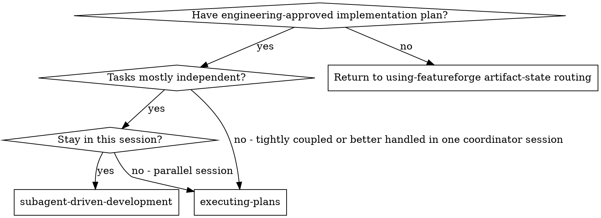
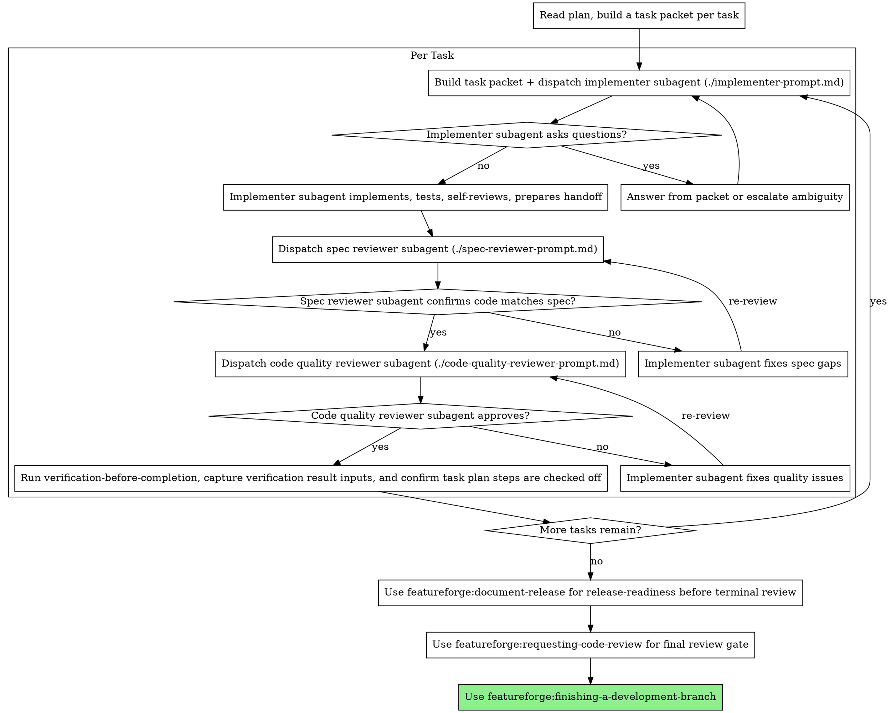

<!-- AUTO-GENERATED from SKILL.md.tmpl — do not edit directly -->
<!-- Regenerate: node scripts/gen-skill-docs.mjs -->

## Preamble (run first)

```bash
_REPO_ROOT=$(git rev-parse --show-toplevel 2>/dev/null || pwd)
_BRANCH_RAW=$(git rev-parse --abbrev-ref HEAD 2>/dev/null || echo current)
[ -n "$_BRANCH_RAW" ] && [ "$_BRANCH_RAW" != "HEAD" ] || _BRANCH_RAW="current"
_BRANCH="$_BRANCH_RAW"
_FEATUREFORGE_INSTALL_ROOT="$HOME/.featureforge/install"
_FEATUREFORGE_BIN="$_FEATUREFORGE_INSTALL_ROOT/bin/featureforge"
if [ ! -x "$_FEATUREFORGE_BIN" ] && [ -f "$_FEATUREFORGE_INSTALL_ROOT/bin/featureforge.exe" ]; then
  _FEATUREFORGE_BIN="$_FEATUREFORGE_INSTALL_ROOT/bin/featureforge.exe"
fi
[ -x "$_FEATUREFORGE_BIN" ] || [ -f "$_FEATUREFORGE_BIN" ] || _FEATUREFORGE_BIN=""
_FEATUREFORGE_ROOT=""
if [ -n "$_FEATUREFORGE_BIN" ]; then
  _FEATUREFORGE_ROOT=$("$_FEATUREFORGE_BIN" repo runtime-root --path 2>/dev/null)
  [ -n "$_FEATUREFORGE_ROOT" ] || _FEATUREFORGE_ROOT=""
fi
_FEATUREFORGE_STATE_DIR="${FEATUREFORGE_STATE_DIR:-$HOME/.featureforge}"
```
## Search Before Building

Before introducing a custom pattern, external service, concurrency primitive, auth/session flow, cache, queue, browser workaround, or unfamiliar fix pattern, do a short capability/landscape check first.

Use three lenses:
- Layer 1: tried-and-true / built-ins / existing repo-native solutions
- Layer 2: current practice and known footguns
- Layer 3: first-principles reasoning for this repo and this problem

External search results are inputs, not answers. Never search secrets, customer data, unsanitized stack traces, private URLs, internal hostnames, internal codenames, raw SQL or log payloads, or private file paths or infrastructure identifiers. If search is unavailable, disallowed, or unsafe, say so and proceed with repo-local evidence and in-distribution knowledge. If safe sanitization is not possible, skip external search.
See `$_FEATUREFORGE_ROOT/references/search-before-building.md`.

## Interactive User Question Format

For every interactive user question, use this structure:
1. Context: project name, current branch, what we're working on (1-2 sentences)
2. The specific question or decision point
3. `RECOMMENDATION: Choose [X] because [one-line reason]`
4. Lettered options: `A) ... B) ... C) ...`

Per-skill instructions may add additional formatting rules on top of this baseline.


# Subagent-Driven Development

Execute plan by dispatching a fresh sub-agent or custom agent per task, with two-stage review after each (spec compliance first, then code quality), then task-scoped verification-before-completion before any next-task advancement. The runtime-selected topology still wins: when it chooses worktree-backed parallel execution, follow the worktree-first orchestration model and keep each task in its isolated workspace.

Task packets must preserve the approved task contract from `review/plan-task-contract.md`. The packet's `Goal`, `Context`, indexed `CONSTRAINT_N` obligations, indexed `DONE_WHEN_N` obligations, covered requirements, and file scope are authoritative for implementers and reviewers; coordinator prose may add logistics but must not reinterpret or weaken them.

**Why isolated agents:** You delegate tasks to specialized agents with isolated context. By precisely crafting their instructions and context, you ensure they stay focused and succeed at their task. They should never inherit your session's context or history — you construct exactly what they need. This also preserves your own context for coordination work.

**Core principle:** Fresh isolated agent per task + two-stage review (spec then quality) = high quality, fast iteration

**Platform note:** Current Codex releases enable subagent workflows by default, so this skill does not require a separate `multi_agent` feature flag. In Codex, prefer the built-in `worker` agent for implementation and fix tasks, the built-in `explorer` agent for read-heavy review and codebase analysis, and project or personal `.codex/agents/*.toml` custom agents only when the built-ins do not fit. FeatureForge installs a `code-reviewer` custom agent for Codex review passes. In GitHub Copilot local installs, use the platform's native custom-agent or sub-agent support.

## Nested Session Guidance

When you dispatch a child that will start a fresh FeatureForge conversation, rely on the current runtime-supported nested-session behavior instead of reintroducing legacy environment-marker contracts in the child process.

## When to Use



**vs. Executing Plans (parallel session):**
- Same session (no context switch)
- Fresh isolated agent per task (no context pollution)
- Two-stage review after each task: spec compliance first, then code quality
- Faster iteration (no human-in-loop between tasks)

## The Process

### Task-Boundary Closure Loop (Mandatory)

For each task, enforce this exact order before dispatching the next task:
1. Complete the task's implementation steps.
2. MUST dispatch dedicated-independent fresh-context task review loops (spec compliance, then code quality); implementer or coordinator self-review never satisfies this gate.
3. If review fails, reopen/remediate/re-review until green.
4. When remediation churn reaches 3 cycles for the same task, follow runtime cycle-break handling before retry.
5. After review is green, run `verification-before-completion` and collect the verification result inputs needed by `close-current-task`.
6. Task `N+1` may begin only after Task `N` has a current positive task-closure record; dedicated-independent review loops and verification are required inputs to `close-current-task` and are not separate begin-time authority after closure is current.
7. Rerun `featureforge workflow operator --plan <approved-plan-path> --external-review-result-ready` and follow its route; the normal closure path is `featureforge plan execution close-current-task --plan <approved-plan-path> --task <n> --review-result pass|fail --review-summary-file <review-summary> --verification-result pass|fail|not-run [--verification-summary-file <path> when verification ran]`.
8. If workflow/operator reports `task_review_dispatch_required` or `final_review_dispatch_required`, keep routing through workflow/operator plus the intent-level commands; do not expand the normal closure loop into low-level dispatch-lineage management.
9. No exceptions: only after close-current-task succeeds may you dispatch Task `N+1`.

### Reviewed-Closure Command Matrix

For the reviewed-closure mental model, read `docs/featureforge/reference/2026-04-01-review-state-reference.md` before dispatching or closing reviewed work. A current reviewed closure matches the current reviewed state. A superseded closure was valid for earlier reviewed work but is no longer authoritative after later reviewed work lands. A stale-unreviewed state means unreviewed edits exist, so the runtime MUST repair review state before recording another closure or late-stage milestone.

`featureforge workflow operator --plan <approved-plan-path>` is the only normal-path routing authority for reviewed-closure and late-stage progression.
Treat `featureforge workflow operator --plan <approved-plan-path>` as authoritative for `phase`, `phase_detail`, `review_state_status`, `next_action`, and `recommended_command`.
Treat `featureforge plan execution status --plan <approved-plan-path>` as optional diagnostic detail.

When an external task-review or final-review result is already in hand, use `featureforge workflow operator --plan <approved-plan-path> --external-review-result-ready` to expose recording-ready routes. Do not use that hint for release-readiness, document-release, or QA routing.

Do not reconstruct closure routing from memory or duplicate route tables in this skill. Follow operator-reported `phase`, `phase_detail`, `review_state_status`, `next_action`, `recommended_command`, and `recording_context` directly, with these guardrails:
- `task_closure_recording_ready` requires `recording_context.task_number`.
- `release_readiness_recording_ready` and `release_blocker_resolution_required` require `recording_context.branch_closure_id`.
- `final_review_recording_ready` requires `recording_context.branch_closure_id`.
- Treat `resume_task` and `resume_step` in diagnostic status output as advisory-only fields; if they disagree with workflow/operator `recommended_command`, follow `recommended_command`.
- When `phase_detail=task_closure_recording_ready`, replay is already complete enough for closure refresh; run `close-current-task` and do not reopen the same step again.
- When workflow/operator reports `review_state_status` as stale or missing closure context, run `featureforge plan execution repair-review-state --plan <approved-plan-path>` directly.
- After `repair-review-state`, MUST follow the command returned in that command's `recommended_command` before any additional recording commands.
- The returned `recommended_command` is authoritative for the immediate reroute.
- Use `featureforge plan execution status --plan <approved-plan-path>` only when additional diagnostics are required.
- Keep compatibility/debug-only runtime primitives out of the normal path unless explicitly debugging a compatibility boundary.
- Hidden compatibility/debug command entrypoints are removed from the public CLI; normal routing must use public commands only.
- In `*_dispatch_required` lanes, request the review and keep rerouting through workflow/operator; do not expand the normal path into low-level dispatch-lineage management.
- MUST NOT manually edit runtime-owned execution records.
- MUST NOT manually edit `**Execution Note:**` lines to recover runtime state.
- MUST NOT manually edit derived markdown artifacts or receipts.
- MUST NOT use the internal task-closure recording service boundary directly.
- MUST use `close-current-task` for task closure.

Late-stage aggregate command coverage:
- `featureforge plan execution advance-late-stage --plan <approved-plan-path>`
- `featureforge plan execution advance-late-stage --plan <approved-plan-path> --result ready|blocked --summary-file <release-summary>`
- `featureforge plan execution advance-late-stage --plan <approved-plan-path> --reviewer-source <source> --reviewer-id <id> --result pass|fail --summary-file <final-review-summary>`
- `featureforge plan execution advance-late-stage --plan <approved-plan-path> --result pass|fail --summary-file <qa-report>`
- Compatibility-only escape hatch: use low-level runtime primitives only when explicitly debugging or preserving compatibility.



## Implementation Preflight

Before dispatching any implementation subagent:

1. Require the exact approved plan path as input. If you are not given one, stop and ask for it or route back to `featureforge:plan-eng-review`.
2. Read that plan first and confirm these exact header lines:
   - `**Workflow State:** Engineering Approved`
   - `**Source Spec:** <path>`
   - `**Source Spec Revision:** <integer>`
3. Read the source spec named in the plan and confirm it is still `CEO Approved`, and that the latest approved spec still matches that exact source-spec path and revision.
4. Stop immediately and redirect:
   - to `featureforge:plan-eng-review` if the plan is draft or malformed
   - to `featureforge:writing-plans` if the source spec path or revision is stale
5. Verify workspace readiness before dispatching subagents:
   - stop on a default protected branch (`main`, `master`, `dev`, or `develop`) unless the user explicitly approves in-place execution
   - stop on detached HEAD
   - stop if merge conflicts, unresolved index entries, rebase, or cherry-pick state is present
   - if the working tree is dirty, stop unless the helper-selected topology and workspace-prepared context explicitly support isolated worktree-backed execution for this run
6. Do not auto-clean the workspace. If the helper-selected topology or protected-branch gate requires isolated execution, provision or route through a worktree-backed workspace before dispatching repo-writing subagents.
7. The later repo-safety checks still govern any additional protected branches declared through repo or user instructions.
8. Run `featureforge workflow operator --plan <approved-plan-path>` before dispatching implementation subagents.
9. If workflow/operator does not report `phase` `executing`, stop and follow the reported `phase`, `phase_detail`, `next_action`, and `recommended_command` instead of reopening execution through compatibility helpers.
10. Treat execution start as a hard gate, not a reminder:
   - no code edits and no test edits are allowed after workflow/operator confirms the current execution preflight handoff and before the first `begin` for the active step
   - do not dispatch implementation subagents for repo-writing work until that first `begin` is recorded
   - if the workspace becomes dirty before the first `begin`, expect later execution-start checks to fail closed (for example `tracked_worktree_dirty`) until the workspace is reconciled or isolated
   - retroactive execution tracking is recovery-only and must never be treated as the normal execution path
   - five-step recovery runbook for dirty-before-begin failures:
     1. reconcile or isolate the workspace
     2. rerun `workflow operator --plan <approved-plan-path>` and confirm the current route is still `executing` for the current approved plan revision
     3. use that helper-backed route before any recovery mutation
     4. backfill only factual-only completed steps using authoritative helper mutations; never infer completion from dirty diffs
     5. resume from the task-boundary review and verification gate before any next-task `begin`

## Helper-Owned Execution State

- calls `workflow operator --plan ...` during preflight
- uses `status --plan ...` only for additional diagnostics when operator output alone is insufficient
- uses the workflow/operator execution-start handoff instead of separate compatibility-helper choreography before dispatching implementation subagents
- calls `begin` before starting work on a plan step
- calls `complete` after each completed step
- reports interruptions or blockers in the handoff/status surface instead of invoking a removed execution-note command
- On the first `begin` for a revision whose plan still says `**Execution Mode:** none`, initialize execution with `--execution-mode featureforge:subagent-driven-development`
- The approved plan checklist is the human-visible execution progress projection. The event log remains authoritative for routing and gates; do not create or maintain a separate ad hoc task tracker outside those shared surfaces.
- Runtime read models are rendered under the state directory during normal execution. Repo-local projection files under `docs/featureforge/projections/` are optional human-readable exports; do not create or maintain a separate ad hoc task tracker outside workflow/operator and status.
- Use `featureforge plan execution materialize-projections --plan <approved-plan-path>` only when the user explicitly needs repo-local human-readable projection exports. Approved plan and evidence files are not modified, and materialization is never required for normal progress. Add `--scope execution|late-stage|all` only when a non-default export scope is needed.

## Runtime Strategy Checkpoints (Automatic, Runtime-Owned)

- Runtime strategy checkpoints are execution-owned state, not workflow-stage transitions. Keep public workflow phase in execution (`executing`) while strategy checkpoints change; remediation stays represented by checkpoint state and operator routing.
- The approved plan/spec scope is fixed during execution. Runtime strategy checkpoints may change topology, lane/worktree allocation, subagent assignment, and remediation order, but must not change approved scope, source plan revision, or required coverage.
- Required checkpoint kinds:
  - `initial_dispatch`: required before repo-writing implementation starts. Runtime records it automatically on first dispatch/begin when missing.
  - `review_remediation`: required after actionable independent-review findings and before remediation starts. Runtime records it automatically when reviewable dispatch lineage enters remediation and when remediation reopens execution work.
  - `cycle_break`: required when churn is detected. Runtime records it automatically when the same task hits three review-dispatch/reopen cycles in one run.
- Cycle-break trigger: cap remediation churn at 3 cycles per task. On the third cycle, transition to `cycle_break` strategy automatically (no human replanning loopback).
- Unit-review receipts and downstream final-review evidence must reference the checkpoint fingerprint from the runtime status for traceability.
- Surface and respect runtime strategy status from `featureforge plan execution status --plan ...`:
  - `strategy_state`
  - `strategy_checkpoint_kind`
  - `last_strategy_checkpoint_fingerprint`
  - `strategy_reset_required`

## Execution-Phase Subagent Dispatch Policy

- Once execution is active for an approved plan (`execution_started` is `yes`), runtime-selected implementation and review subagent dispatch is authorized and does not require per-dispatch user-consent prompts.
- This authorization is limited to execution-phase dispatch performed by workflow-owned execution skills (`featureforge:executing-plans` and `featureforge:subagent-driven-development`).
- Non-execution ad-hoc delegation still follows normal user-consent policy.

## Authoritative Mutation Boundary (Coordinator/Runtime/Harness Owned)

- Task packets, candidate edits, and handoff notes are candidate artifacts. They are input context, not authoritative runtime mutation state.
- Implementer helpers/subagents must not directly invoke `record-contract`; the coordinator/runtime/harness owns this authoritative mutation command.
- Implementer helpers/subagents must not directly invoke `record-evaluation`; the coordinator/runtime/harness owns this authoritative mutation command.
- Implementer helpers/subagents must not directly invoke `record-handoff`; the coordinator/runtime/harness owns this authoritative mutation command.
- Implementer helpers/subagents must not directly invoke `begin`; the coordinator/runtime helper owns this authoritative execution-state mutation.
- Implementer helpers/subagents must not directly invoke removed `note`; the coordinator/runtime helper owns interruption and execution-state mutation boundaries.
- Implementer helpers/subagents must not directly invoke `complete`; the coordinator/runtime helper owns this authoritative execution-state mutation.
- Implementer helpers/subagents must not directly invoke `reopen`; the coordinator/runtime helper owns this authoritative execution-state mutation.
- Implementer helpers/subagents must not directly invoke `transfer`; the coordinator/runtime helper owns this authoritative execution-state mutation.
- If packet context conflicts with helper-reported execution state, fail closed and defer to coordinator-owned runtime checks instead of mutating state directly.

## Protected-Branch Repo-Write Gate

The main agent owns the protected-branch gate for every repo-writing task slice, even when an implementer subagent does the coding.
The coordinator owns every `git commit`, `git merge`, and `git push` for this workflow, even when an implementer subagent does the coding.

Before dispatching or applying any repo-writing task slice, run the shared repo-safety preflight for that exact scope:

```bash
featureforge repo-safety check --intent write --stage featureforge:subagent-driven-development --task-id <current-task-slice> --path <repo-relative-path> --write-target execution-task-slice
```

- Use one stable task id per repo-writing task slice and pass the concrete repo-relative paths when they are known.
- If the helper returns `allowed`, continue with that task slice.
- If it returns `blocked`, name the branch, the stage, and the blocking `failure_class`, then route to either a feature branch / `featureforge:using-git-worktrees` or explicit user approval for this exact task slice.
- If the user explicitly approves the protected-branch write, approve the full task-slice scope you intend to use on that branch, including the repo-relative paths and any follow-on git targets that are part of the same slice:

```bash
featureforge repo-safety approve --stage featureforge:subagent-driven-development --task-id <current-task-slice> --reason "<explicit user approval>" --path <repo-relative-path> --write-target execution-task-slice [--write-target git-commit] [--write-target git-merge] [--write-target git-push]
featureforge repo-safety check --intent write --stage featureforge:subagent-driven-development --task-id <current-task-slice> --path <repo-relative-path> --write-target execution-task-slice [--write-target git-commit] [--write-target git-merge] [--write-target git-push]
```

- Continue only if the re-check returns `allowed`.
- Before a coordinator-owned follow-on `git commit`, `git merge`, or `git push` on the same protected-branch task slice, re-run the gate with the same task id, the same repo-relative paths, and the same approved write-target set.
- If the protected-branch task scope changes, run a new `approve` plus full-scope `check` before continuing.
- Do not treat a worktree on `main`, `master`, `dev`, or `develop` as safe by itself; the branch must be non-protected or explicitly approved.

## Model Selection

Use the least powerful model that can handle each role to conserve cost and increase speed.

**Mechanical implementation tasks** (isolated functions, clear specs, 1-2 files): use a fast, cheap model. Most implementation tasks are mechanical when the plan is well-specified.

**Integration and judgment tasks** (multi-file coordination, pattern matching, debugging): use a standard model.

**Architecture, design, and review tasks**: use the most capable available model.

**Task complexity signals:**
- Touches 1-2 files with a complete spec → cheap model
- Touches multiple files with integration concerns → standard model
- Requires design judgment or broad codebase understanding → most capable model

**Codex role mapping:**
- Implementer → built-in `worker`
- Spec reviewer → built-in `explorer` for read-heavy passes, or `default` when the review needs broader judgment
- Code-quality reviewer → installed `code-reviewer` custom agent for the standard FeatureForge review flow
- Custom agent → only when you need task-specific instructions that the built-ins do not cover

## Handling Implementer Status

Implementer subagents report one of four statuses. Handle each appropriately:

**DONE:** Proceed to spec compliance review.

**DONE_WITH_CONCERNS:** The implementer completed the work but flagged doubts. Read the concerns before proceeding. If the concerns are about correctness or scope, address them before review. If they're observations (e.g., "this file is getting large"), note them and proceed to review.

**NEEDS_CONTEXT:** The implementer needs information that wasn't provided. Provide the missing context and re-dispatch.

If the question is already answered by the packet, answer directly from the packet. If the packet does not answer it, the task is ambiguous and execution must stop or route back to review.

**BLOCKED:** The implementer cannot complete the task. Assess the blocker:
1. If it's a context problem, provide more context and re-dispatch with the same model
2. If the task requires more reasoning, re-dispatch with a more capable model
3. If the task is too large, break it into smaller pieces
4. If the plan itself is wrong, escalate to the human

**Never** ignore an escalation or force the same model to retry without changes. If the implementer said it's stuck, something needs to change.

## Prompt Templates

- `./implementer-prompt.md` - Dispatch implementer subagent
- `./spec-reviewer-prompt.md` - Dispatch spec compliance reviewer subagent
- `./code-quality-reviewer-prompt.md` - Dispatch code quality reviewer subagent

## Packet Contract

- Build a task packet from the approved plan/spec pair before every implementation or review dispatch.
- pass the packet verbatim to implementer and reviewers.
- Treat packet content as the authoritative execution contract for that task slice; do not paraphrase or weaken requirement statements.
- Reviewers must grade packet-assigned `DONE_WHEN_N` and `CONSTRAINT_N` obligations by ID and cite those IDs in findings.
- Code-quality review must grade reuse expectations from packet constraints and fail avoidable duplicate implementation as a hard failure.
- Controllers may add transient logistics such as branch, working directory, or base commit, but they may not add new semantic requirements.
- If the packet does not answer it, the task is ambiguous and execution must stop or route back to review.

## Example Workflow

```
You: I'm using Subagent-Driven Development to execute this plan.

[Read plan file once: docs/featureforge/plans/feature-plan.md]
[Build the task packet for Task 1 from the approved plan/spec pair]
[Use the approved plan as the human-visible execution progress projection]

Task 1: Shared install migration docs

[Dispatch implementation subagent with the packet verbatim]

Implementer: "Before I begin - should the migration docs include both Unix shell and PowerShell commands?"

You: "The packet already requires both shells. Keep the shared install root at ~/.featureforge/install and document both shells."

Implementer: "Got it. Implementing now..."
[Later] Implementer:
  - Updated shared-root migration docs
  - Added tests, 5/5 passing
  - Self-review: Found I missed the PowerShell temp-clone cleanup, added it
  - Ready for coordinator-owned git actions

[Dispatch spec compliance reviewer]
Spec reviewer: ✅ Spec compliant - all requirements met, nothing extra

[Get git SHAs, dispatch code quality reviewer]
Code reviewer: Strengths: Good test coverage, clean. Issues: None. Approved.

[Confirm Task 1's plan steps are checked off in the approved plan]

Task 2: Recovery modes

[Build the task packet for Task 2]
[Dispatch implementation subagent with the packet verbatim]

Implementer: [No questions, proceeds]
Implementer:
  - Added verify/repair modes
  - 8/8 tests passing
  - Self-review: All good
  - Ready for coordinator-owned git actions

[Dispatch spec compliance reviewer]
Spec reviewer: ❌ Issues:
  ### Finding TASK_DONE_WHEN_UNMET
  **Finding ID:** TASK_DONE_WHEN_UNMET
  **Severity:** critical
  **Task:** Task 2
  **Violated Field or Obligation:** DONE_WHEN_1
  **Evidence:** The packet requires progress reporting every 100 items, but the diff has no reporting call in the processing loop.
  **Required Fix:** Add progress reporting at the packet-required interval.
  **Hard Fail:** yes
  ### Finding TASK2_SCOPE_EXTRA_JSON_FLAG
  **Finding ID:** TASK2_SCOPE_EXTRA_JSON_FLAG
  **Severity:** important
  **Task:** Task 2
  **Violated Field or Obligation:** PLAN_DEVIATION_FOUND
  **Evidence:** The Task 2 packet does not request a `--json` flag, but the diff adds one.
  **Required Fix:** Remove the unrequested `--json` flag from the Task 2 diff or route the scope expansion back through plan approval.
  **Hard Fail:** no

[Implementer fixes issues]
Implementer: Removed --json flag, added progress reporting

[Spec reviewer reviews again]
Spec reviewer: ✅ Spec compliant now

[Dispatch code quality reviewer]
Code reviewer: Issues:
  ### Finding TASK2_PROGRESS_INTERVAL_CONSTANT
  **Finding ID:** TASK2_PROGRESS_INTERVAL_CONSTANT
  **Severity:** important
  **Task:** Task 2
  **Violated Field or Obligation:** PACKET_REUSE_SCOPE
  **Evidence:** The diff repeats the reporting interval literal `100` instead of using a named constant.
  **Required Fix:** Extract the interval into a named constant and use it at each reporting site.
  **Hard Fail:** no

[Implementer fixes]
Implementer: Extracted PROGRESS_INTERVAL constant

[Code reviewer reviews again]
Code reviewer: ✅ Approved

[Mark Task 2 complete]

...

[After all tasks]
[Announce: I'm using the requesting-code-review skill for the final review pass.]
[Invoke featureforge:requesting-code-review]
[Resolve any Critical or Important findings]

[Announce: I'm using the finishing-a-development-branch skill to complete this work.]
[Invoke featureforge:finishing-a-development-branch]
[Let that skill require qa-only when browser QA is warranted, require document-release for workflow-routed work, then present merge/PR/keep/discard options and follow the chosen path]
```

## Advantages

**vs. Manual execution:**
- Subagents follow TDD naturally
- Fresh context per task (no confusion)
- Parallel-safe (subagents don't interfere)
- Subagent can ask questions (before AND during work)

**vs. Executing Plans:**
- Same session (no handoff)
- Continuous progress (no waiting)
- Review checkpoints automatic

**Efficiency gains:**
- No repeated artifact parsing per subagent (controller provides the helper-built packet)
- Semantic context stays packet-backed instead of drifting into controller summaries
- Subagent gets the exact approved task contract upfront
- Questions surfaced before work begins (not after)

**Quality gates:**
- Self-review catches issues before handoff
- Two-stage review: spec compliance, then code quality
- Review loops ensure fixes actually work
- Spec compliance prevents over/under-building
- Code quality ensures implementation is well-built
- Those per-task review loops satisfy the "review early" rule during execution; `featureforge:requesting-code-review` remains the final whole-diff gate unless you intentionally want an extra interim checkpoint

**Cost:**
- More subagent invocations (implementer + 2 reviewers per task)
- Controller does more prep work (building packets and coordinating reviewers)
- Review loops add iterations
- But catches issues early (cheaper than debugging later)

## Red Flags

**Never:**
- Start implementation on a default protected branch (`main`, `master`, `dev`, or `develop`) without explicit user consent
- Skip reviews (spec compliance OR code quality)
- Proceed with unfixed issues
- Dispatch multiple implementation subagents in parallel without helper-selected topology, isolated worktrees, and disjoint lane ownership
- Make subagent re-read the plan/spec when the helper-built packet already defines the task contract
- Replace the packet with controller-written semantic summaries or extra "scene-setting" requirements
- Ignore subagent questions (answer before letting them proceed)
- Accept "close enough" on spec compliance (spec reviewer found issues = not done)
- Skip review loops (reviewer found issues = implementer fixes = review again)
- Let implementer self-review replace actual review (both are needed)
- **Start code quality review before spec compliance is ✅** (wrong order)
- Move to next task while either review has open issues

**If subagent asks questions:**
- Answer clearly and completely
- Provide additional context if needed
- Don't rush them into implementation

**If reviewer finds issues:**
- Implementer (same subagent) fixes them
- Reviewer reviews again
- Repeat until approved
- Don't skip the re-review

**If subagent fails task:**
- Dispatch fix subagent with specific instructions
- Don't try to fix manually (context pollution)

## Integration

**Required workflow skills:**
- **featureforge:writing-plans** - Creates the plan this skill executes
- **featureforge:plan-eng-review** - Provides the approved plan and the execution preflight handoff
- **featureforge:requesting-code-review** - REQUIRED: Final review gate after execution completes
- **featureforge:finishing-a-development-branch** - Complete development after all tasks

**Conditional completion gate:**
- **featureforge:qa-only** - Required when browser QA is warranted by the branch change surface or test-plan artifact; optional otherwise
- **featureforge:document-release** - Required release-readiness pass for workflow-routed work before completion

**Subagents should use:**
- **featureforge:test-driven-development** - Subagents follow TDD for each task

**Optional direct invocation:**
- **featureforge:using-git-worktrees** - Use when the user explicitly wants isolated workspace management before execution, or when runtime-directed remediation says to prepare the workspace first

**Alternative workflow:**
- **featureforge:executing-plans** - Use for parallel session instead of same-session execution
