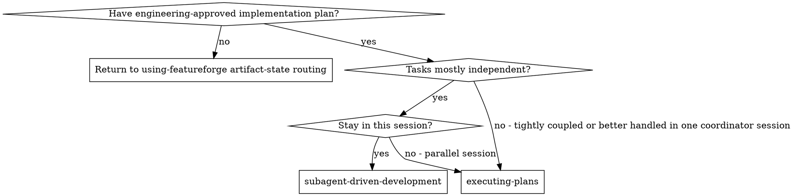

<!-- AUTO-GENERATED from SKILL.md.tmpl — do not edit directly -->
<!-- Regenerate: node scripts/gen-skill-docs.mjs -->

## Preamble (run first)

```bash
_REPO_ROOT=$(git rev-parse --show-toplevel 2>/dev/null || pwd)
_BRANCH_RAW=$(git rev-parse --abbrev-ref HEAD 2>/dev/null || echo current)
[ -n "$_BRANCH_RAW" ] && [ "$_BRANCH_RAW" != "HEAD" ] || _BRANCH_RAW="current"
_BRANCH="$_BRANCH_RAW"
_FEATUREFORGE_INSTALL_ROOT="$HOME/.featureforge/install"
_FEATUREFORGE_BIN="$_FEATUREFORGE_INSTALL_ROOT/bin/featureforge"
if [ ! -x "$_FEATUREFORGE_BIN" ] && [ -f "$_FEATUREFORGE_INSTALL_ROOT/bin/featureforge.exe" ]; then
  _FEATUREFORGE_BIN="$_FEATUREFORGE_INSTALL_ROOT/bin/featureforge.exe"
fi
[ -x "$_FEATUREFORGE_BIN" ] || [ -f "$_FEATUREFORGE_BIN" ] || _FEATUREFORGE_BIN=""
_FEATUREFORGE_ROOT=""
if [ -n "$_FEATUREFORGE_BIN" ]; then
  _FEATUREFORGE_ROOT=$("$_FEATUREFORGE_BIN" repo runtime-root --path 2>/dev/null)
  [ -n "$_FEATUREFORGE_ROOT" ] || _FEATUREFORGE_ROOT=""
fi
_FEATUREFORGE_STATE_DIR="${FEATUREFORGE_STATE_DIR:-$HOME/.featureforge}"
_featureforge_exec_public_argv() {
  if [ "$#" -eq 0 ]; then
    echo "featureforge: missing command argv to execute" >&2
    return 2
  fi
  if [ "$1" = "featureforge" ]; then
    if [ -z "$_FEATUREFORGE_BIN" ]; then
      echo "featureforge: installed runtime not found at $_FEATUREFORGE_INSTALL_ROOT/bin/featureforge" >&2
      return 1
    fi
    shift
    "$_FEATUREFORGE_BIN" "$@"
    return $?
  fi
  echo "featureforge: refusing non-featureforge public argv: $1" >&2
  return 2
}
```
## Installed Control Plane

Live workflow routing uses only `$_FEATUREFORGE_BIN`; never use `./bin/featureforge`, `target/debug/featureforge`, or `cargo run` for live routing. Query workflow/operator JSON with `$_FEATUREFORGE_BIN workflow operator --plan <approved-plan-path> --json`.

If the installed runtime/root cannot be resolved, stop before making workflow mutations. Use only typed operator JSON route surfaces: execute `recommended_public_command_argv` when present; when `recommended_public_command_template` appears, treat `required_inputs` as validation metadata and materialize templates only by rerunning `$_FEATUREFORGE_BIN workflow operator --plan <approved-plan-path> --input NAME=VALUE --json`. Detailed binding and route-specific stop rules live in `$_FEATUREFORGE_ROOT/references/operator-route-authority.md`. Treat display-only `recommended_command` as non-executable; if no typed executable surface exists, stop and report the route diagnostic.
## Search Before Building

Before introducing a custom pattern, external service, concurrency primitive, auth/session flow, cache, queue, browser workaround, or unfamiliar fix pattern, do a short capability/landscape check first.

Use three lenses, then decide from local repo truth:
- Layer 1: tried-and-true / built-ins / existing repo-native solutions
- Layer 2: current practice and known footguns
- Layer 3: first-principles reasoning for this repo and this problem

External search results are inputs, not answers. Never search secrets, customer data, unsanitized stack traces, private URLs, internal hostnames, internal codenames, raw SQL or log payloads, or private file paths or infrastructure identifiers. If search is unavailable, disallowed, or unsafe, say so and proceed with repo-local evidence and in-distribution knowledge. If safe sanitization is not possible, skip external search.
See `$_FEATUREFORGE_ROOT/references/search-before-building.md`.

## Interactive User Question Format

For every interactive user question, use this structure:
1. Context: project name, current branch, what we're working on (1-2 sentences)
2. The specific question or decision point
3. `RECOMMENDATION: Choose [X] because [one-line reason]`
4. Lettered options: `A) ... B) ... C) ...`

Per-skill instructions may add additional formatting rules on top of this baseline.


# Subagent-Driven Development

Execute plan by dispatching a fresh sub-agent or custom agent per task, with two-stage review after each (spec compliance first, then code quality), then task-scoped verification-before-completion before any next-task advancement. The runtime-selected topology still wins: when it chooses worktree-backed parallel execution, follow the worktree-first orchestration model and keep each task in its isolated workspace.

Task packets must preserve the approved task contract from `$_FEATUREFORGE_ROOT/review/plan-task-contract.md`. The packet's `Goal`, `Context`, indexed `CONSTRAINT_N` obligations, indexed `DONE_WHEN_N` obligations, covered requirements, and file scope are authoritative for implementers and reviewers; coordinator prose may add logistics but must not reinterpret or weaken them.

**Core principle:** Fresh isolated agent per task + spec review + code-quality review + verified task closure before any next task.

Extended examples, model-selection hints, and rationale live in `$_FEATUREFORGE_ROOT/references/execution-review-qa-examples.md`.

## When to Use


```dot
digraph when_to_use {
    "Have engineering-approved implementation plan?" [shape=diamond];
    "Return to using-featureforge artifact-state routing" [shape=box];
    "Tasks mostly independent?" [shape=diamond];
    "Stay in this session?" [shape=diamond];
    "subagent-driven-development" [shape=box];
    "executing-plans" [shape=box];

    "Have engineering-approved implementation plan?" -> "Return to using-featureforge artifact-state routing" [label="no"];
    "Have engineering-approved implementation plan?" -> "Tasks mostly independent?" [label="yes"];
    "Tasks mostly independent?" -> "Stay in this session?" [label="yes"];
    "Tasks mostly independent?" -> "executing-plans" [label="no - tightly coupled or better handled in one coordinator session"];
    "Stay in this session?" -> "subagent-driven-development" [label="yes"];
    "Stay in this session?" -> "executing-plans" [label="no - parallel session"];
}
```

## The Process

### Task-Boundary Closure Loop (Mandatory)

For each task, enforce this exact order before dispatching the next task:
1. Complete the task's implementation steps.
2. MUST dispatch dedicated-independent fresh-context task review loops (spec compliance, then code quality); implementer or coordinator self-review never satisfies this gate.
   Review findings must use deterministic repair-packet fields: `Finding ID`, `Severity`, `Task`, `Violated Field or Obligation`, `Evidence`, `Required Fix`, and `Hard Fail`.
3. If review fails, reopen/remediate/re-review until green.
4. When remediation churn reaches 3 cycles for the same task, follow runtime cycle-break handling before retry.
5. After review is green, run `verification-before-completion` and collect the verification result inputs needed by `close-current-task`.
6. For FeatureForge-on-FeatureForge execution, every execution-evidence update must include a runtime provenance section with:
   - installed runtime path used for live workflow routing
   - installed runtime hash used for live workflow routing
   - workspace runtime hash used for tests/fixtures (or `none` when no workspace runtime was used)
   - state dir used for live workflow commands
   - explicit confirmation that workspace runtime did not mutate live workflow state (or the explicit approved override record when it did)
7. Task `N+1` may begin only after Task `N` has a current positive task-closure record; dedicated-independent review loops and verification are required inputs to `close-current-task` and are not separate begin-time authority after closure is current.
8. After the dedicated-independent review result is in hand, query `$_FEATUREFORGE_BIN workflow operator --plan <approved-plan-path> --external-review-result-ready --json`, then follow the Installed Control Plane section and canonical route reference for the returned route; verification results are `close-current-task` inputs, not a reason to pass that flag.
9. If workflow/operator still reports a review-dispatch or recording route after an external review result is ready, keep rerouting through workflow/operator and the canonical route reference; do not expand the loop into low-level dispatch-lineage management.
10. No exceptions: only after close-current-task succeeds may you dispatch Task `N+1`.

### Reviewed-Closure Route Authority

Reviewed-closure and late-stage handoffs are operator-owned. Keep workflow/operator JSON as the route authority; use `$_FEATUREFORGE_ROOT/references/operator-route-authority.md` for route-specific binding detail and `$_FEATUREFORGE_ROOT/docs/featureforge/reference/2026-04-01-review-state-reference.md` only for the review-state mental model.

Use `$_FEATUREFORGE_BIN workflow operator --plan <approved-plan-path> --external-review-result-ready --json` only after an external task-review or final-review result is in hand; do not use that hint for release-readiness, document-release, or QA routing.

Do not duplicate route tables, infer low-level dispatch-lineage commands, or manually edit runtime-owned records, derived markdown projections, or `**Execution Note:**` lines to recover routing state. Follow operator JSON and the canonical route reference.

When no tasks remain, query workflow/operator for the selected late-stage route, then execute only the selected typed route or selected handoff skill.

## Implementation Preflight

Before dispatching any implementation subagent:

1. Require the exact approved plan path as input. If you are not given one, stop and ask for it or route back to `featureforge:plan-eng-review`.
2. Read that plan first and confirm these exact header lines:
   - `**Workflow State:** Engineering Approved`
   - `**Source Spec:** <path>`
   - `**Source Spec Revision:** <integer>`
3. Read the source spec named in the plan and confirm it is still `CEO Approved`, and that the latest approved spec still matches that exact source-spec path and revision.
4. Stop immediately and redirect:
   - to `featureforge:plan-eng-review` if the plan is draft or malformed
   - to `featureforge:writing-plans` if the source spec path or revision is stale
5. Verify workspace readiness before dispatching subagents:
   - stop on a default protected branch (`main`, `master`, `dev`, or `develop`) unless the user explicitly approves in-place execution
   - stop on detached HEAD
   - stop if merge conflicts, unresolved index entries, rebase, or cherry-pick state is present
   - if the working tree is dirty, stop unless the runtime-selected topology and workspace-prepared context explicitly support isolated worktree-backed execution for this run
6. Do not auto-clean the workspace. If the runtime-selected topology or protected-branch gate requires isolated execution, provision or route through a worktree-backed workspace before dispatching repo-writing subagents.
7. The later repo-safety checks still govern any additional protected branches declared through repo or user instructions.
8. Run `$_FEATUREFORGE_BIN workflow operator --plan <approved-plan-path> --json` before dispatching implementation subagents.
9. If workflow/operator JSON does not report `phase` `executing`, stop normal execution and follow the Installed Control Plane section plus the canonical route reference for the current operator result. Treat `phase`, `phase_detail`, and `next_action` as diagnostic context.
10. Treat execution start as a hard gate, not a reminder: no code edits, no test edits, and no repo-writing implementation subagent dispatch after workflow/operator confirms the current execution preflight handoff and before the first `begin` for the active step. If the workspace becomes dirty before the first `begin`, expect later checks to fail closed with reason codes such as `tracked_worktree_dirty` until reconciled or isolated. Retroactive execution tracking is recovery-only; use the canonical route reference for recovery binding details.

## Runtime-Owned Execution State

- calls `$_FEATUREFORGE_BIN workflow operator --plan ... --json` during preflight
- uses `status --plan ...` only for additional diagnostics when operator output alone is insufficient
- uses the workflow/operator execution-start handoff instead of separate compatibility/debug choreography before dispatching implementation subagents
- calls `begin` before starting work on a plan step
- calls `complete` after each completed step
- reports interruptions or blockers in the handoff/status surface instead of invoking command-shaped note or repair side channels
- On the first `begin` for a revision whose plan still says `**Execution Mode:** none`, initialize execution with `--execution-mode featureforge:subagent-driven-development`
- The approved plan checklist is the human-visible execution progress projection. The event log remains authoritative for routing and gates; do not create or maintain a separate ad hoc task tracker outside those shared surfaces.
- Runtime read models are rendered under the state directory during normal execution. Repo-local projection files under `docs/featureforge/projections/` are optional human-readable exports; do not create or maintain a separate ad hoc task tracker outside workflow/operator and status.
- Use `$_FEATUREFORGE_BIN plan execution materialize-projections --plan <approved-plan-path>` for state-dir-only diagnostic projection refreshes. If the user explicitly needs repo-local human-readable projection exports, add `--repo-export --confirm-repo-export`; approved plan and evidence files are not modified, and materialization is never required for normal progress. Add `--scope execution|late-stage|all` only when a non-default export scope is needed.

## Runtime Strategy Checkpoints (Automatic, Runtime-Owned)

- Runtime strategy checkpoints are execution-owned state, not workflow-stage transitions. Keep public workflow phase in execution (`executing`) while strategy checkpoints change; remediation stays represented by checkpoint state and operator routing.
- The approved plan/spec scope is fixed during execution. Runtime strategy checkpoints may change topology, lane/worktree allocation, subagent assignment, and remediation order, but must not change approved scope, source plan revision, or required coverage.
- Required checkpoint kinds:
  - `initial_dispatch`: required before repo-writing implementation starts. Runtime records it automatically on first dispatch/begin when missing.
  - `review_remediation`: required after actionable independent-review findings and before remediation starts. Runtime records it automatically when reviewable runtime review state enters remediation and when remediation reopens execution work.
  - `cycle_break`: required when churn is detected. Runtime records it automatically when the same task hits three review-dispatch/reopen cycles in one run.
- Cycle-break trigger: cap remediation churn at 3 cycles per task. On the third cycle, transition to `cycle_break` strategy automatically (no human replanning loopback).
- Reviewers return summaries/results; the controller/runtime binds those results to authoritative state and runtime-owned review projections retain checkpoint fingerprints for traceability. Agents do not search for, repair, or depend on those projection files.
- Surface and respect runtime strategy status from `$_FEATUREFORGE_BIN plan execution status --plan ...`:
  - `strategy_state`
  - `strategy_checkpoint_kind`
  - `last_strategy_checkpoint_fingerprint`
  - `strategy_reset_required`

## Execution-Phase Subagent Dispatch Policy

- Once execution is active for an approved plan (`execution_started` is `yes`), runtime-selected implementation and review subagent dispatch is authorized and does not require per-dispatch user-consent prompts.
- This authorization is limited to execution-phase dispatch performed by workflow-owned execution skills (`featureforge:executing-plans` and `featureforge:subagent-driven-development`).
- Non-execution ad-hoc delegation still follows normal user-consent policy.

## Authoritative Mutation Boundary (Coordinator/Runtime/Harness Owned)

- Task packets, candidate edits, and handoff notes are candidate artifacts. They are input context, not authoritative runtime mutation state.
- Implementers/subagents must not directly mutate runtime execution state. The coordinator/runtime owns all workflow/operator-guided public execution mutations, including start, completion, reopen, transfer, closure, repair, and advancement.
- Implementers/subagents must report interruptions, blockers, and handoff material through the coordinator-owned handoff/status surface instead of command-shaped note or repair side channels.
- If packet context conflicts with runtime-reported execution state, fail closed and defer to coordinator-owned runtime checks instead of mutating state directly.

## Protected-Branch Repo-Write Gate

The main agent owns the protected-branch gate for every repo-writing task slice, even when an implementer subagent does the coding.
The coordinator owns every `git commit`, `git merge`, and `git push` for this workflow, even when an implementer subagent does the coding.

Before dispatching or applying any repo-writing task slice, run the shared repo-safety preflight for that exact scope:

```bash
$_FEATUREFORGE_BIN repo-safety check --intent write --stage featureforge:subagent-driven-development --task-id <current-task-slice> --path <repo-relative-path> --write-target execution-task-slice
```

- Use one stable task id per repo-writing task slice and pass the concrete repo-relative paths when they are known.
- If the repo-safety check returns `allowed`, continue with that task slice.
- If it returns `blocked`, name the branch, the stage, and the blocking `failure_class`, then route to either a feature branch / `featureforge:using-git-worktrees` or explicit user approval for this exact task slice.
- If the user explicitly approves the protected-branch write, approve the full task-slice scope you intend to use on that branch, including the repo-relative paths and any follow-on git targets that are part of the same slice:

```bash
$_FEATUREFORGE_BIN repo-safety approve --stage featureforge:subagent-driven-development --task-id <current-task-slice> --reason "<explicit user approval>" --path <repo-relative-path> --write-target execution-task-slice [--write-target git-commit] [--write-target git-merge] [--write-target git-push]
$_FEATUREFORGE_BIN repo-safety check --intent write --stage featureforge:subagent-driven-development --task-id <current-task-slice> --path <repo-relative-path> --write-target execution-task-slice [--write-target git-commit] [--write-target git-merge] [--write-target git-push]
```

- Continue only if the re-check returns `allowed`.
- Before a coordinator-owned follow-on `git commit`, `git merge`, or `git push` on the same protected-branch task slice, re-run the gate with the same task id, the same repo-relative paths, and the same approved write-target set.
- If the protected-branch task scope changes, run a new `approve` plus full-scope `check` before continuing.
- Do not treat a worktree on `main`, `master`, `dev`, or `develop` as safe by itself; the branch must be non-protected or explicitly approved.

## Handling Implementer Status

Handle `DONE`, `DONE_WITH_CONCERNS`, `NEEDS_CONTEXT`, and `BLOCKED` as described in `$_FEATUREFORGE_ROOT/references/execution-review-qa-examples.md`. If the question is already answered by the packet, answer directly from the packet. If the packet does not answer it, the task is ambiguous and execution must stop or route back to review. Never ignore an escalation or force the same model to retry without changes.

## Prompt Templates

- skill-local `implementer-prompt.md` - Dispatch implementer subagent
- skill-local `spec-reviewer-prompt.md` - Dispatch spec compliance reviewer subagent
- skill-local `code-quality-reviewer-prompt.md` - Dispatch code quality reviewer subagent

## Packet Contract

- Build a task packet from the approved plan/spec pair before every implementation or review dispatch.
- pass the packet verbatim to implementer and reviewers.
- Treat packet content as the authoritative execution contract for that task slice; do not paraphrase or weaken requirement statements.
- Reviewers must grade packet-assigned `DONE_WHEN_N` and `CONSTRAINT_N` obligations by ID and cite those IDs in findings.
- Code-quality review must grade reuse expectations from packet constraints and fail avoidable duplicate implementation as a hard failure.
- Controllers may add transient logistics such as branch, working directory, or base commit, but they may not add new semantic requirements.
- If the packet does not answer it, the task is ambiguous and execution must stop or route back to review.

## Completion Hand-Off Shape

Those per-task review loops satisfy the "review early" rule during execution. After the final task closes, query workflow/operator and follow the returned route; do not run a memorized terminal skill sequence.

```
[Query $_FEATUREFORGE_BIN workflow operator --plan <approved-plan-path> --json]
[Follow the Installed Control Plane section and canonical route reference]
[Execute only the returned typed public argv, operator-materialized template argv, or workflow/operator-selected handoff lane]
[After each lane completes, requery workflow/operator until the route is terminal or explicitly blocked]
```

## Red Flags

**Never:**
- Start implementation on a default protected branch (`main`, `master`, `dev`, or `develop`) without explicit user consent
- Skip reviews (spec compliance OR code quality)
- Proceed with unfixed issues
- Dispatch multiple implementation subagents in parallel without runtime-selected topology, isolated worktrees, and disjoint lane ownership
- Make subagent re-read the plan/spec when the generated task packet already defines the task contract
- Replace the packet with controller-written semantic summaries or extra "scene-setting" requirements
- Ignore subagent questions (answer before letting them proceed)
- Accept "close enough" on spec compliance (spec reviewer found issues = not done)
- Skip review loops (reviewer found issues = implementer fixes = review again)
- Let implementer self-review replace actual review (both are needed)
- **Start code quality review before spec compliance is ✅** (wrong order)
- Move to next task while either review has open issues

**If subagent asks questions:**
- Answer clearly and completely
- Provide additional context if needed
- Don't rush them into implementation

**If reviewer finds issues:**
- Implementer (same subagent) fixes them
- Reviewer reviews again
- Repeat until approved
- Don't skip the re-review

**If subagent fails task:**
- Dispatch fix subagent with specific instructions
- Don't try to fix manually (context pollution)

## Integration

**Upstream workflow skills:**
- **featureforge:writing-plans** - Creates the plan this skill executes
- **featureforge:plan-eng-review** - Provides the approved plan and the execution preflight handoff

**Workflow/operator-selected completion lanes:**
- **featureforge:requesting-code-review** - Use only when workflow/operator selects the terminal final-review lane
- **featureforge:finishing-a-development-branch** - Use only when workflow/operator selects branch-finishing work
- **featureforge:qa-only** - Use only when workflow/operator selects QA work or the current routed lane explicitly requires browser QA
- **featureforge:document-release** - Use only when workflow/operator selects release-readiness documentation work

**Subagents should use:**
- **featureforge:test-driven-development** - Subagents follow TDD for each task

**Optional direct invocation:**
- **featureforge:using-git-worktrees** - Use when the user explicitly wants isolated workspace management before execution, or when runtime-directed remediation says to prepare the workspace first

**Alternative workflow:**
- **featureforge:executing-plans** - Use for parallel session instead of same-session execution
