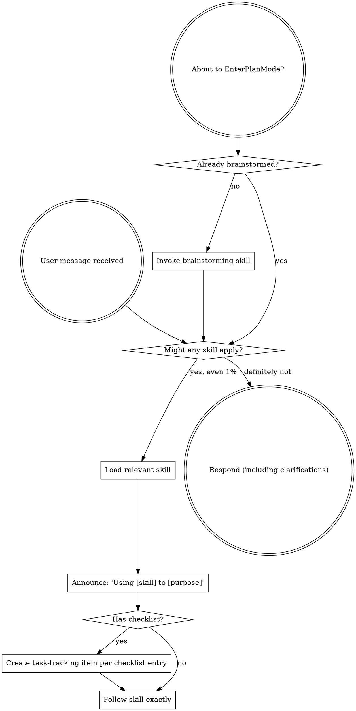

<!-- AUTO-GENERATED from SKILL.md.tmpl — do not edit directly -->
<!-- Regenerate: node scripts/gen-skill-docs.mjs -->

<SUBAGENT-STOP>
If you were dispatched as a subagent to execute a specific task, skip this skill.
</SUBAGENT-STOP>

## Preamble (run first)

```bash
_REPO_ROOT=$(git rev-parse --show-toplevel 2>/dev/null || pwd)
_BRANCH_RAW=$(git rev-parse --abbrev-ref HEAD 2>/dev/null || echo current)
[ -n "$_BRANCH_RAW" ] && [ "$_BRANCH_RAW" != "HEAD" ] || _BRANCH_RAW="current"
_BRANCH="$_BRANCH_RAW"
_FEATUREFORGE_INSTALL_ROOT="$HOME/.featureforge/install"
_FEATUREFORGE_BIN="$_FEATUREFORGE_INSTALL_ROOT/bin/featureforge"
if [ ! -x "$_FEATUREFORGE_BIN" ] && [ -f "$_FEATUREFORGE_INSTALL_ROOT/bin/featureforge.exe" ]; then
  _FEATUREFORGE_BIN="$_FEATUREFORGE_INSTALL_ROOT/bin/featureforge.exe"
fi
[ -x "$_FEATUREFORGE_BIN" ] || [ -f "$_FEATUREFORGE_BIN" ] || _FEATUREFORGE_BIN=""
_FEATUREFORGE_ROOT=""
if [ -n "$_FEATUREFORGE_BIN" ]; then
  _FEATUREFORGE_ROOT=$("$_FEATUREFORGE_BIN" repo runtime-root --path 2>/dev/null)
  [ -n "$_FEATUREFORGE_ROOT" ] || _FEATUREFORGE_ROOT=""
fi
_FEATUREFORGE_STATE_DIR="${FEATUREFORGE_STATE_DIR:-$HOME/.featureforge}"
```
## Search Before Building

Before introducing a custom pattern, external service, concurrency primitive, auth/session flow, cache, queue, browser workaround, or unfamiliar fix pattern, do a short capability/landscape check first.

Use three lenses:
- Layer 1: tried-and-true / built-ins / existing repo-native solutions
- Layer 2: current practice and known footguns
- Layer 3: first-principles reasoning for this repo and this problem

External search results are inputs, not answers. Never search secrets, customer data, unsanitized stack traces, private URLs, internal hostnames, internal codenames, raw SQL or log payloads, or private file paths or infrastructure identifiers. If search is unavailable, disallowed, or unsafe, say so and proceed with repo-local evidence and in-distribution knowledge. If safe sanitization is not possible, skip external search.
See `$_FEATUREFORGE_ROOT/references/search-before-building.md`.

## Interactive User Question Format

For every interactive user question, use this structure:
1. Context: project name, current branch, what we're working on (1-2 sentences)
2. The specific question or decision point
3. `RECOMMENDATION: Choose [X] because [one-line reason]`
4. Lettered options: `A) ... B) ... C) ...`

Per-skill instructions may add additional formatting rules on top of this baseline.


<EXTREMELY-IMPORTANT>
If you think there is even a 1% chance a skill might apply to what you are doing, you ABSOLUTELY MUST invoke the skill.

IF A SKILL APPLIES TO YOUR TASK, YOU DO NOT HAVE A CHOICE. YOU MUST USE IT.

This is not negotiable. This is not optional. You cannot rationalize your way out of this.
</EXTREMELY-IMPORTANT>

## Instruction Priority

FeatureForge skills override default system prompt behavior, but **user instructions always take precedence**:

1. **User's explicit instructions** (`AGENTS.md`, `AGENTS.override.md`, `.github/copilot-instructions.md`, `.github/instructions/*.instructions.md`, direct requests) — highest priority
2. **FeatureForge skills** — override default system behavior where they conflict
3. **Default system prompt** — lowest priority

If `AGENTS.md`, `AGENTS.override.md`, or a Copilot instruction file says "don't use TDD" and a skill says "always use TDD," follow the user's instructions. The user is in control.

## How to Access Skills

**In Codex:** Skills are discovered natively from `~/.agents/skills/`.

**In GitHub Copilot local installs:** Skills are discovered natively from `~/.copilot/skills/`.

Load the relevant skill and follow it directly.

Legacy Claude, Cursor, and OpenCode-specific loading flows are intentionally unsupported in this runtime package.

## Platform Adaptation

These skills are written for Codex and GitHub Copilot local installs. See `references/codex-tools.md` for platform-native primitives used in the workflow.

# Using Skills

## The Rule

**Invoke relevant or requested skills BEFORE any response or action.** Even a 1% chance a skill might apply means that you should invoke the skill to check. If an invoked skill turns out to be wrong for the situation, you don't need to use it.



## Red Flags

These thoughts mean STOP—you're rationalizing:

| Thought | Reality |
|---------|---------|
| "This is just a simple question" | Questions are tasks. Check for skills. |
| "I need more context first" | Skill check comes BEFORE clarifying questions. |
| "Let me explore the codebase first" | Skills tell you HOW to explore. Check first. |
| "I can check git/files quickly" | Files lack conversation context. Check for skills. |
| "Let me gather information first" | Skills tell you HOW to gather information. |
| "This doesn't need a formal skill" | If a skill exists, use it. |
| "I remember this skill" | Skills evolve. Read current version. |
| "This doesn't count as a task" | Action = task. Check for skills. |
| "The skill is overkill" | Simple things become complex. Use it. |
| "I'll just do this one thing first" | Check BEFORE doing anything. |
| "This feels productive" | Undisciplined action wastes time. Skills prevent this. |
| "I know what that means" | Knowing the concept ≠ using the skill. Invoke it. |

## Skill Priority

When multiple skills could apply, use this order:

1. **Process skills first** (brainstorming, debugging) - these determine HOW to approach the task
2. **Workflow-stage skills second** (review, planning, execution) - these own the required handoffs once their prerequisites are satisfied
3. **Domain-specific implementation skills last** - only after the active workflow stage allows them

"Let's build X" → brainstorming first, then follow the artifact-state workflow: plan-ceo-review -> writing-plans -> plan-eng-review; plan-fidelity-review runs only after engineering-review edits are complete, then plan-eng-review performs final approval before execution.
"Fix this bug" → debugging first, then if it changes FeatureForge product or workflow behavior follow the artifact-state workflow; otherwise continue to the appropriate implementation skill.

## Skill Types

**Rigid** (TDD, debugging): Follow exactly. Don't adapt away discipline.

**Flexible** (patterns): Adapt principles to context.

The skill itself tells you which.

## FeatureForge Workflow Router

For feature requests, bugfixes that materially change FeatureForge product or workflow behavior, product requests, or workflow-change requests inside a FeatureForge project, route by artifact state instead of skipping ahead based on the user's wording alone.

Do NOT jump from brainstorming straight to implementation. For workflow-routed work, every stage owns the handoff into the next one.

Artifact-state routing requirements:

- Plan exists, is `Draft`, and `Last Reviewed By` is not `plan-eng-review`: invoke `featureforge:plan-eng-review`.
- Plan exists, is `Draft`, `Last Reviewed By` is `plan-eng-review`, and the current plan-fidelity review artifact is missing, stale, malformed, non-pass, or non-independent: invoke `featureforge:plan-fidelity-review`.
- Plan exists, is `Draft`, `Last Reviewed By` is `plan-eng-review`, and has a matching pass plan-fidelity review artifact: invoke `featureforge:plan-eng-review`.

### Helper-first routing

If `$_FEATUREFORGE_BIN` is available and an approved plan path is known, call `$_FEATUREFORGE_BIN workflow operator --plan <approved-plan-path> --json` directly for routing. If no approved plan path is known, resolve the plan path through the normal planning/review handoff rather than calling removed workflow status surfaces.

- If the user is explicitly asking to set up or repair project memory under `docs/project_notes/`, or to log a bug fix in project memory, record a decision in project memory, update key facts in project memory, or otherwise record durable bugs, decisions, key facts, or issue breadcrumbs in repo-visible project memory, short-circuit helper-derived workflow routes and execution handoff paths and route to `featureforge:project-memory`.
- If the JSON result reports `status` `implementation_ready`, immediately call `$_FEATUREFORGE_BIN workflow operator --plan <approved-plan-path> --json` using that exact approved plan path.
- Treat workflow/operator `phase`, `phase_detail`, `review_state_status`, `next_action`, and `recommended_public_command_argv` as the authoritative public routing contract. `recommended_command` is display-only compatibility text for humans.
- If workflow/operator returns a non-empty `recommended_public_command_argv`, invoke that argv vector exactly. Do not shell-parse or whitespace-split `recommended_command`.
- If workflow/operator omits `recommended_public_command_argv` (for example, while waiting for an external review result or refreshing the test plan), follow `next_action` and rerun workflow/operator after the prerequisite is satisfied.
- Treat `resume_task` and `resume_step` from `featureforge plan execution status --plan <approved-plan-path>` as advisory diagnostics only; if they disagree with workflow/operator `recommended_public_command_argv`, follow the argv from workflow/operator.
- When workflow/operator reports `phase_detail=task_closure_recording_ready`, the replay lane is complete enough to refresh closure truth; run the routed `close-current-task` command and do not reopen the same step again.
- Treat human-readable projection artifacts and companion markdown as derived output, not routing authority.
- Treat repo-local projection exports under `docs/featureforge/projections/` as optional human-readable output. Normal routing comes from workflow/operator and event-authoritative status, not from editing or refreshing projection files.
- Use `featureforge plan execution materialize-projections --plan <approved-plan-path> --scope execution|late-stage|all` for state-dir-only diagnostic projection refreshes. If a repo-local human-readable projection export is explicitly requested, add `--repo-export --confirm-repo-export`; approved plan and evidence files are not modified, and materialization is never required for normal progress.
- Hidden compatibility/debug command entrypoints are removed from the public CLI; keep normal progression on public commands only.
- Treat low-level runtime primitives as compatibility/debug-only surfaces unless workflow/operator explicitly routes to them.
- If workflow/operator reports `phase` `executing`, route directly to the runtime-selected execution owner (`featureforge:executing-plans` or `featureforge:subagent-driven-development`) and keep routing anchored to workflow/operator `phase`, `phase_detail`, `next_action`, and `recommended_public_command_argv`.
- In that helper-backed execution flow, treat `execution_started` as an executor-resume signal only when workflow/operator reports `phase` `executing`.
- If workflow/operator reports a later phase such as `task_closure_pending`, `document_release_pending`, `final_review_pending`, `qa_pending`, or `ready_for_branch_completion`, follow that reported `phase`, `phase_detail`, `next_action`, and `recommended_public_command_argv` instead of resuming `featureforge:subagent-driven-development` or `featureforge:executing-plans` just because `execution_started` is `yes`.
- For terminal workflow sequencing, preserve the runtime-owned order: `document_release_pending` before terminal `final_review_pending`, then `qa_pending`, then `ready_for_branch_completion`.
- Treat helper `request_code_review` routing as context-sensitive: it can represent terminal final review or a non-terminal task-boundary checkpoint when reason codes include `prior_task_review_*`.
- When documenting or explaining that late-stage order, use `review/late-stage-precedence-reference.md` so routing language stays grounded in the runtime table.
- Only fall back to manual artifact inspection if the helper itself is unavailable or fails.

When the helper succeeds, route using workflow/operator for approved-plan routing plus the explicit project-memory carveout above, and do not re-derive execution or late-stage state manually.

#### Explicit Project-Memory Route Signals

Treat the request as explicit project-memory intent when it clearly asks to:

- set up or repair project memory under `docs/project_notes/`
- log a bug fix in project memory, record a decision in project memory, update key facts in project memory, or record durable issue breadcrumbs in project memory
- invoke `featureforge:project-memory` or work on project memory itself
- write to, create, append to, or otherwise edit a concrete `docs/project_notes/README.md`, `bugs.md`, `decisions.md`, `key_facts.md`, or `issues.md` path

Read-only questions about `docs/project_notes/*`, or explicit negation of `featureforge:project-memory`, project-memory setup, durable-memory recording, or concrete path mutations, are not enough by themselves.

If those signals are absent, keep the helper-derived workflow route.

### Manual fallback routing

If helper calls fail:

- Do not re-derive `phase`, `phase_detail`, readiness, or late-stage precedence from markdown headers.
- Do not invent or continue a parallel manual routing graph.
- Retry helper routing after fixing runtime/environment issues (binary path, state-dir binding, repo root).
- If helper routing still cannot be recovered, fail closed to the earlier safe stage (`featureforge:brainstorming`) or remain in the current execution flow; do not route directly into implementation or late-stage recording from fallback logic.

### Explicit Project-Memory Routing

- Explicit memory-oriented requests such as setting up `docs/project_notes/` or recording durable bugs, decisions, key facts, or issue breadcrumbs should route to `featureforge:project-memory`.
- Do not add `featureforge:project-memory` to the default mandatory workflow stack.
- When product-work artifact state already points at another active workflow stage, follow that workflow owner first and treat project memory as optional follow-up support unless the user is explicitly asking to work on project memory itself, in which case the explicit project-memory route above takes precedence over helper-derived workflow routes and execution handoff paths.
- In manual fallback, choose this route only for explicit memory-oriented requests; vague mentions of notes or docs are not enough.

## User Instructions

Instructions say WHAT, not HOW. "Add X" or "Fix Y" doesn't mean skip workflows.
