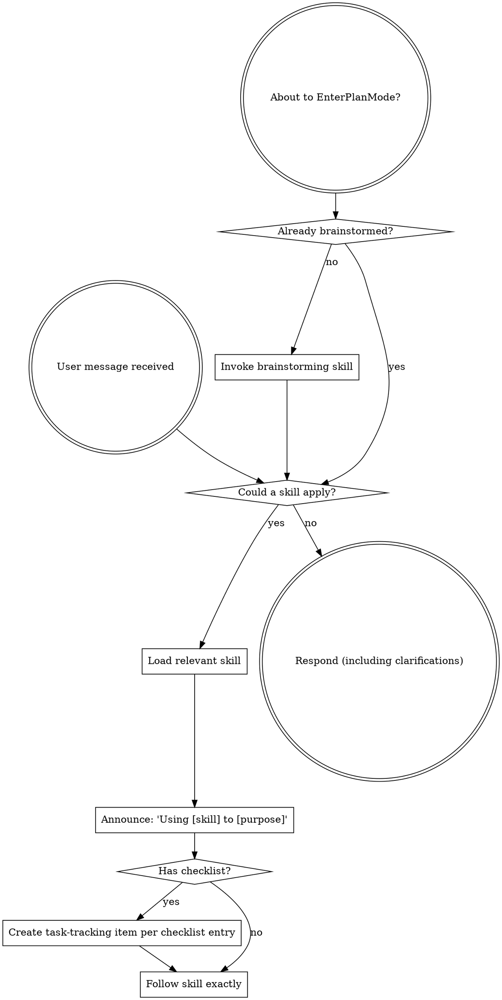

<!-- AUTO-GENERATED from SKILL.md.tmpl — do not edit directly -->
<!-- Regenerate: node scripts/gen-skill-docs.mjs -->

<SUBAGENT-STOP>
If you were dispatched as a subagent to execute a specific task, skip this skill.
</SUBAGENT-STOP>

## Preamble (run first)

```bash
_REPO_ROOT=$(git rev-parse --show-toplevel 2>/dev/null || pwd)
_BRANCH_RAW=$(git rev-parse --abbrev-ref HEAD 2>/dev/null || echo current)
[ -n "$_BRANCH_RAW" ] && [ "$_BRANCH_RAW" != "HEAD" ] || _BRANCH_RAW="current"
_BRANCH="$_BRANCH_RAW"
_FEATUREFORGE_INSTALL_ROOT="$HOME/.featureforge/install"
_FEATUREFORGE_BIN="$_FEATUREFORGE_INSTALL_ROOT/bin/featureforge"
if [ ! -x "$_FEATUREFORGE_BIN" ] && [ -f "$_FEATUREFORGE_INSTALL_ROOT/bin/featureforge.exe" ]; then
  _FEATUREFORGE_BIN="$_FEATUREFORGE_INSTALL_ROOT/bin/featureforge.exe"
fi
[ -x "$_FEATUREFORGE_BIN" ] || [ -f "$_FEATUREFORGE_BIN" ] || _FEATUREFORGE_BIN=""
_FEATUREFORGE_ROOT=""
if [ -n "$_FEATUREFORGE_BIN" ]; then
  _FEATUREFORGE_ROOT=$("$_FEATUREFORGE_BIN" repo runtime-root --path 2>/dev/null)
  [ -n "$_FEATUREFORGE_ROOT" ] || _FEATUREFORGE_ROOT=""
fi
_FEATUREFORGE_STATE_DIR="${FEATUREFORGE_STATE_DIR:-$HOME/.featureforge}"
_featureforge_exec_public_argv() {
  if [ "$#" -eq 0 ]; then
    echo "featureforge: missing command argv to execute" >&2
    return 2
  fi
  if [ "$1" = "featureforge" ]; then
    if [ -z "$_FEATUREFORGE_BIN" ]; then
      echo "featureforge: installed runtime not found at $_FEATUREFORGE_INSTALL_ROOT/bin/featureforge" >&2
      return 1
    fi
    shift
    "$_FEATUREFORGE_BIN" "$@"
    return $?
  fi
  echo "featureforge: refusing non-featureforge public argv: $1" >&2
  return 2
}
```
## Installed Control Plane

Live workflow routing uses only `$_FEATUREFORGE_BIN`; never use `./bin/featureforge`, `target/debug/featureforge`, or `cargo run` for live routing. Query workflow/operator JSON with `$_FEATUREFORGE_BIN workflow operator --plan <approved-plan-path> --json`.

If the installed runtime/root cannot be resolved, stop before making workflow mutations. Use only typed operator JSON route surfaces: execute `recommended_public_command_argv` when present; when `recommended_public_command_template` appears, treat `required_inputs` as validation metadata and materialize templates only by rerunning `$_FEATUREFORGE_BIN workflow operator --plan <approved-plan-path> --input NAME=VALUE --json`. Detailed binding and route-specific stop rules live in `$_FEATUREFORGE_ROOT/references/operator-route-authority.md`. Treat display-only `recommended_command` as non-executable; if no typed executable surface exists, stop and report the route diagnostic.
## Search Before Building

Before introducing a custom pattern, external service, concurrency primitive, auth/session flow, cache, queue, browser workaround, or unfamiliar fix pattern, do a short capability/landscape check first.

Use three lenses, then decide from local repo truth:
- Layer 1: tried-and-true / built-ins / existing repo-native solutions
- Layer 2: current practice and known footguns
- Layer 3: first-principles reasoning for this repo and this problem

External search results are inputs, not answers. Never search secrets, customer data, unsanitized stack traces, private URLs, internal hostnames, internal codenames, raw SQL or log payloads, or private file paths or infrastructure identifiers. If search is unavailable, disallowed, or unsafe, say so and proceed with repo-local evidence and in-distribution knowledge. If safe sanitization is not possible, skip external search.
See `$_FEATUREFORGE_ROOT/references/search-before-building.md`.

## Interactive User Question Format

For every interactive user question, use this structure:
1. Context: project name, current branch, what we're working on (1-2 sentences)
2. The specific question or decision point
3. `RECOMMENDATION: Choose [X] because [one-line reason]`
4. Lettered options: `A) ... B) ... C) ...`

Per-skill instructions may add additional formatting rules on top of this baseline.


<IMPORTANT>
Check relevant or requested skills before responding or acting unless an explicit user instruction forbids skill use or gives a conflicting process. User instructions always win.
</IMPORTANT>

## Instruction Priority

FeatureForge skills override default system prompt behavior, but **user instructions always take precedence**:

1. **User's explicit instructions** (`AGENTS.md`, `AGENTS.override.md`, `.github/copilot-instructions.md`, `.github/instructions/*.instructions.md`, direct requests) — highest priority
2. **FeatureForge skills** — override default system behavior where they conflict
3. **Default system prompt** — lowest priority

If `AGENTS.md`, `AGENTS.override.md`, or a Copilot instruction file says "don't use TDD" and a skill says "always use TDD," follow the user's instructions. The user is in control.

## How to Access Skills

**In Codex:** Skills are discovered natively from `~/.agents/skills/`.

**In GitHub Copilot local installs:** Skills are discovered natively from `~/.copilot/skills/`.

Load the relevant skill and follow it directly.

Legacy Claude, Cursor, and OpenCode-specific loading flows are intentionally unsupported in this runtime package.

## Platform Adaptation

These skills are written for Codex and GitHub Copilot local installs. See skill-local `references/codex-tools.md` for platform-native primitives used in the workflow.

# Using Skills

## Skill Selection Rule

Before responding or acting, load skills that are requested by name or clearly relevant to the task. If applicability is uncertain, briefly check the most likely skill; if it turns out not to apply, stop using it and continue with the user's requested process.


```dot
digraph skill_flow {
    "User message received" [shape=doublecircle];
    "About to EnterPlanMode?" [shape=doublecircle];
    "Already brainstormed?" [shape=diamond];
    "Invoke brainstorming skill" [shape=box];
    "Could a skill apply?" [shape=diamond];
    "Load relevant skill" [shape=box];
    "Announce: 'Using [skill] to [purpose]'" [shape=box];
    "Has checklist?" [shape=diamond];
    "Create task-tracking item per checklist entry" [shape=box];
    "Follow skill exactly" [shape=box];
    "Respond (including clarifications)" [shape=doublecircle];

    "About to EnterPlanMode?" -> "Already brainstormed?";
    "Already brainstormed?" -> "Invoke brainstorming skill" [label="no"];
    "Already brainstormed?" -> "Could a skill apply?" [label="yes"];
    "Invoke brainstorming skill" -> "Could a skill apply?";

    "User message received" -> "Could a skill apply?";
    "Could a skill apply?" -> "Load relevant skill" [label="yes"];
    "Could a skill apply?" -> "Respond (including clarifications)" [label="no"];
    "Load relevant skill" -> "Announce: 'Using [skill] to [purpose]'";
    "Announce: 'Using [skill] to [purpose]'" -> "Has checklist?";
    "Has checklist?" -> "Create task-tracking item per checklist entry" [label="yes"];
    "Has checklist?" -> "Follow skill exactly" [label="no"];
    "Create task-tracking item per checklist entry" -> "Follow skill exactly";
}
```

Do not gather code context, ask clarifying questions, or start implementation before checking a clearly relevant skill, unless the user has explicitly forbidden that skill or workflow.

## Skill Priority

When multiple skills could apply, use this order:

1. **Process skills first** (brainstorming, debugging) - these determine HOW to approach the task
2. **Workflow-stage skills second** (review, planning, execution) - these own the required handoffs once their prerequisites are satisfied
3. **Domain-specific implementation skills last** - only after the active workflow stage allows them

"Let's build X" → brainstorming first, then follow the artifact-state workflow: plan-ceo-review -> writing-plans -> plan-eng-review; plan-fidelity-review runs only after engineering-review edits are complete, then plan-eng-review performs final approval before execution.
"Fix this bug" → debugging first, then if it changes FeatureForge product or workflow behavior follow the artifact-state workflow; otherwise continue to the appropriate implementation skill.

## Skill Types

**Rigid** (TDD, debugging): Follow exactly. Don't adapt away discipline.

**Flexible** (patterns): Adapt principles to context.

The skill itself tells you which.

## FeatureForge Workflow Router

For feature requests, bugfixes that materially change FeatureForge product or workflow behavior, product requests, or workflow-change requests inside a FeatureForge project, route by artifact state instead of skipping ahead based on the user's wording alone.

Do NOT jump from brainstorming straight to implementation. For workflow-routed work, every stage owns the handoff into the next one.

Artifact-state routing requirements:

- Plan exists, is `Draft`, and `Last Reviewed By` is not `plan-eng-review`: invoke `featureforge:plan-eng-review`.
- Plan exists, is `Draft`, `Last Reviewed By` is `plan-eng-review`, and the current plan-fidelity review artifact is missing, stale, malformed, or non-independent: invoke `featureforge:plan-fidelity-review`.
- Plan exists, is `Draft`, `Last Reviewed By` is `plan-eng-review`, and the current plan-fidelity review artifact is non-pass: invoke `featureforge:plan-eng-review`.
- Plan exists, is `Draft`, `Last Reviewed By` is `plan-eng-review`, and has a matching pass plan-fidelity review artifact: invoke `featureforge:plan-eng-review`.

#### Explicit Project-Memory Route Signals

Short-circuit runtime-derived workflow routes and execution handoff paths to `featureforge:project-memory` only when the user clearly asks to:

- set up or repair project memory under `docs/project_notes/`
- log a bug fix, record a decision, update key facts, or record durable issue breadcrumbs in repo-visible project memory
- invoke `featureforge:project-memory` or work on project memory itself
- write to, create, append to, or otherwise edit a concrete `docs/project_notes/README.md`, `bugs.md`, `decisions.md`, `key_facts.md`, or `issues.md` path

Read-only questions about `docs/project_notes/*`, or explicit negation of `featureforge:project-memory`, project-memory setup, durable-memory recording, or concrete path mutations, are not enough by themselves. Do not add `featureforge:project-memory` to the default mandatory workflow stack; when the user is not explicitly asking to work on project memory itself, follow the active workflow owner first and treat project memory as optional follow-up support.

### Runtime-first routing

If `$_FEATUREFORGE_BIN` is available and an approved plan path is known, call `$_FEATUREFORGE_BIN workflow doctor --plan <approved-plan-path> --json` only for orientation/diagnosis, then call `$_FEATUREFORGE_BIN workflow operator --plan <approved-plan-path> --json` as route authority. The generated Installed Control Plane section and canonical route reference at `$_FEATUREFORGE_ROOT/references/operator-route-authority.md` own typed argv/template binding, task-closure replay, repair, late-stage lanes, and stop rules; recovery remains on operator-routed public commands.

- If no approved plan path is known, resolve it through the normal planning/review handoff rather than removed workflow status surfaces.
- Treat `phase_detail=task_closure_recording_ready` as the routed task-closure replay lane, and treat projection artifacts as derived output, not routing authority.
- If operator reports `phase` `executing`, route to the runtime-selected execution owner; treat `execution_started` as a resume signal only in that phase.
- If operator reports task closure, repair, document release, final review, QA, branch completion, or another diagnostic route, follow only the selected route surface instead of resuming execution or terminal sequencing from memory.
- If doctor/operator fails, fix only obvious binary, state-dir, or repo-root binding and rerun. If routing still cannot be recovered, stop and report unresolved route binding; do not reconstruct routing from artifacts manually. Do not re-derive `phase`, `phase_detail`, readiness, or late-stage precedence from markdown headers.

## User Instructions

Instructions say WHAT, not HOW. "Add X" or "Fix Y" doesn't mean skip workflows.
